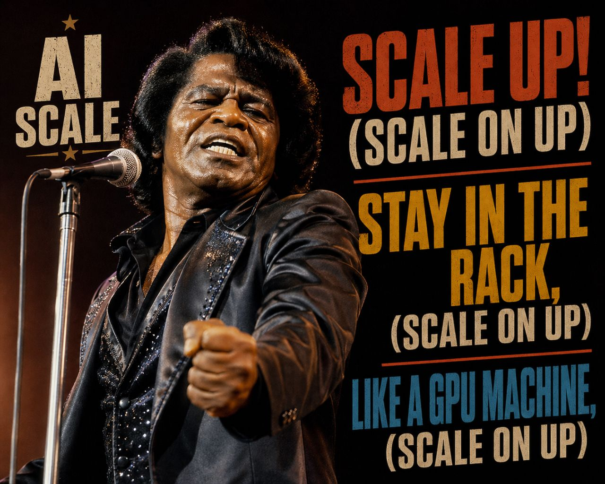

# GPU Networking for Networker Dummies



> A deep dive into how GPUs talk to each other, written by a networking person, for networking people.

If you have spent your career thinking in terms of routers, MPLS labels, routing tables, BGP and the occasional `tcpdump`, the world of "GPU networking" can feel like it was designed by aliens. People throw around words like *NVLink*, *NVSwitch*, *collective*, *all-reduce*, *RDMA*, *RoCE* and *rail-optimized fabric* as if they were obvious. They are not.

This document is two things at once, the same way I did the [k8s service & LB testing notes](https://github.com/robric/k8s-svc-and-lb-testing) were:
- a **personal cheat sheet** so I (and maybe you) can stop re-clauding/googling "how does this NVLink thing connect GPUs to each other ?" every six months.
- an **educational source** to explain how GPU interconnects actually work, starting from networking intuition you already have.


The golden rule for the whole document: **whenever something looks like magic, we map it back to a networking concept you already know** — a link, a switch, a fabric, a routing decision, a congestion problem. GPUs are just a new kind of endpoint. The wires are still wires.

> **One vendor as the worked example.** "GPU" here means the category, not a brand. We build the whole mental model on **NVIDIA** hardware — it is the most widely deployed and the most concrete to point at, and its vocabulary (NVLink, SM, CUDA, NCCL) is what you will hit first in the wild. But the *architecture* is universal: a die of throughput tiles, fast on-package memory, a high-bandwidth **scale-up** link to nearby peers, and an **RDMA NIC** out to the cluster. AMD and Intel assemble the same building blocks under different names. We learn it once on NVIDIA, then map the alternatives — **AMD and Intel** in their own chapter, and the **open standards (UALink, Ultra Ethernet)** that answer NVIDIA's proprietary stack in theirs — once the model is in place.

## Contents

- [1. The landscape: the GPU and the networks around it](#1-the-landscape-the-gpu-and-the-networks-around-it)
  - [1.1 Why GPUs run the show (and what the CPU still does)](#11-why-gpus-run-the-show-and-what-the-cpu-still-does)
  - [1.2 What a GPU looks like, and the words for its parts](#12-what-a-gpu-looks-like-and-the-words-for-its-parts)
  - [1.3 Host vs device](#13-host-vs-device)
  - [1.4 The two network paths: host vs GPU](#14-the-two-network-paths-host-vs-gpu)
  - [1.5 The two workloads: training vs inference](#15-the-two-workloads-training-vs-inference)
    - [1.5.1 Two traffic shapes](#151-two-traffic-shapes)
    - [1.5.2 The other axis: how much CPU per GPU](#152-the-other-axis-how-much-cpu-per-gpu)
  - [1.6 The picture so far](#16-the-picture-so-far)
- [2. GPU Networking, the big picture: two fundamentally different problems](#2-gpu-networking-the-big-picture-two-fundamentally-different-problems)
  - [2.1 Scale-up vs scale-out](#21-scale-up-vs-scale-out)
  - [2.2 A picture to anchor everything](#22-a-picture-to-anchor-everything)
  - [2.3 Why two layers at all? (the networking intuition)](#23-why-two-layers-at-all-the-networking-intuition)
- [3. Scale-up: the NVLink fabric](#3-scale-up-the-nvlink-fabric)
  - [3.1 The problem NVLink solves](#31-the-problem-nvlink-solves)
  - [3.2 NVLink as a link: lanes, sublinks, and how to read a spec sheet](#32-nvlink-as-a-link-lanes-sublinks-and-how-to-read-a-spec-sheet)
  - [3.3 From links to a fabric: a single NVSwitch (one node)](#33-from-links-to-a-fabric-a-single-nvswitch-one-node)
  - [3.4 Scaling past the box: NVL72, then NVL576](#34-scaling-past-the-box-nvl72-then-nvl576)
    - [3.4.1 NVL72: one rack, one switch tier](#341-nvl72-one-rack-one-switch-tier)
    - [3.4.2 NVL576: eight racks, two switch tiers (a folded Clos)](#342-nvl576-eight-racks-two-switch-tiers-a-folded-clos)
  - [3.5 Memory semantics: load/store vs send/receive](#35-memory-semantics-loadstore-vs-sendreceive)
  - [3.6 Decoding the names: DGX/HGX/MGX, Oberon/Kyber, and the NVL## trap](#36-decoding-the-names-dgxhgxmgx-oberonkyber-and-the-nvl-trap)
  - [3.7 Where scale-up ends and scale-out must begin](#37-where-scale-up-ends-and-scale-out-must-begin)
- [4. Scale-out: the GPU cluster network](#4-scale-out-the-gpu-cluster-network)
  - [4.1 The job: connect the islands](#41-the-job-connect-the-islands)
  - [4.2 RDMA on the wire: one-sided, kernel-bypass, GPUDirect](#42-rdma-on-the-wire-one-sided-kernel-bypass-gpudirect)
  - [4.3 InfiniBand vs RoCE: two ways to carry RDMA](#43-infiniband-vs-roce-two-ways-to-carry-rdma)
  - [4.4 Why AI traffic breaks ordinary networks](#44-why-ai-traffic-breaks-ordinary-networks)
  - [4.5 Keeping it lossless: PFC, ECN, and DCQCN](#45-keeping-it-lossless-pfc-ecn-and-dcqcn)
  - [4.6 Shaping the fabric: leaves, spines, and how GPUs hang off them](#46-shaping-the-fabric-leaves-spines-and-how-gpus-hang-off-them)
    - [4.6.1 The baseline: a node homed to its leaf](#461-the-baseline-a-node-homed-to-its-leaf)
    - [4.6.2 Rail-only: dropping the spine](#462-rail-only-dropping-the-spine)
    - [4.6.3 Scaling past one pod: a spine over the rails](#463-scaling-past-one-pod-a-spine-over-the-rails)
    - [4.6.4 Multi-plane: splitting the NIC across fabrics](#464-multi-plane-splitting-the-nic-across-fabrics)
    - [4.6.5 Scaling across datacenters](#465-scaling-across-datacenters)
  - [4.7 Steering the traffic: picking among the paths](#47-steering-the-traffic-picking-among-the-paths)
- [5. Collectives: the traffic the fabric carries](#5-collectives-the-traffic-the-fabric-carries)
  - [5.1 Where the traffic comes from: parallelism](#51-where-the-traffic-comes-from-parallelism)
  - [5.2 The catalog: what each collective does to a tensor](#52-the-catalog-what-each-collective-does-to-a-tensor)
  - [5.3 On the wire: ring, tree, and letting the switch do the math](#53-on-the-wire-ring-tree-and-letting-the-switch-do-the-math)
  - [5.4 Two workloads, two traffic shapes: training vs inference](#54-two-workloads-two-traffic-shapes-training-vs-inference)
- [6. The software stack: from the model to the silicon](#6-the-software-stack-from-the-model-to-the-silicon-draft)
  - [6.1 The stack, from driver to app](#61-the-stack-from-driver-to-app)
  - [6.2 How code becomes GPU instructions](#62-how-code-becomes-gpu-instructions)
  - [6.3 Two software worlds: training and serving](#63-two-software-worlds-training-and-serving)
- [7. The other planes: frontend, storage, and management](#7-the-other-planes-frontend-storage-and-management)
  - [7.1 The frontend: the host-side networks](#71-the-frontend-the-host-side-networks)
  - [7.2 Storage: the plane on both sides](#72-storage-the-plane-on-both-sides)
  - [7.3 Management and out-of-band: the wire that never carries a tensor](#73-management-and-out-of-band-the-wire-that-never-carries-a-tensor)
- [8. The vendor landscape: AMD, Intel, and the hyperscalers](#8-the-vendor-landscape-amd-intel-and-the-hyperscalers)
  - [8.1 The same shape, different names](#81-the-same-shape-different-names)
  - [8.2 AMD: the open bet](#82-amd-the-open-bet)
  - [8.3 Intel Gaudi: one fabric for both scales](#83-intel-gaudi-one-fabric-for-both-scales)
  - [8.4 The hyperscalers: silicon you mostly can't buy](#84-the-hyperscalers-silicon-you-mostly-cant-buy)
- [9. Open standards: the fabric without the vendor](#9-open-standards-the-fabric-without-the-vendor)
  - [9.1 The scale-up front: answering NVLink](#91-the-scale-up-front-answering-nvlink)
  - [9.2 The scale-out front: answering InfiniBand](#92-the-scale-out-front-answering-infiniband)
  - [9.3 Where it leaves the networker](#93-where-it-leaves-the-networker)
- [References](#references)

---

## 1. The landscape: the GPU and the networks around it

Before we can talk about how GPUs *network*, we need two things: the bare minimum about what a GPU *is* (1.1–1.3), then the wider map — the **several different networks** an AI data center actually runs (1.4), the **workloads** that drive their traffic (1.5), and a **one-paragraph recap** (1.6). The GPU bits are the *just enough* version — no warps, no occupancy, no kernel tuning. If you already know what an SM, HBM and `cuda:0` are, jump to 1.4.

### 1.1 Why GPUs run the show (and what the CPU still does)

A CPU has a few very fast, very clever cores optimized for *latency* — get one task done as quickly as possible, with big caches and branch prediction. A GPU flips the trade: it has **thousands of simple cores** optimized for *throughput* — do the same arithmetic on huge batches of data in parallel. AI training is exactly that: enormous matrix multiplications, the same operation over millions of numbers. That's why GPUs, not CPUs, run the show.

Networking analogy: think **control plane vs data plane**, exactly like in a router. The **CPU is the control plane** — relatively few cores making complex, branchy decisions and orchestrating the work. The **GPU is the data plane** — a wide, massively-parallel engine (like a forwarding ASIC) that just hammers the same operation across an enormous volume of data. The CPU decides *what* to run; the GPU does the bulk arithmetic. Different tool, different job.

But here's the **subtle difference that makes GPU networking its own beast** — and it's the thread for everything that follows. In a router, the data-plane payload is a **packet**, and a packet fits *entirely inside a single ASIC* while it's processed. One packet, one chip, done. An AI data-plane payload is different: the **tensors** (the model's weights and activations) can be too big to fit in one GPU, so they're **sharded** — split across many GPUs, each holding only a slice. No single GPU sees the whole thing.

That one fact changes everything. Because the payload is spread across chips, the GPUs can't work in isolation — they must **constantly collaborate**: exchange slices, sum partial results, redistribute outputs, all *mid-computation*. Where a router ASIC forwards independent packets that never need to know about each other, GPUs run a tightly-coordinated team effort. **That collaboration *is* the traffic GPU networking has to carry** — and it's a far richer, more demanding pattern than "forward this packet." The rest of this document is, fundamentally, about how that GPU-to-GPU collaboration gets wired and orchestrated.

### 1.2 What a GPU looks like, and the words for its parts

Before the glossary, one picture. At the highest level a GPU is **a big grid of compute tiles (Streaming Multiprocessor - SMs -) wrapped in a ring of very fast memory (HBM)**, with link interfaces (PCIe, NVLink) at the edges to talk to the outside world:

```
   +================ GPU (one device / one die) =================+
   |                                                             |
   | HBM stacks:   [====] [====] [====] [====]   (feed the grid) |
   | +------------------------------------------------------+    |
   | | SM  SM  SM  SM  SM  SM  SM  SM  SM  SM  SM  SM  SM   |    |
   | | SM  SM  SM  SM  SM  SM  SM  SM  SM  SM  SM  SM  SM   |    |
   | | SM  SM  SM   ...  ~100-150 SMs total  ...  SM  SM    |    |
   | | SM  SM  SM  SM  SM  SM  SM  SM  SM  SM  SM  SM  SM   |    |
   | +------------------------------------------------------+    |
   |         shared L2 cache   (die-wide cache layer)            +===> NVLink : peer GPUs (scale-up)
   | HBM stacks:   [====] [====] [====] [====]                   |
   +====+==============================+=========================+
        |                              |
        | PCIe                         | PCIe (GPUDirect RDMA)
        v                              v
     host CPU                       NIC (ConnectX / BlueField)
                                       |
                                       | 800G  InfiniBand / RoCE
                                       v
                                 scale-out fabric
```

<p align="center"><em>A GPU: a grid of SMs wrapped in HBM, links at the edges.</em></p>

The three edges leaving the box map exactly onto the two-interconnect story coming up:

- **NVLink → peer GPUs** — the sideways link. This is *scale-up* (§3).
- **PCIe → host CPU** — the general-purpose link for control and loading data.
- **PCIe → NIC** (ConnectX / BlueField) — the on-ramp to the *scale-out* network (§4).

That last edge, the NIC, matters more than it looks. With **GPUDirect RDMA** the NIC reads and writes GPU HBM *directly* over PCIe, without bouncing through CPU memory — so GPU-to-GPU traffic across nodes never touches the host's RAM. On the newest Grace-Blackwell boards this gets tighter still (**Data Direct** / DirectNIC): instead of GPUs and NICs hanging off **discrete PCIe switch chips** (the older layout, BlueField-3 NICs, ~200 Gb/s per GPU), the **ConnectX-8 SuperNIC itself acts as the PCIe switch**, sitting directly in the GPU's PCIe path (~400 Gb/s per GPU) — fewer hops, no detour up to the CPU. But it's still PCIe (Gen6) electrically — *not* a new non-PCIe link, and *not* NVLink — just a more integrated PCIe topology.

Zoom into **one SM** — this is where the actual math happens:

```
   +------------------- one SM (Streaming Multiprocessor) -------------------+
   | Warp schedulers               -> pick which threads run each cycle      |
   | CUDA cores  [][][][][][][][]  -> general FP32 / INT lanes               |
   | Tensor cores  [####][####]    -> matrix-multiply engines (AI workhorse) |
   | SFU  [><][><]                 -> exp, log, sqrt... (e.g. softmax)       |
   | LD/ST units                   -> move data between regs & memory        |
   | Registers + Shared mem / L1   -> tiny ultra-fast scratch by the ALUs    |
   | Other units                   -> specialized: TMA copies, FP64, TMEM... |
   +-------------------------------------------------------------------------+
```

<p align="center"><em>Inside one SM: schedulers, math units, and local scratch memory.</em></p>

The takeaway: **compute is the grid of SMs; memory bandwidth is the HBM ring feeding them; the network (PCIe/NVLink) hangs off the edge.** Everything in this document is about that last part — the edge — but it only makes sense once you see that the edge exists to keep the HBM, and through it the SMs, fed.

Now the terms. A few recur everywhere — here's the minimum to read a spec sheet:

- **SM (Streaming Multiprocessor)** — the GPU's basic compute building block. One GPU has many SMs (think ~100–150 on a modern data-center GPU), each packed with arithmetic units. Roughly "a core, but really a cluster of cores." You rarely tune these as a networker; just know "more SMs = more compute."
- **CUDA core / Tensor core** — the arithmetic units inside an SM. **Tensor cores** are the specialized matrix-multiply units that do the heavy lifting for AI. When NVIDIA quotes "FLOPS", this is where they come from.
- **HBM (High-Bandwidth Memory)** — the GPU's own RAM, stacked right next to the chip on the same package. This is the GPU's equivalent of a server's DRAM, but enormously faster: **~3–8 TB/s** of bandwidth on current parts. Capacity is smallish (tens to ~192 GB), which is *why* models must be split across many GPUs — and that splitting is what creates GPU-to-GPU traffic in the first place.
- **VRAM** — informal synonym for HBM capacity ("this GPU has 80 GB of VRAM").
- **CUDA** — NVIDIA's programming model/software stack for running code on the GPU. For our purposes it's mostly relevant as the thing that *names and addresses* GPUs.

> **Why a networker should care about HBM:** the whole reason GPU networking exists is that one GPU's HBM can't hold a big model. You split the model across GPUs, and now those GPUs must constantly exchange data at speeds that *approach HBM bandwidth*. The network is there to feed the HBM. Keep that framing — everything downstream is about not starving these memories.

### 1.3 Host vs device

A GPU is not a standalone computer. It lives inside a server, attached to a CPU:

```
   +------------------------------- Server (one node) -------------------------------+
   |                                                                                 |
   |        CPU0 (host)  <===== UPI / Infinity Fabric =====>  CPU1 (host)            |
   |          |                                                  |                   |
   |          |  PCIe                                      PCIe  |                   |
   |    +-----+-----+-----+                          +-----+-----+-----+             |
   |    |     |     |     |                          |     |     |     |             |
   | +-----++-----++-----++-----+                 +-----++-----++-----++-----+       |
   | |GPU0 ||GPU1 ||GPU2 ||GPU3 |                 |GPU4 ||GPU5 ||GPU6 ||GPU7 |       |
   | |HBM  ||HBM  ||HBM  ||HBM  |                 |HBM  ||HBM  ||HBM  ||HBM  |       |
   | +-----++-----++-----++-----+                 +-----++-----++-----++-----+       |
   |  cuda:0 cuda:1 cuda:2 cuda:3                  cuda:4 cuda:5 cuda:6 cuda:7       |
   |                                                                                 |
   |\_____ NUMA domain 0 _______/              \_______ NUMA domain 1 _______/       |
   +---------------------------------------------------------------------------------+
```

<p align="center"><em>One node: two CPU sockets, eight GPUs, two NUMA domains.</em></p>

- The **CPU is the "host"**; each **GPU is a "device."**
- **Real boxes are dual-socket.** A reference 8-GPU server (NVIDIA HGX/DGX-class) has **two CPU sockets**, with the GPUs partitioned across them — typically GPU0–3 under CPU0 and GPU4–7 under CPU1 (often through PCIe switches). This is **not failover redundancy** — if a CPU dies its GPUs don't migrate. It's there for **PCIe lanes** (8 GPUs + ~8 NICs + NVMe need more lanes than one socket has) and **NUMA balance**. Note that this already makes the node a **NUMA machine** *before* NVLink enters — crossing from a CPU0-GPU to a CPU1-GPU traverses the inter-socket link (UPI / Infinity Fabric).
- Software enumerates the GPUs in a node as `cuda:0`, `cuda:1`, `cuda:2`, … — just an index per device, like interface IDs (`eth0`, `eth1`) on a box. This is what people mean by "N distinct GPUs": even when the GPUs are fully wired together, you still address `cuda:0 … cuda:7` individually. (Hold onto this — it's why "8 GPUs acting as one" is an abstraction, not a hardware fact.)
- **The fabric unifies devices, not hosts.** Wiring GPUs together (NVLink, §3) can make many act as one pool of memory — but it never fuses the *machines*. A GPU rack stays a **cluster of separate servers**, each with its own OS. A GB200 NVL72's 72 GPUs form a single NVLink domain (§3.4.1), yet its CPUs are **18 independent hosts** — an `lscpu` on one shows that tray's ~144 cores, never all 2,592 [[44]](#ref-44). The memory fabric unifies; the operating systems do not.
- **PCIe** is the general-purpose bus connecting CPU and GPUs (and NICs). It's fine for loading data and control, but it is **far too slow** to be the path GPUs use to share memory with each other at HBM speeds. Hold that thought — it's the exact gap NVLink exists to fill, in §3.
- *Aside:* "superchip" designs (Grace-Hopper, GB200) change this CPU↔GPU relationship — the CPU attaches to the GPU over a fast, **cache-coherent NVLink-C2C** link (~900 GB/s, ~7× a PCIe-5 link) instead of PCIe, at a higher ratio (GB200 = 1 Grace CPU per 2 Blackwell GPUs). How that ratio is chosen — and why it has drifted over the years — is §1.5.2; the naming is §3.6.

### 1.4 The two network paths: host vs GPU

Zoom out from the chip to the data hall, network-engineer hat on. A GPU node sits on *many* networks — but they fall into **two categories**, and the cleanest way to tell them apart is **which processor owns the path**. This is just **host vs device** (§1.3) drawn as networks:

```
   +============================ FRONTEND ============================+
   |                                                                  |   
   |  host / CPU path  ·  conventional Ethernet / IP / TCP   (-> §6)  |
   |                                                                  |
   |    inference / serving      users -> model endpoints (N-S)       |
   |    tenant / VPC             multi-tenant isolation, overlays     |
   |    orchestration / control  k8s · Slurm · job scheduling         |
   |    management / OOB         BMC · provisioning · telemetry       |
   |                                                                  |   
   +================================ ^ ===============================+
                                     |
                        via the CPU  |  (sockets, TCP/IP)
                                     |
              +----------------------+----------------------+
              |                 one GPU node                |
              |        host CPU        |        GPUs        |
              |        (host)          |      (devices)     |
              +----------------------+----------------------+
                                     |
                        via the GPU  |  (RDMA, GPUDirect)
                                     |
   +================================ v ===============================+
   |                                                                  |   
   |  GPU / RDMA path  ·  kernel-bypass, no sockets        (-> §3,§4) |
   |                                                                  |
   |    compute fabric           GPU <-> GPU  (the collective traffic)|
   |       · scale-up            NVLink, in-rack                (§3)  |
   |       · scale-out           IB / RoCE RDMA, cluster-wide   (§4)  |
   |                                                                  |
   |    storage fabric           GPU <-> high-perf storage            |
   |       · GPUDirect Storage   NVMe / parallel-FS -> GPU HBM (RDMA) |
   |                                                                  |   
   +============================= BACKEND ============================+
```

<p align="center"><em>Two paths off a node: the CPU frontend, the GPU/RDMA backend.</em></p>

- **Frontend — the host / CPU / socket path** (top of the diagram). Not one network but several, all conventional **Ethernet / IP / TCP** you already run: **inference / serving** (user requests to model endpoints, north-south, load-balanced), **tenant / VPC** (multi-tenant isolation), **orchestration** (k8s / Slurm scheduling), and **management / OOB** (BMC, provisioning). From a GPU's point of view it's all "stuff the host does for me" — and all of it is **your existing skill set** (→ §6).
- **Backend — the GPU / RDMA / memory path** (bottom). Kernel-bypass, no sockets, and itself **two fabrics**: a **compute fabric** carrying GPU↔GPU collective traffic — **scale-up** (NVLink, in-rack — §3) and **scale-out** (IB / RoCE RDMA, cluster-wide — §4); plus a **storage fabric** for **GPU↔high-performance storage** via **GPUDirect Storage** (NVMe / parallel-FS DMA'd straight into HBM). This is the new, hard part — the rest of the document.

Two things refuse to sit neatly on one side — which is exactly the tell that the split is about **path, not function**:

- **Storage shows up on both.** Bulk data-loading through the host CPU is *frontend*; the high-performance GPUDirect-Storage path is *backend*. Same data — different processor carrying it.
- **OOB management** is technically its own *out-of-band* wire (to the BMCs), but it's a host/management concern, so it rides with the frontend.

The takeaway that frames the whole doc: **the frontend is your existing skill set** (Ethernet, IP, BGP, load-balancing — back in §6); **the backend is the genuinely new thing** — the GPU datapath, in two fabrics (§3 scale-up, §4 scale-out). Everything hard lives on the path that skips the CPU.

### 1.5 The two workloads: training vs inference

Everything so far — sharded tensors, GPUs collaborating mid-computation — has quietly assumed *one* kind of work. But a GPU data center runs **two very different jobs**, and they stress the network in opposite ways. You already have the perfect pair of analogies for them: **training is a batch / bulk-sync job; inference is a latency-sensitive request-response service.** Which one you're wiring for changes what the network has to be good at.

#### 1.5.1 Two traffic shapes

```
   TRAINING  — backend only, all GPUs in lockstep
      G === G === G === G
      ||  gradient all-reduce  ||      east-west, synchronized every
      G === G === G === G              step  ->  tail-latency bound

   INFERENCE — users in front, lighter backend behind
      users  ->  [ model endpoints ]   north-south, load-balanced (frontend)
                       |
      G === G === G === G              east-west but lighter: the model is
      (lighter collectives)            still sharded across GPUs (backend)
```

<p align="center"><em>Training: backend lockstep. Inference: user-facing front, lighter back.</em></p>

**Training — build the model.** This is the heavy one. Thousands of GPUs run in **lockstep**, grinding through the dataset for days or weeks, and after every step they reconcile what they learned — the **gradient all-reduce** from §3.7: *every parameter, summed across every replica.* Its traffic signature:
- **East-west and internal** — GPU↔GPU collectives dominate; almost nothing leaves for a user. Pure **backend** (§1.4).
- **Synchronized and bursty** — everyone hits the network at the same instant, then waits for the slowest before the next step (§4.1). **Tail latency sets the pace of the whole job.**
- **Throughput-bound** — you care about sustained bandwidth, not single-request microseconds.


**Inference — use the model to serve users.** The model is trained; now you run it forward to answer requests. This *is* the **inference / serving** network already sitting at the top of the §1.4 diagram — **north-south, user-facing, load-balanced**, the Ethernet/IP/TCP traffic you've run your whole career. But there's a backend twist: a frontier model is still too big for one GPU, so even *serving* it is spread across GPUs — so inference *also* produces east-west collective traffic, just **lighter and less tightly synchronized** than training.

For the models driving all this — **autoregressive LLMs**, which generate their answer one token at a time — inference splits into **two phases** with different appetites, increasingly run on *different* GPUs. *(This split is generative-specific, not universal: a classifier, an embedding model, or a vision model just does a single forward pass — no token-by-token decode, no KV cache. It's the autoregressive LLM that makes serving its own beast.)*
- **Prefill** — read the whole prompt and build its context in one parallel pass. **Compute-heavy, bursty** (like ingesting a full request payload at once).
- **Decode** — emit the answer one token at a time, each token depending on the last. **Latency-bound, many tiny steps, memory-bandwidth-hungry** (like a long-lived chatty session dribbling out its reply).

| Property      | Training              | Inference                       |
|---------------|-----------------------|---------------------------------|
| Goal          | build the model       | serve the model                 |
| Direction     | east-west (GPU↔GPU)   | north-south + lighter east-west |
| Network plane | backend               | frontend + backend              |
| Pattern       | synchronized, bursty  | streaming, request-driven       |
| Bound by      | throughput            | latency (especially decode)     |
| Looks like…   | HPC batch / bulk sync | a web request-response tier     |

The takeaway for the rest of the doc: **§3 and §4 are mostly the *training* story** — the synchronized backend collectives that push the fabric hardest. Inference adds the familiar **frontend** dimension (→ §6) plus a lighter backend. But "lighter" is changing fast: modern serving is starting to **disaggregate** — running prefill and decode on separate GPU pools and shipping the intermediate state (the KV cache) between them over the backend fabric — which turns inference into its own demanding network problem. We flag it here and come back to it later; for now, just hold the split: **training stresses the backend; inference spans both planes.**

#### 1.5.2 The other axis: how much CPU per GPU

The two workloads differ on a second axis besides network traffic: **how hard each leans on the host CPU**. It is tempting to say inference pushed the **CPU:GPU ratio** up — but the history is messier than that, and worth seeing before drawing the lesson [[42]](#ref-42).

| Node (announced)   | GPUs            | CPU (total cores)    | cores/GPU | CPU-GPU link           |
|--------------------|-----------------|----------------------|-----------|------------------------|
| DGX-1 (2016-17)    | 8x Pascal/Volta | 2x Xeon (40)         | 5         | PCIe 3 (~32 GB/s)      |
| DGX-2 (2018)       | 16x Volta       | 2x Xeon (48)         | 3         | PCIe 3 (~32 GB/s)      |
| DGX A100 (2020)    | 8x Ampere       | 2x EPYC (128)        | 16        | PCIe 4 (~64 GB/s)      |
| DGX H100 (2022)    | 8x Hopper       | 2x Xeon (112)        | 14        | PCIe 5 (~128 GB/s)     |
| DGX B200 (2024)    | 8x Blackwell    | 2x Xeon (112)        | 14        | PCIe 5 (~128 GB/s)     |
| GB200 (2024)       | Grace-Blackwell | 1 Grace (72) : 2 GPU | 36        | NVLink-C2C (900 GB/s)  |
| Vera Rubin* (2025) | Vera Rubin      | 1 Vera (88) : 2 GPU  | 44        | NVLink-C2C (1800 GB/s) |

<p align="center"><em>CPU cores per GPU across the generations — noisy, and not an inference trend.</em></p>

*How to read it: **cores/GPU = node CPU cores ÷ GPUs** — except the superchips (GB200, Vera Rubin), which aren't 8-GPU nodes but fix the ratio at 1 CPU : 2 GPUs, the same at any rack size.*

\**Vera Rubin is announced, not shipping (production 2026); its figures are preliminary [[43]](#ref-43). Years are announcement dates — H100 shipped in volume in 2023, GB200 in 2025.*

Read down the *cores/GPU* column and there is no clean upward march — **5 → 3 → 16 → 14 → 14 → 36 → 44** — and the moves that matter are not about inference:

- **The big jump is DGX A100 (2020)**, from 3 to 16 cores/GPU — and it came from switching to **AMD EPYC** (64 cores per socket) plus PCIe 4, *before* ChatGPT and the inference boom. A CPU-supply jump, not a workload one.
- **Packing GPUs pushes the ratio down** — DGX-2 put 16 GPUs on two sockets and *fell* to 3 cores/GPU.
- **The recent move is architectural.** GB200's 36 cores/GPU arrives with the **Grace** superchip, whose real change is not the core count but the **coupling**: the CPU reaches the GPU over **cache-coherent NVLink-C2C at ~900 GB/s** — roughly 7× a PCIe-5 link — sharing one address space (§1.3). The CPU is bound *tighter*, not just made *bigger* — and Vera Rubin\* (production 2026) pushes the same lever again: 44 cores/GPU and a **1.8 TB/s** C2C link, double GB200's.

So the *ratio* is a design variable set by CPU core-density, GPU packing, and architecture — not a clean inference signal. What *is* an inference story lives one level up, in **software**. Training's host job is light: feed batches, launch kernels, checkpoint. Serving runs a **per-request control plane on the CPU** — tokenize, schedule (continuous batching), sample, manage the KV cache, route prefill and decode (§5.4). And **agentic** workloads (agent-to-agent, tool use) add more: the orchestration *between* model calls — planning, tool invocation, retrieval — is CPU work that scales with the number of agent steps, not model FLOPs. So the host matters more for serving than for training even where the node BOM looks identical; the frontend that carries that work is §7.1.

### 1.6 The picture so far

> A node = 1 CPU host + several GPU devices (`cuda:0…`). Each GPU is thousands of throughput cores (SMs / tensor cores) fronted by a small pool of very fast memory (HBM). Models are too big for one GPU's HBM, so they're split across GPUs — which forces those GPUs to exchange data fast. **That "exchange data fast" requirement is the entire reason GPU networking exists** — and it splits into two problems, which is exactly where §2 begins.

---

## 2. GPU Networking, the big picture: two fundamentally different problems

When we say "GPU networking", we are actually talking about **two different interconnects** solving **two different problems** — plus a **third scale** (**scale-across**) that appears once a single cluster outgrows one building. Almost every confusion in this space comes from mixing the first two up, so before anything else we separate them cleanly.

We do it in three steps:

- **§2.1** — scale-up vs scale-out, side by side.
- **§2.2** — one picture to anchor the whole document.
- **§2.3** — why two layers at all, in networking terms.

### 2.1 Scale-up vs scale-out

- **Scale-up** = bind a *small number* of GPUs (8, 72, …) into a single **tightly-coupled shared-memory domain** — one global address space, memory-speed sharing — so they can cooperate on one problem *as if* they were one giant GPU. Note the *as if*: software still sees N distinct GPUs (the `cuda:0…` from §1.3), each with its own memory and scheduler; the fabric just makes "pretending" cheap. This is **NVLink / NVSwitch** territory.
- **Scale-out** = connect a *large number* of those domains together into a *cluster* of thousands or tens of thousands of GPUs, using a packet-switched network. This is **InfiniBand / RoCE-over-Ethernet** territory, and it is the part that looks most like the networking you already know.
- **Scale-across** = stretch a *single* cluster across **more than one building** — several datacenters, tens to thousands of km apart — once power and space run out in one site. It rides dedicated **DCI** (data-center-interconnect) optics, *not* the public WAN, and only the *least chatty* traffic can tolerate the distance. It is really scale-out pulled long, so we meet it here and detail it in §4.6.5.

A useful mental model from the networking world:

> **Scale-up is the backplane of a chassis switch. Scale-out is the spine-leaf fabric that connects many chassis together.**

Inside a chassis, line cards talk over a backplane that is fast, short, lossless and dumb-simple to reason about. Between chassis, you build a Clos fabric with cables, optics, switches, congestion control and routing. GPUs have exactly the same two layers.

### 2.2 A picture to anchor everything

```
                        ---  SCALE-OUT  ---
            (cluster of many nodes, packet-switched network:
                     InfiniBand or RoCE/Ethernet)

         Node A                                   Node B
   +-------------------+                    +-------------------+
   |   --- SCALE-UP ---|                    |   --- SCALE-UP ---|
   |                   |                    |                   |
   | GPU0 ==== GPU1    |     RDMA over      | GPU0 ==== GPU1    |
   |  ||   X    ||     | <================> |  ||   X    ||     |
   | GPU2 ==== GPU3    |   IB / RoCE NICs   | GPU2 ==== GPU3    |
   |   (NVLink mesh    |                    |   (NVLink mesh    |
   |    via NVSwitch)  |                    |    via NVSwitch)  |
   +---------+---------+                    +---------+---------+
             |                                        |
            NIC(s)                                   NIC(s)
             |                                        |
             +-------------- Leaf switch -------------+
                                  |
                              Spine fabric
             (all of the above = one site / datacenter)
                                  |
                    ---  SCALE-ACROSS (DCI)  ---
              coherent optics over DWDM, 10s-100s of km
                                  |
                   +-----------------------------+
                   | Site B: a 2nd datacenter    |
                   | (another full scale-out     |
                   |  cluster of scale-up nodes) |
                   +-----------------------------+
```

<p align="center"><em>Scale-up binds GPUs inside a node; scale-out links the nodes; scale-across links the datacenters.</em></p>

- The `====` and `X` **inside** each node are **NVLink** — the scale-up fabric. Memory-semantic, microsecond-and-below, hundreds of GB/s to TB/s *per GPU*.
- The lines **between** nodes are the **scale-out** network — packet-switched, RDMA, built from NICs, leaf and spine switches, measured in hundreds of Gb/s *per port*.
- The tier at the **bottom** is **scale-across** — the same scale-out idea stretched between *sites* over DCI optics, carrying only the traffic that rarely talks (detailed in §4.6.5).

Two interconnects, two units even (GB/s vs Gb/s — note the capital B vs little b, we'll come back to that). Keep them separate in your head and 80% of the confusion disappears.

### 2.3 Why two layers at all? (the networking intuition)

Because the two problems have opposite requirements:

| Property            | Scale-up (NVLink)              | Scale-out (IB / RoCE)             |
|---------------------|--------------------------------|-----------------------------------|
| Goal                | Bind N GPUs into one           | Connect many nodes into a cluster |
|                     | shared-memory domain           |                                   |
| Distance            | Inside a box / rack            | Across racks, rows, the data hall |
| Semantics           | Memory load/store (address)    | Messages / RDMA (packets)         |
| Bandwidth per GPU   | ~0.9–1.8 **TB/s**              | ~0.4 **Tb/s** (400G) per NIC      |
| Latency             | 10s–100s of **ns**             | ~1–3 **µs**                       |
| Scale               | 8s to ~72 GPUs                 | Thousands to 100k+ GPUs           |
| Looks like…         | NUMA / shared-memory           |                                   |
|                     | multiprocessor                 | A Clos data-center network        |

You *cannot* build a 100,000-GPU machine entirely out of scale-up — the physics (distance, power, radix) won't let you. And you *don't want* to run tightly-coupled memory traffic over a routed packet network if you can avoid it — it's too slow. So you use the fast, dumb, short fabric where you can (scale-up), and the smart, routed, long fabric where you must (scale-out).

This document tackles **scale-up first** (NVLink), then scale-out later.

---


## 3. Scale-up: the NVLink fabric

> Goal of this section: by the end you should be able to explain, to another networking person, what NVLink *is*, what problem it solves, and why it is **not** just "a faster PCIe" and **not** quite "an Ethernet for GPUs" either.

NVLink, in seven steps:

- **§3.1** — the problem NVLink solves.
- **§3.2** — NVLink as a link: lanes, sublinks, reading a spec sheet.
- **§3.3** — from links to a fabric: a single NVSwitch.
- **§3.4** — scaling past the box: NVL72, then NVL576.
- **§3.5** — memory semantics: load/store vs send/receive.
- **§3.6** — decoding the names: DGX/HGX/MGX, Oberon/Kyber, the NVL## trap.
- **§3.7** — where scale-up ends and scale-out begins.

### 3.1 The problem NVLink solves

Back in §1.1 we established the uncomfortable fact that drives all of this: tensors are **sharded** across GPUs, so the GPUs must **collaborate mid-computation** — exchanging slices and summing partial results constantly, every layer, while the math is running. And §1.2 gave us the speed those exchanges happen at: the data lives in **HBM**, which moves at **3–8 TB/s**. The collaboration traffic wants to run at something close to *that*, because the moment GPU-to-GPU transfer is much slower than HBM, the Tensor cores sit idle waiting for data — and idle Tensor cores are the one thing a $40k GPU must never do.

So the requirement is brutally simple to state: **let one GPU read and write another GPU's HBM at a useful fraction of HBM speed, with very low latency.** That's it. The question is just what wire you do it over.

**Why PCIe ran out of road.** PCIe is the obvious candidate — it's already there (§1.3) — but it fails on two counts:

- **Bandwidth.** A PCIe Gen5 x16 link is about **64 GB/s per direction** (~128 GB/s if you add both directions - nvidia math -). HBM is **3,000–8,000 GB/s**. So PCIe is roughly **30–60× slower** than the memory it's trying to feed. Routing the collaboration traffic over PCIe is like giving each line card in a chassis a single 1G uplink and asking it to keep up with a 100G backplane — the GPUs would spend most of their time stalled.
- **Topology.** PCIe is a **tree rooted at the CPU** (the root complex). GPUs don't talk to each other as equals; they talk *up* toward the CPU and back *down*, sharing the root's bandwidth. Even with peer-to-peer (GPUDirect P2P), you're squeezing many GPUs through a hierarchy that was designed for a CPU to reach its peripherals — not for 8 GPUs to all blast each other at full tilt simultaneously. It's an oversubscribed access network, not a non-blocking fabric.

**The goal: turn the tree into a memory fabric.** What NVLink sets out to do is replace that slow, CPU-rooted tree, *between the GPUs*, with a **flat, dedicated, high-bandwidth fabric** where any GPU can reach any peer's HBM directly — and do it with **memory semantics** (plain `load`/`store` to an address), not packet send/receive. In other words: make the GPUs a real **NUMA shared-memory domain** (the framing from §2), where "remote" memory is merely a few times slower than local, instead of dozens of times slower.

Here's the whole motivation in one table — one GPU's view of its three options for reaching data:

| Where the data is (one GPU's view) | Bandwidth          | Speed vs local HBM |
|------------------------------------|--------------------|--------------------|
| **Local HBM** (its own memory)     | ~3,000–8,000 GB/s  | 1× (baseline)      |
| **Peer GPU over NVLink**           | ~900–1,800 GB/s    | ~¼ – ½             |
| **Peer GPU over PCIe Gen5**        | ~128 GB/s (aggr.)  | ~1/30 – 1/60       |

That middle row is the entire point of NVLink: it drags "another GPU's memory" from *60× slower than local* up to *2–4× slower than local* — close enough that treating the whole group as one big pool of memory actually works. (Note the units callback from §2.2: HBM and NVLink are quoted in **GB/s**, the scale-out network later will be in **Gb/s** — a factor-of-8 trap waiting for the unwary.)

> **One-line version:** PCIe is a slow tree to the CPU; NVLink is a fast mesh between GPUs. Scale-up is the art of making "remote HBM" almost as cheap as "local HBM."

The next subsections unpack *how*: NVLink as a physical link (§3.2), how links become a fabric via NVSwitch (§3.3), what "memory semantics" really buys you (§3.5), and the real systems and numbers (§3.6).

### 3.2 NVLink as a *link*: lanes, sublinks, and how to read a spec sheet

NVLink looks exotic until you realize it's built from the **exact same Lego bricks as every other serial interconnect you know** — Ethernet, PCIe, InfiniBand. It's SerDes lanes, bonded into ports, bonded into a fat pipe. Once you see the hierarchy, the spec sheets stop lying to you.

**The hierarchy** — read top (the 2-wire pairs) down to bottom (the per-GPU pipe). This drawing shows the **NVLink 3.0+** layout — 4 pairs per sub-link; 1.0/2.0 used 8:

```
    PAIRS   each = 2 wires, ONE direction  (showing 4; an RX set mirrors it)
        | |  | |  | |  | |              
        [p]  [p]  [p]  [p]                  [p]  [p]  [p]  [p]
          \    \   /   /                      \    \   /   /
           \____\_/___/                        \____\_/___/
                |   bundle 4 same-way pairs          |
                v                                    v
                SUB-LINKS  (4 pairs, one direction each)
        +-----------------+                  +-----------------+
        |   TX sub-link   |                  |   RX sub-link   |
        +-----------------+                  +-----------------+
                  \                             /
                   \________ TX + RX __________/
                                |   pair one TX with one RX
                                v
                      LINK  (full-duplex "port")
                  +----------------------------+
                  |     1 link  =  TX + RX     |
                  +----------------------------+
                                |              
                                v
                           per-GPU NVLINK
        +--------------------------------------------+
        |  [L0][L1][L2][L3] .......... [L17]   (x18)  |
        +--------------------------------------------+
            = 18 x  50 GB/s  =   900 GB/s   (H100,      NVLink 4)
            = 18 x 100 GB/s  =  1800 GB/s   (Blackwell, NVLink 5)

   (NVLink 3.0+ shown: 4 pairs per sub-link; 1.0/2.0 used 8.)
```

<p align="center"><em>Wire pairs bond into sub-links, into links, into one per-GPU pipe.</em></p>

Map this to networking and it's familiar territory:

- A **differential pair** is one **unidirectional** SerDes wire pair. (Heads-up: a "lane" in PCIe/Ethernet usually means a *full-duplex* pair-of-pairs — one TX, one RX. NVLink counts the one-way pairs, so keep the direction straight.)
- A **link** is a **full-duplex port**: one transmit sub-link + one receive sub-link — exactly like a 400G Ethernet port that's really 4×100G lanes each way.
- The **per-GPU number** is **18 ports bonded into one logical pipe** — think a **LAG / port-channel** of 18 links. The GPU stripes its peer traffic across all of them.

**How to read the spec sheet without getting fooled.** NVIDIA quotes NVLink bandwidth as what it calls **"bidirectional"** — every link, both directions (TX + RX), summed. Heads-up: that is *not* how a networker uses the word. To us "bidirectional / full-duplex" is a property of the link, and we quote bandwidth **per direction**; the TX+RX sum we'd call **aggregate** or **total**. NVIDIA's "bidirectional" = your "aggregate." This naming gap is the source of 90% of the confusion when comparing NVLink to a NIC:

- **"Bidirectional" (NVIDIA) = aggregate TX+RX, not per-direction.** "900 GB/s" on an H100 is the TX+RX sum — i.e. **450 GB/s per direction**. A NIC quoted as "400G" is already **per-direction** (400 Gbit/s each way). So normalize first: H100 NVLink is ~3,600 Gbit/s *per direction* vs a 400G NIC's 400 — about **9× per direction**, not the ~18× the raw headlines imply.
- **GB/s, not Gb/s.** NVLink is **bytes**, NICs are **bits** — a factor of 8 (the §2.2 trap). 900 GB/s = 7,200 Gb/s.
- **Per-link vs per-GPU.** A spec might say "50 GB/s per link" *or* "900 GB/s per GPU." Same chip — just multiply by the 18 links.

†*Pairs-per-sub-link is well-documented as 8 for 1.0/2.0 and 4 from 3.0 on; the exact lane signaling rate of the newest gens varies by source, so treat that detail as approximate. The per-link and per-GPU totals are the solid, NVIDIA-published numbers.*

**The generations, in one table** (per-link and per-GPU are both *aggregated* with tx+rx as per NVIDIA's convention):

| NVLink gen | Year | GPU / arch        | Pairs/sub-link† | Links/GPU | Per-link (aggr.) | Per-GPU (aggr.) |
|------------|------|-------------------|-----------------|-----------|------------------|-----------------|
| 1.0        | 2016 | P100 (Pascal)     | 8               | 4         | 40 GB/s          | 160 GB/s        |
| 2.0        | 2017 | V100 (Volta)      | 8               | 6         | 50 GB/s          | 300 GB/s        |
| 3.0        | 2020 | A100 (Ampere)     | 4               | 12        | 50 GB/s          | 600 GB/s        |
| 4.0        | 2022 | H100 (Hopper)     | 4               | 18        | 50 GB/s          | 900 GB/s        |
| 5.0        | 2024 | B200 (Blackwell)  | 4               | 18        | 100 GB/s         | 1,800 GB/s      |
| 6.0*       | 2026 | R100 (Rubin)      | 4               | 18*       | 200 GB/s*        | 3,600 GB/s      |

\**NVLink 6.0 / Rubin is announced, not yet broadly shipping (full production early 2026). The **3,600 GB/s per GPU** figure is published (72-GPU Vera Rubin NVL72 → ~260 TB/s rack); the link count and per-link split shown (18 × 200 GB/s) are inferred from that total and may change.*

Notice *how* the bandwidth grows: from 2.0 to 4.0 the per-link rate was flat at 50 GB/s and NVIDIA just **added more links** (6 → 12 → 18). With 5.0 they ran out of "more links" headroom and instead **doubled the per-link rate** (faster ~200G-class SerDes lanes), keeping 18 links but reaching 1.8 TB/s — and 6.0 (Rubin) doubles the per-link rate again to land at 3.6 TB/s. Same two knobs any network architect has: *more ports*, or *faster ports*.

One honest caveat before we move on: a single NVLink **link only reaches one neighbor**. 18 links on a GPU does **not** mean it can talk to 18 GPUs at full speed by magic — it means it has 18 ports' worth of bandwidth that must be *distributed* across whatever peers it needs to reach. How those 18 links get wired so that all 8 (or 72) GPUs can talk to each other at full bandwidth is a switching problem — and that's **NVSwitch**, §3.3.

### 3.3 From links to a fabric: a single NVSwitch (one node)

We left §3.2 with a cliffhanger: a GPU has **18 links, and each link reaches exactly one neighbor.** So how do you get *all* the GPUs in a box talking to *all* the others at full bandwidth? This is a topology question you have answered a hundred times in networking — and the answer is the same one networking reached decades ago.

**Option A: wire them directly to each other (a full mesh).** Give every GPU a cable to every other GPU. For a handful of GPUs this even works — early DGX-1 (V100) did a variant of it. But you already know how that ends — O(N²) cabling that won't extend, and a GPU's 18 links are a fixed budget to split across every peer. No need to dwell on it: you put a **switch** in the middle (Option B).

**Option B: connect every GPU to a switch (NVSwitch).** NVSwitch is precisely that — a **non-blocking crossbar switch for NVLink traffic**. Every GPU plugs its 18 links into the switch tier instead of into other GPUs. The crossbar then lets **any GPU reach any other GPU at full NVLink bandwidth, uniformly**.

In a real server that switch is not a separate box. The standard building block is an **8-GPU node**: eight GPUs and the NVSwitch chips share one baseboard (NVIDIA's **HGX** board), soldered down and wired by board traces, not cables, in a single ~**8 RU** chassis — so the whole scale-up fabric sits *inside one box*:

```
   8-GPU HGX H100 — each GPU spreads its 18 links across 4 NVSwitch chips
   (the 4 chips together act as ONE non-blocking crossbar)

   +--------------- HGX H100 server (8 RU) ----------------+
   |    G0    G1    G2    G3    G4    G5    G6    G7       |  8 GPUs, 18 links each
   |     \     \     \    |     |    /     /     /         |
   |      \     \     \   |     |   /     /     /          |  each GPU's 18 links
   |       \     \     \  |     |  /     /     /           |  go to ALL 4 chips
   | +------------+------------+------------+------------+ |  (see zoom below for
   | | NVSwitch 0 | NVSwitch 1 | NVSwitch 2 | NVSwitch 3 | |  the 5+5+4+4 split)
   | +------------+------------+------------+------------+ |
   |      => any GPU <-> any GPU, full ~900 GB/s, uniform  |
   +-------------------------------------------------------+

```

<p align="center"><em>One 8 RU HGX H100 server: 8 GPUs and their 4-chip NVSwitch crossbar, any-to-any.</em></p>

The chip count depends on the generation, but the wiring rule is the same: every GPU fans its 18 links evenly across all the NVSwitch chips on the baseboard.

- **Hopper (HGX H100)** — **4** third-generation NVSwitch chips; each GPU's 18 links split **5+5+4+4** (18 won't divide evenly by 4). NVLink 4, 900 GB/s per GPU — 7.2 TB/s aggregate across the eight [[30]](#ref-30).
- **Blackwell (HGX B200)** — a higher-radix switch, so just **2** chips; the same 18 links now divide cleanly **9+9**. NVLink 5, 1.8 TB/s per GPU — 14.4 TB/s aggregate [[31]](#ref-31).

The zoom below traces the Hopper split — one GPU's 18 links landing on its four chips for the HGX H100:

```
   Zoom — how ONE GPU's 18 links land on the 4 chips:

                     +---------+
                     |  GPU 0  |    18 NVLinks
                     +---------+
                    /   /   \   \
                  5/  5/   4\   \4      <- links per chip
                  /   /       \   \
             +----+ +----+ +----+ +----+
             | S0 | | S1 | | S2 | | S3 |
             +----+ +----+ +----+ +----+
                5  +  5  +  4  +  4  = 18      (every GPU wires up
                                                the same way)
```

<p align="center"><em>One GPU's 18 links, split 5+5+4+4 across the four chips.</em></p>

The result is **full bisection bandwidth**: all 8 GPUs can be talking to all others simultaneously, each at the full per-GPU rate, with no internal bottleneck.

If that picture feels familiar, it should — a **non-blocking crossbar is just a switch fabric**, the same principle inside any switch: the ports never cable to each other, they all connect to the fabric, and it sprays traffic across its planes so every pair gets full bandwidth. NVSwitch is that fabric, built for GPUs. The *only* real difference is the payload: a switch fabric moves **cells** (packets sliced into fixed-size units, sprayed and reassembled), NVSwitch moves **memory reads and writes**.

But the node has a hard ceiling: one baseboard holds eight GPUs and no more. To grow the domain further, NVIDIA lifts the same NVSwitch chips off the board and out into the rack — §3.4.

### 3.4 Scaling past the box: NVL72, then NVL576

You've climbed this ladder before. In networking, when a **single pizza-box switch** runs out of ports you move to a **modular chassis**; when the chassis runs out, you build an **IP fabric** — a Clos of many switches. Scale-up climbs the *same* ladder: §3.3's 8-GPU node was the pizza box — a *fat* one (8 RU, since its ports are 700 W GPUs), but a pizza box in the way that matters here, with the fabric fixed on the baseboard rather than in swappable cards. Now we take the next two rungs — the chassis (NVL72, §3.4.1) and the two-tier Clos (NVL576, §3.4.2).

#### 3.4.1 NVL72: one rack, one switch tier

The on-board NVSwitch handles 8 GPUs. To go bigger, NVIDIA lifts the same switch chips *out* of the server and into dedicated **NVLink Switch trays** wired across a whole rack. That's what a **GB200 NVL72** is: 72 Blackwell GPUs (18 compute trays) + **9 NVLink Switch trays** (two NVSwitch chips each — 18 in all), all stitched into **one single NVLink domain** where any of the 72 GPUs can load/store any other's HBM at full speed [[1]](#ref-1)[[14]](#ref-14)[[41]](#ref-41). *This* is where "72 GPUs act as one giant GPU" (the abstraction from §1.1) stops being marketing and becomes a wiring diagram — it's a non-blocking NVLink fabric, just scaled from 8 ports to 72.

Physically, this is where the switch **leaves the baseboard**. The pizza-box collapses into a true chassis: compute trays and **NVLink Switch trays** become separate units in the rack, joined by the **NVLink spine** — a copper-cable backplane down the back. Now the chassis-router comparison is no longer an analogy — it's the literal build: **compute trays = line cards, switch trays = fabric cards, the spine = the backplane. The rack *is* the chassis.**

```
   GB200 NVL72 = the 8-GPU NVSwitch fabric, scaled 4 -> 18 nvswitch chips:

     G0    G1    G2    ......    G69   G70   G71      72 GPUs
      |     |     |      ...      |     |     |        each GPU: 18 NVLinks,
       \    |     |              |     |    /          one to each chip
   ==== NVLink spine: passive copper backplane (~5,000 cables) ====
       /    |     |              |     |    \
      |     |     |      ...      |     |     |
   +-------------+ +-------------+       +-------------+
   | +---+ +---+ | | +---+ +---+ |       | +---+ +---+ |
   | |NVS| |NVS| | | |NVS| |NVS| |  ...  | |NVS| |NVS| |   9 switch trays
   | | 0 | | 1 | | | | 2 | | 3 | |       | |16 | |17 | |   x 2 NVS chips
   | +---+ +---+ | | +---+ +---+ |       | +---+ +---+ |   = 18 chips
   +-------------+ +-------------+       +-------------+
      tray 0          tray 1                tray 8

   each GPU  -> 1 link to each of the 18 chips
   each chip -> 72 ports = 1 from each GPU   =>  1,296 links, non-blocking
```

<p align="center"><em>NVL72: one link from each GPU to each of 18 chips, over copper.</em></p>

Zooming to a single GPU makes the "1 per chip" concrete (the §3.3 zoom, now 18 chips instead of 4):

```
   One GPU (G0) and its 18 NVLinks — exactly one to EACH chip:

                                 +---------+
                                 |   G0    |   18 NVLinks
                                 +---------+
                        1 /  1 / 1 |   ...   | 1 \ 1 \
                         /    /    |         |    \   \
                  +-----+ +-----+ +-----+     +-----+ +-----+ +-----+
                  |NVS0 | |NVS1 | |NVS2 | ... |NVS15| |NVS16| |NVS17|
                  +-----+ +-----+ +-----+     +-----+ +-----+ +-----+
                     1       1       1   ...     1       1       1      = 18 (1 per chip)

   G0 has NO direct link to any other GPU. It reaches all 71 others
   THROUGH the chips: every chip connects to all 72 GPUs, so
        G0  ->  any chip  ->  any GPU      (always one switch hop)
```

<p align="center"><em>Every GPU reaches all 71 others through the chips — one hop.</em></p>

**So how does a GPU actually attach to those switch trays? Still NVLink** — the same protocol as on the baseboard, just carried over *cable* now instead of board traces. Each GPU's 18 NVLink ports run out the back of its compute tray into the **NVLink spine**: a **passive copper** cable backplane of ~5,000 coax cables. There's no hand-cabling — trays mate through **rear blind-mate connectors**, so sliding a tray into the rack makes it "bite" into the spine.

And notice how *tidy* the wiring is (bottom of the diagram) compared with the 8-GPU node's lumpy **5+5+4+4**: at NVL72 there are 18 NVLinks per GPU and 18 NVSwitch chips, so it divides perfectly — **exactly one link per chip**, every chip touching all 72 GPUs.

This also quietly explains the rack itself: the spine is **copper**, and copper only carries NVLink signaling **a meter or two**. That's *why* NVL72 is one dense, liquid-cooled rack rather than a row of them. But copper's reach isn't the end of scale-up — only the end of *single-tier, single-rack* NVLink. The next rung breaks through it with optics **and a second switch tier**.

#### 3.4.2 NVL576: eight racks, two switch tiers (a folded Clos)

**Rubin Ultra NVL576** (announced, ~2027) puts **576 GPUs across 8 racks into one NVLink domain**.\* You can't do that with one tier of switches — 576 GPUs won't fan into a single bank of chips, and copper won't cross 8 racks. So NVIDIA does the exact thing a network architect does when one switch runs out of ports: **add a second tier.** The NVLink fabric becomes a **two-tier, all-to-all topology — a folded Clos (leaf-spine)**:

```
   NVL576 — two-tier NVLink Clos (folded): 8 racks, 576 GPUs

   tier 2 (spine):           [   NVLink spine switches   ]
                            /      |      |      |        \      <- OPTICAL
   tier 1 (leaf):    [ rack 0 ]  [ rack 1 ]  ...  [ rack 7 ]       between racks
                       | | |       | | |            | | |
                      72 GPUs     72 GPUs    ...    72 GPUs      <- COPPER in-rack
                       \____________ 576 GPUs total ___________/

   any GPU <-> any of the other 575  =  2 switch hops (leaf -> spine -> leaf)
```

<p align="center"><em>NVL576: a two-tier NVLink Clos — copper in-rack, optics between racks.</em></p>

Two things change from NVL72:

- **A second switch tier** (the spine) ties the per-rack leaf switches together, so every GPU still reaches every other — now in **two hops** instead of one.
- **The media splits by distance:** still **copper inside each rack** (the spine backplane from above), but **optical between racks** — copper can't span 8 racks, so the inter-rack links move to optics. (The very copper-reach limit we just hit, now solved with light instead of refused.)

**The Clos / leaf-spine fabric you know from IP networking shows up *first inside scale-up*.** NVL576 is a folded Clos — but it carries **memory load/stores over NVLink**, not packets. Scale-out (§4) will be *another* Clos, carrying **packets over Ethernet/InfiniBand**. Same topology shape; different fabric, different payload.

**The catch is the cost, and it is brutal.** That second tier has to be optical, and optics are where the economics break. NVIDIA first showed a Blackwell **GB200 NVL576** and then left it on paper: crossing racks needs roughly **9 × 1.6T optical modules per GPU**, at ~$1,500 apiece — about **$14K of optics per GPU, nearly half the price of the GPU itself** [[41]](#ref-41). The single-tier, all-copper **NVL72** sidesteps every one of them, on the order of **6× cheaper** interconnect and **~20 kW less per rack**. That is why the volume Blackwell product is NVL72, and why the 576-GPU domain slipped a generation to **Rubin Ultra**: a two-tier NVLink Clos only pays once the optics get cheaper — which is exactly the co-packaged-optics move below.

**And the ladder keeps climbing.** The generation after Rubin pushes further still: **Feynman's NVL1152** (~2028) links **8 next-gen "Kyber" racks into one 1,152-GPU NVLink domain**, and to reach that far the NVLink switches move to **co-packaged optics (CPO)** — light fused right into the switch package. Notice the through-line: every rung needs a *longer, faster* interconnect just to keep "remote HBM ≈ local HBM" —

> board traces (pizza box) → **copper** spine (NVL72) → **copper in-rack + optics between racks** (NVL576) → **co-packaged optics** (NVL1152).

Even so, scale-up still has a ceiling. You can keep stacking NVLink tiers, but each one costs more optics, power, and latency, and the NVLink domain stays in the hundreds-to-low-thousands of GPUs. Past that you stop extending the *memory* fabric and cross into the packet-switched **scale-out** network — a different fabric with different rules, which is why it gets its own half of the document. The hand-off is §3.7; the scale-out fabric itself is §4.

\**NVL576 / Rubin Ultra (~2027) and NVL1152 / Feynman (~2028) are announced roadmap, not shipping — treat the specifics as preliminary. The durable point is the **media ladder**: copper → optics → co-packaged optics, as the NVLink domain grows.*

### 3.5 Memory semantics: load/store vs send/receive

Four sections on *how the wires are arranged*. Now the part that genuinely breaks networking intuition: **what travels over those wires, and how software asks for it.** NVLink doesn't move *messages* — it moves *memory accesses*, and that one difference is what makes a pile of GPUs feel like a single machine.

There are two fundamentally different ways for one chip to get at data sitting in another:

**1. Message passing (send / receive) — the model you already know.** Both sides are active. The sender packages data into a message, addresses it, hands it to the network; the receiver posts a receive and copies it out. This is sockets, MPI, and — at the wire — every packet you've ever `tcpdump`'d. The defining trait: **the data is an explicit message, and the receiver has to participate.**

**2. Memory semantics (load / store) — the NVLink model.** There is no "send." A GPU just executes a **`load` or `store` to a memory address** — and if that address happens to live in *another* GPU's HBM, the NVLink fabric quietly fetches or writes it. The remote GPU is **passive**: it runs no code, posts no receive; its memory is simply *there*, in a shared address space. To the program, reaching a peer's HBM looks like reaching its own — just a few times slower (§3.1).

```
   MESSAGE PASSING  (send/receive — the network)
     GPU A                                  GPU B
     pack -> address -> SEND        ===>    post RECV -> copy out
     both sides active; the unit on the wire is a *message / packet*

   MEMORY SEMANTICS  (load/store — NVLink)
     GPU A                                  GPU B
     st [addr in B's HBM] = val     --->    ( passive — runs no code )
     ld R1, [addr in B's HBM]       <---    ( passive — runs no code )
     one side acts; the unit is a *memory access* to a shared address
```

<p align="center"><em>Send/receive needs both sides; load/store needs only the issuer.</em></p>

**Why this is the whole ballgame for scale-up.** The §3.1 goal was to make N GPUs a NUMA shared-memory domain — *this* is the mechanism. Because every GPU's HBM sits in one **global address space**, a pointer on GPU 0 can point into GPU 7's memory, and dereferencing it Just Works over NVLink. You don't "send the tensor to GPU 7" — you write to where GPU 7 will read it. That's why "72 GPUs act as one giant GPU" is more than a slogan: at the lowest level they share an address space the way cores in one chip do.

**The spectrum (and where RDMA fits).** It isn't a clean binary — the network has spent 20 years inching *toward* memory semantics:

| Model                    | Primitive                   | Who acts                  | Granularity              |
|--------------------------|-----------------------------|---------------------------|--------------------------|
| **Sockets / TCP**        | `send` / `recv`             | both CPUs                 | a message                |
| **RDMA**<br>(scale-out)  | one-sided<br>`READ`/`WRITE` | NIC only<br>(remote idle) | work-request<br>(~KB)    |
| **NVLink**<br>(scale-up) | `load` / `store`            | issuing GPU<br>only       | 1 instruction<br>(bytes) |

RDMA is the interesting middle: it's **one-sided** like NVLink (the remote CPU doesn't participate), which is why people call it "memory-like." But RDMA still moves **packets**, posted as work-requests through queue pairs, at kilobyte granularity and microsecond latency. NVLink is the far end: **instruction-level memory access**, at near-HBM granularity and tens-of-nanoseconds latency. RDMA reaches *toward* memory semantics; NVLink *is* memory.

**One honest clarification for the literal-minded networker.** "But surely it's still packets on the wire?" Physically, yes — NVLink frames its transactions into flits and signals them over the SerDes lanes (§3.2). There's a wire format. The difference isn't "no packets ever," it's **the abstraction exposed to software**: NVLink presents *memory* (addresses, load/store), not *messages* (sockets, send/recv). You never write networking code to use it — you dereference a pointer and the hardware turns that into fabric traffic. That line, **memory vs messages**, is the real boundary between scale-up and scale-out — deeper than bandwidth or distance.

> **Keep this:** scale-up = **load/store into a shared address space** (memory semantics, NUMA). Scale-out = **send/receive or RDMA of messages** (packets). Same goal — move bytes between GPUs — opposite programming models.

### 3.6 Decoding the names: DGX/HGX/MGX, Oberon/Kyber, and the NVL## trap

We've met the technology (§3.2) and the systems (§3.4). What's left is the part that makes NVIDIA's slides unreadable to a newcomer: **the names.** None of them are hard once decoded — here's the cheat sheet.

**DGX vs HGX vs MGX — three layers, not three products.** They name *different layers of the same stack*, which is why people use all three about "the same" machine:

- **HGX** = the **GPU baseboard** — the 8-GPU + NVSwitch board (§3.3) that NVIDIA sells to server makers. The building block, not a whole system.
- **DGX** = NVIDIA's **complete, branded system** built around an HGX board — the finished server/rack you buy from NVIDIA (DGX H100, DGX GB200).
- **MGX** = a **modular rack reference design** OEMs build to, so a Supermicro/Dell rack and an NVIDIA rack are mechanically compatible. Think "the spec for the rack," not a box.

> One line: **HGX = the board, DGX = NVIDIA's whole system, MGX = the rack blueprint.**

**Oberon vs Kyber — the rack architectures.** These name the *physical rack generation* the trays and spine plug into. **Oberon** is today's NVL72 rack (Blackwell, Rubin). **Kyber** is the next one (Rubin Ultra onward), denser — it roughly doubles the per-rack NVLink domain and is what NVL576 / NVL1152 are built on. When someone says "Kyber rack," hear "the post-Blackwell rack that holds more GPUs per NVLink domain."

**The `NVL##` trap — dies vs packages.** `NVL` + a number = the size of the **NVLink (scale-up) domain**. The trap is *what the number counts.* NVIDIA briefly counted **GPU dies**, then reverted to **packages**:

- A modern "GPU" **package is 2 dies** (Blackwell, Rubin). So "NVL72" (72 packages) and the short-lived "NVL144" (144 dies) were **the same rack**, counted two ways.
- So when the number jumps, ask *dies or packages?* before assuming the domain doubled. **NVL72 = NVL144 = one 72-package rack.**

**The whole lineup, on one line each** (NVLink-gen numbers and bandwidth are back in §3.2; this is just the name map):

| GPU generation          | Rack arch | Flagship NVLink domain | ~Year   |
|-------------------------|-----------|------------------------|---------|
| Blackwell (GB200/GB300) | Oberon    | NVL72                  | 2024–25 |
| Rubin                   | Oberon    | NVL72 (was "NVL144")   | 2026    |
| Rubin Ultra             | Kyber     | NVL576                 | 2027    |
| Feynman                 | Kyber     | NVL1152                | 2028    |

With the names decoded, a sentence like *"the Kyber-based Rubin Ultra NVL576 MGX rack"* stops being noise and parses cleanly: **Rubin Ultra GPUs**, in the **Kyber** rack design, wired into a **576-GPU NVLink domain**, to the **MGX** modular spec.

### 3.7 Where scale-up ends and scale-out must begin

Everything in §3 has been **one bounded thing**: a single NVLink memory domain — 8 GPUs, 72, eventually a few thousand — where any GPU can `load`/`store` any other's HBM as if it were local. Beautiful, fast, and *finite.* This last section is about the wall it hits, and what you do when you reach it.

**Why scale-up can't just keep growing.** Every rung up the ladder (§3.4) gets more expensive on several axes at once:

- **Power & cooling.** One NVL72 rack is ~**120 kW**, liquid-cooled. You cannot put a 100,000-GPU NVLink domain in a building — the power density alone is impossible.
- **Distance & media.** Copper dies at a meter or two; past that it's optics, then co-packaged optics — each step costlier and more power-hungry, just to hold "remote HBM ≈ local HBM."
- **Switch radix & latency.** Every extra NVLink tier (§3.4.2) adds hops and latency, and NVSwitch radix is finite. The shared-memory illusion weakens the bigger you stretch it.
- **Cost.** NVLink switching + optics is *premium* interconnect. Making all 100k GPUs in a cluster members of one memory fabric would be financially absurd.

So there's a hard ceiling — today, hundreds to a few thousand GPUs per NVLink domain. A frontier training job needs **tens of thousands**. The gap is bridged by *not* extending the memory fabric, but switching to a different one.

**The real architecture: scale-up islands, stitched by a scale-out fabric.**

```
   The real cluster = scale-up ISLANDS stitched by a scale-out FABRIC

   +-----------------+   +-----------------+        +-----------------+
   |  NVL72 island   |   |  NVL72 island   |        |  NVL72 island   |
   | 72 GPUs,        |   | 72 GPUs,        |  ...   | 72 GPUs,        |
   | NVLink memory   |   | NVLink memory   |        | NVLink memory   |
   | fabric (ld/st)  |   | fabric (ld/st)  |        | fabric (ld/st)  |
   +--------+--------+   +--------+--------+        +--------+--------+
            | NICs                | NICs                     | NICs
            +---------------------+------------ ... ---------+
                                  |
                  scale-out fabric: IB / RoCE, packet-switched
                  RDMA over a leaf-spine Clos   ->   all of §4
```

<p align="center"><em>The real cluster: scale-up islands stitched by a scale-out fabric.</em></p>

Inside each island, GPUs share memory over NVLink (§3.1–3.6). Between islands, they fall back to **message passing over the NIC** — RDMA packets across an InfiniBand or RoCE Clos (§4). Two fabrics, layered: a fast *memory* fabric inside the island, a routed *packet* fabric between islands.

**The punchline — the boundary is also where you cut the workload.** This isn't just physics; it dictates *how a model is partitioned.* You match each kind of parallel traffic to the fabric that suits it:

- **Tensor parallelism / MoE all-to-all** — chatty, fine-grained, latency-critical (an exchange *every layer*). This **must** live **inside** the scale-up island, on NVLink.
- **Data & pipeline parallelism** — coarser and less frequent (gradients once per step, activations once per stage). These ride **across** the scale-out fabric, where higher latency is tolerable.

And *that* is the real reason NVIDIA keeps pushing the NVLink domain bigger (8 → 72 → 576): **a larger scale-up island lets more of the chatty, hard traffic stay on the fast memory fabric**, leaving the scale-out network to carry only the coarse stuff. Grow the island, relax the network.

So scale-up ends not at a number, but at a **role boundary**: it handles the tight, memory-speed collaboration; everything beyond that is handed to the packet network. That network — RDMA, RoCE vs InfiniBand, rails, congestion control, the parts that look most like the networking you already do — is **§4**, the other half of this document.

---

## 4. Scale-out: the GPU cluster network

> Goal: by the end you should see the scale-out fabric for what it is — **a data-center network you already know how to reason about** (Clos, packets, ECMP, congestion control) — but pushed to extremes that break the usual assumptions, and speaking **RDMA** instead of TCP.

This half is home turf. Where scale-up (§3) was an alien *memory* fabric, scale-out is a **packet-switched network**: NICs, leaf and spine switches, links, routing, congestion control. You have built these. The twist is *what* runs on it and *how hard* it gets pushed:

- the endpoints are **GPUs, not servers**, and they talk **RDMA**, not sockets;
- the traffic is a handful of **enormous, synchronized flows**, not millions of small independent ones;
- the fabric is often required to be **lossless**, which is *not* how you built your last data center;
- and a few giant flows wreck plain **ECMP**, so the fabric needs help — either a **rail-optimized** topology or a flatter Clos with **adaptive load balancing** (adaptive routing / packet spraying).

Same golden rule as §3: map each piece to networking you already know, then flag exactly where GPU clusters diverge — because the places they diverge are where all the pain (and all the interesting engineering) lives.

Scale-out, in seven steps:

- **§4.1** — the job: connect the islands.
- **§4.2** — RDMA on the wire: one-sided, kernel-bypass, GPUDirect.
- **§4.3** — InfiniBand vs RoCE: two carriers, one transport.
- **§4.4** — why AI traffic breaks ordinary networks.
- **§4.5** — keeping it lossless: PFC, ECN, and DCQCN.
- **§4.6** — shaping the fabric: leaves, spines, and how GPUs attach.
- **§4.7** — steering the traffic: picking among the paths.

### 4.1 The job: connect the islands

§3.7 left us with the picture: **scale-up islands** — each an NVLink memory domain of 8–72 GPUs — that now have to be wired into a **cluster**. That's the whole job of scale-out. The numbers are what make it hard.

**The scale.** A frontier training run wants **tens of thousands** of GPUs; the biggest clusters are now **100,000+**. At 72 GPUs per NVL72 island, 100k GPUs is roughly **1,400 islands** to interconnect. And each GPU brings its **own NIC** — well-provisioned AI clusters run about **one NIC per GPU** (the NIC edge from §1.2) — so the fabric is terminating on the order of **100,000 high-speed ports**, all for a *single job*. That's a bigger network than most enterprises run in total.

**The bandwidth cliff (why the boundary exists at all).** Per GPU, the two fabrics aren't remotely close:

| Fabric                          | Per-GPU bandwidth            |
|---------------------------------|------------------------------|
| Scale-up (NVLink 5, Blackwell)  | ~1,800 GB/s (≈ 14,400 Gb/s)  |
| Scale-out (one 800G NIC)        | ~800 Gb/s                    |

That's an **~18× drop** at the island edge (and it grows with each NVLink generation — Rubin's 3,600 GB/s makes it ~36×). Cross the boundary and your bandwidth falls by more than an order of magnitude. *This* is the quantitative reason for §3.7's workload-cut rule: keep the chatty traffic **inside** the island; push across the NIC only what you must.

**What actually crosses.** Mostly the coarse, periodic collective traffic from §3.7:

- **data-parallel gradient all-reduce** — once per training step, but it's *every* parameter, summed across *every* replica;
- **pipeline activations** — handed stage to stage;
- and, when a model's tensor/expert-parallel group is forced larger than one island, some of that too (avoided where possible — that's the cliff again).

**The thing that makes it brutal.** These are not independent flows. A collective is **synchronized**: thousands of GPUs launch the same all-reduce at the same instant, blast the network, then **all wait for the slowest one** before the next compute step can start. The fabric isn't carrying background traffic — it sits on the **critical path of every iteration**, and its **tail latency sets the pace of the entire job**. A single congested link doesn't slow one flow; it stalls *all* the GPUs waiting on that collective. Hold onto that — it's the reason §4.4–4.6 exist.

### 4.2 RDMA on the wire: one-sided, kernel-bypass, GPUDirect

Back in §3.5 we slotted RDMA onto the spectrum between sockets and NVLink: **one-sided** like NVLink (the remote stays passive), but still **moving packets** at kilobyte granularity and microsecond latency. That was *where it fits*. This is *what it actually is* — because RDMA is the language every endpoint on the scale-out fabric speaks, and three tricks make it work.

**Why sockets can't do this job.** Trace a byte over plain TCP: the app makes a syscall, the kernel's TCP/IP stack processes it, the data is copied (often twice), the CPU fields interrupts, and the same happens in reverse on the far side. At a few Gb/s on a web server, fine. At **400–800 Gb/s per NIC**, the CPU would burn *all* its cycles just shuffling bytes — the host becomes the bottleneck before the wire is half full. Scale-out throws that whole model out.

```
   TCP / sockets  (the slow path you know)
     app -> syscall -> kernel TCP/IP -> copy -> NIC  ===>  NIC -> kernel -> copy -> app
            the CPU touches every packet: syscalls, copies, interrupts

   RDMA + GPUDirect  (the scale-out path)
     GPU HBM ==DMA==> NIC  ================>  NIC ==DMA==> GPU HBM
            CPU posts the request once, then never touches the data
```

<p align="center"><em>TCP touches the CPU on every packet; RDMA+GPUDirect keeps it off.</em></p>

**One idea, three cuts.** What follows isn't three separate inventions — it's a single goal, **no CPU touches the bytes on either end**, enforced at the three places a CPU could otherwise sit on the datapath. A router already keeps its data plane off the route processor; scale-out pushes that further, off *every* CPU, near and far:

| Where a CPU could sit on the path                       | What removes it              | Side |
|---------------------------------------------------------|------------------------------|------|
| **local** CPU — its kernel/OS (syscalls, copies, TCP) | **kernel bypass**            | near |
| **local** CPU — its DRAM (a staging buffer)           | **GPUDirect RDMA**           | near |
| **remote** CPU — running receive-side code            | **one-sided `WRITE`/`READ`** | far  |

Two cuts on the near side (the kernel, then the memory), one on the far side. They're genuinely different mechanisms — bypass is about *software on the path*, GPUDirect about *where the buffer lives*, one-sided about *who runs code* — but they add up to one outcome: a GPU writing into another GPU's memory with no processor in the loop.

**Cut 1 — kernel bypass (near side: the local OS) — which is just how a router already works.** You invented this one. A router has *never* run its data plane through the CPU: packets are switched in the line-card ASIC at line rate, and only control-plane or exception traffic gets **punted** up to the route processor. Kernel bypass is that exact split brought to the server. The NIC becomes the line-card fast path — the application talks to it *directly* through memory-mapped queues, with **no syscall and no kernel on the data path** — and the host CPU/kernel is demoted to route-processor duty: it sets the connection up once (the control plane, §1.1), then never sees a packet again. After setup, posting a transfer is just dropping a descriptor into a queue the NIC is already watching — no per-packet OS involvement, no copies. Servers traditionally did the *opposite*, pushing every byte up through the kernel; RDMA makes the server NIC behave like the router you already run.

**Cut 2 — GPUDirect RDMA (near side: the local DRAM).** Bypass took the local CPU's *software* off the path; GPUDirect takes its *memory* off too. The NIC DMAs **straight into and out of GPU HBM** over PCIe (the NIC edge from §1.2), so a cross-node GPU-to-GPU transfer is **HBM → NIC → wire → NIC → HBM** — the host's DRAM is never a stop on the way. This is the literal mechanism behind §1.4's "backend = the path that skips the CPU": the CPU sets the transfer up and is then completely out of the datapath.

**Cut 3 — one-sided operations (far side: the remote CPU).** The near-side cuts freed the *initiator's* CPU; this one frees the *target's*. RDMA's headline verbs are **`WRITE`** and **`READ`**: the initiating NIC writes into, or reads out of, the *remote* node's memory **without the remote CPU doing anything** — it runs no code and fields no interrupt (the §3.5 "one-sided" property). There's also a two-sided **`SEND`/`RECV`** pair for when both ends should participate (handshakes, control):

| Operation                   | Who acts       | Remote CPU     | Typical use           |
|-----------------------------|----------------|----------------|-----------------------|
| `SEND` / `RECV` (two-sided) | both ends      | posts a `RECV` | control, handshakes   |
| `WRITE` (one-sided)         | initiator only | passive        | push data into a peer |
| `READ` (one-sided)          | initiator only | passive        | pull data from a peer |

Each verb rides the wire as an **opcode in the RDMA transport header — the BTH (Base Transport Header)** — alongside the destination queue-pair number and a packet sequence number. That byte layout, and how InfiniBand and RoCE wrap the *same* BTH in different lower layers, is exactly §4.3.

The shape under the hood is just that: **app ↔ NIC via memory-mapped queues (queue pairs), NIC ↔ NIC over the wire, the OS nowhere in sight.** The one prerequisite: target memory must be **registered** with the NIC first, yielding an `rkey` the initiator presents to touch it — a **capability token** (an address *plus* pre-authorized permission) that §4.3 will show riding in the packet itself.

Put the three cuts together and that's the scale-out endpoint: a GPU writing into another GPU's memory a row of racks away, **no processor in the loop** — the closest a packet network gets to NVLink's memory semantics. But it rests on one quiet assumption: those one-sided `WRITE`s only stay correct if packets **don't drop**, and the simple RDMA transport has no graceful loss recovery. That assumption drives the rest of §4 — starting with *how* RDMA is actually carried.

### 4.3 InfiniBand vs RoCE: two ways to carry RDMA

Two carriers do that job in production — and the most useful thing to know up front is that **they share the same transport**; the difference is only what you wrap around it.

- **InfiniBand (IB)** — a purpose-built, end-to-end fabric (NVIDIA/Mellanox): its own NICs (HCAs), its own switches, its own link and network layers, **lossless by design.**
- **RoCE** — **RDMA over Converged Ethernet**: the *same* RDMA transport repackaged to ride the **Ethernet/IP** you already run. "RoCE v2" is the version everyone means today.

**The packet tells the whole story.** Lay an IB frame next to a RoCEv2 frame and the relationship is obvious — RoCEv2 takes InfiniBand's transport (the BTH and everything above it) *untouched*, and swaps only the **carrier** beneath it:

```
   On the wire (left = first byte out):

                  carrier  (differs)       |  transport  (byte-identical)
   InfiniBand   [ LRH ][ GRH* ]            |  [ BTH ][ RETH ][ payload ][ ICRC ]
   RoCE v2      [ Eth ][ IP ][ UDP:4791 ]  |  [ BTH ][ RETH ][ payload ][ ICRC ]

   * GRH is optional (inter-subnet). IB adds a trailing link VCRC;
     RoCE rides inside an ordinary Ethernet frame (FCS).
```

<p align="center"><em>IB and RoCEv2 share the transport; only the carrier beneath differs.</em></p>

Read left-to-right, that's the derivation made literal: **RoCEv2 = InfiniBand's transport layer dropped onto UDP/IP/Ethernet.** Everything from the **BTH** rightward is the same transport — same headers, same field layout (with a few fields *used* differently, noted just below); IB carries it over its own link/network headers (LRH/GRH), RoCEv2 carries it inside a normal UDP datagram — **destination port 4791**, the registered "this payload is RDMA" marker.

**Zoom into the BTH itself** — 12 bytes, three 32-bit words. The *layout* is identical whether InfiniBand or a RoCEv2 UDP datagram carries it; a few fields are *interpreted* differently, which we flag right after:

```
    0                   1                   2                   3
    0 1 2 3 4 5 6 7 8 9 0 1 2 3 4 5 6 7 8 9 0 1 2 3 4 5 6 7 8 9 0 1
   +-+-+-+-+-+-+-+-+-+-+-+-+-+-+-+-+-+-+-+-+-+-+-+-+-+-+-+-+-+-+-+-+
   |    OpCode     |S|M|Pad| TVer  |             P_Key             |
   +-+-+-+-+-+-+-+-+-+-+-+-+-+-+-+-+-+-+-+-+-+-+-+-+-+-+-+-+-+-+-+-+
   |F|B| Reserved  |                Destination QP                 |
   +-+-+-+-+-+-+-+-+-+-+-+-+-+-+-+-+-+-+-+-+-+-+-+-+-+-+-+-+-+-+-+-+
   |A|  Reserved   |          Packet Sequence Number (PSN)         |
   +-+-+-+-+-+-+-+-+-+-+-+-+-+-+-+-+-+-+-+-+-+-+-+-+-+-+-+-+-+-+-+-+

   OpCode = which RDMA op (the verb)   P_Key = partition (tenant) tag
   F/B = FECN/BECN congestion bits     A     = AckReq
   S/M/Pad/TVer = small control bits
```

<p align="center"><em>The 12-byte BTH: opcode, destination queue pair, sequence number.</em></p>

The fields that matter to us *are* the §4.2 concepts, now as bytes on the wire:

- **OpCode** — *which verb* (the `WRITE`/`READ`/`SEND` from the §4.2 table); it also tells the receiver whether an extended header like RETH follows.
- **Destination QP** — *which queue pair* (which connection), the 24-bit address of the target's queue.
- **PSN** (packet sequence number) — *ordering and loss detection* — the field that makes "don't drop packets" enforceable (→ §4.5).
- the **RETH** on an RDMA op carries the **remote virtual address + R_Key** — the `rkey` capability token from §4.2, now a header field.

That last one is worth drawing too, because the **RETH (RDMA Extended Transport Header)** *is* §4.2's one-sided superpower as bytes — 16 bytes saying *where* to write and *by whose leave*:

```
    0                   1                   2                   3
    0 1 2 3 4 5 6 7 8 9 0 1 2 3 4 5 6 7 8 9 0 1 2 3 4 5 6 7 8 9 0 1
   +-+-+-+-+-+-+-+-+-+-+-+-+-+-+-+-+-+-+-+-+-+-+-+-+-+-+-+-+-+-+-+-+
   |                    Virtual Address  [63:32]                   |
   +-+-+-+-+-+-+-+-+-+-+-+-+-+-+-+-+-+-+-+-+-+-+-+-+-+-+-+-+-+-+-+-+
   |                    Virtual Address  [31:0]                    |
   +-+-+-+-+-+-+-+-+-+-+-+-+-+-+-+-+-+-+-+-+-+-+-+-+-+-+-+-+-+-+-+-+
   |                             R_Key                             |
   +-+-+-+-+-+-+-+-+-+-+-+-+-+-+-+-+-+-+-+-+-+-+-+-+-+-+-+-+-+-+-+-+
   |                           DMA Length                          |
   +-+-+-+-+-+-+-+-+-+-+-+-+-+-+-+-+-+-+-+-+-+-+-+-+-+-+-+-+-+-+-+-+
```

<p align="center"><em>The 16-byte RETH: remote address, R_Key, length — where, and by whose leave.</em></p>

**Virtual Address** = where in the peer's HBM to land the data · **R_Key** = the `rkey` capability that authorizes it · **DMA Length** = how many bytes. It rides only on the *first (or only)* packet of an RDMA `WRITE`/`READ` — the BTH OpCode flags its presence. This one header is what lets the initiator reach straight into a peer's memory with the target CPU asleep (§4.2's far-side cut).

**Same bytes, not always the same meaning.** A handful of fields carry over structurally but diverge in use between the two fabrics:

- **F / B (FECN / BECN)** — the congestion bits, and only the *forward* half changes. **InfiniBand** sets **FECN (F)** in a data packet's BTH at the congested switch, and the receiver echoes back **BECN (B)** (piggybacked on an ACK, or in a CN packet). **RoCEv2** moves the *forward* signal up to **IP-header ECN** — the switch marks IP, so the BTH **F bit goes unused** — but the *backward* half is **still the B bit**: the receiver bounces a dedicated **CNP** (BTH opcode `0x81`, **BECN=1**) to throttle the sender. So **F is IB-only; B lives on both** — RoCE just packages it as the CNP (the §4.5 story).
- **P_Key (partition key)** — a real, Subnet-Manager-administered partition (≈ a VLAN) on InfiniBand; RoCEv2 has no Subnet Manager, so it's still *validated* on ingress but not SM-managed — isolation comes from VLANs / PFC priorities instead.
- **ICRC** — same field, different coverage: RoCEv2 recomputes it with IP/UDP standing in for IB's LRH and the GRH blanked to `0xFF`, since those bytes change hop-to-hop.

The same correspondence, layer by layer — note the transport (bottom) is structurally identical, only the carrier (top) differs:

| Layer                | InfiniBand                            | RoCE v2                               |
|----------------------|---------------------------------------|---------------------------------------|
| Link / local         | LRH — LIDs, set by a Subnet Manager   | Ethernet — MACs                       |
| Network / global     | GRH *(optional, IPv6-style GIDs)*     | IP — routable                         |
| Transport shim       | —                                     | UDP :4791 *(src port = flow entropy)* |
| **Transport (RDMA)** | **BTH** — opcode, dest QP, PSN        | **BTH** — identical                   |
| **RDMA addressing**  | **RETH** — remote virt addr + R_Key   | **RETH** — identical                  |
| Integrity            | ICRC + link VCRC                      | ICRC + Ethernet FCS                   |

**So what actually differs?** Only the carrier — but that one swap drives every practical tradeoff:

- **Routability — RoCEv2 has IP, so it rides your Clos.** Because the transport sits inside UDP/IP, a RoCEv2 packet is a *normal routable packet*: ECMP, leaf-spine, all of it. Better still, the **UDP source port is free entropy** — the NIC varies it per flow so ECMP can spread RDMA across parallel paths (a §4.6 lever). InfiniBand instead routes on its own **LIDs**, handed out by a centralized **Subnet Manager** — a single controller programming the fabric, a very different control plane from distributed IP routing. *(Aside: the original **RoCE v1** put the BTH straight over Ethernet with no IP — L2-only, non-routable; effectively dead. v2 added IP/UDP precisely to make RDMA routable.)*
- **Who guarantees losslessness — the real fork.** RDMA's simple transport assumes packets don't drop (§4.2). InfiniBand delivers that **for free**: its link layer uses **credit-based flow control** — a sender transmits only when the receiver has advertised buffer space, so the fabric *cannot* overflow and drop. Ethernet has no such thing; it drops when congested. So RoCE has to be **made** lossless on top, with PFC and ECN/DCQCN bolted on. That's not a footnote — it's the central operational headache of running RoCE, and it gets its own section (§4.5).
- **Ecosystem.** IB is one vendor's vertically integrated fabric, lossless out of the box at a premium; RoCE runs on **standard Ethernet switches from anyone** plus RDMA-capable NICs — commodity economics and your existing skill set — but now *you* own the losslessness IB handed you for free. (Who those vendors actually are is the landscape below.)

> **InfiniBand = buy a fabric that's lossless by construction. RoCE = make your Ethernet behave like one.**

**Stepping back: which do you buy — and from whom?** The mechanism splits cleanly; the *market* splits along **silicon**, and two camps matter:

- **NVIDIA — vertically integrated.** It sells *both* answers: **InfiniBand** (Quantum) and its own AI-Ethernet, **Spectrum-X** (a proprietary RoCE with adaptive routing and built-in congestion control). Choosing IB *or* Ethernet can still mean staying all-NVIDIA — Spectrum-X is what runs xAI's Colossus.
- **Broadcom — the merchant backbone.** Its **Tomahawk** (scale-out, now 102.4 Tb/s) and **Jericho** (scale-across) ASICs sit under almost everyone who isn't buying Spectrum-X — *including the hyperscalers' own switches.*

That last point is the easy one to get wrong: AWS, Google and Meta are **not** a third silicon camp. They wrap **Broadcom** switch chips in their own white-box hardware, their own network OS (Meta's FBOSS, SONiC), and — the part they genuinely own — their own NICs and transport (AWS's **Nitro** running the **SRD** protocol). The only fully in-house *silicon* on that path is the NIC/DPU and the accelerator's scale-up link (Google's **TPU** interconnect + optical-circuit switches), **not** the Ethernet switch.

Two things to carry out of here:

- **The silicon war is NVIDIA vs Broadcom** — fought mostly *inside* the Ethernet column now that NVIDIA sells Ethernet too.
- **The market has tipped Ethernet-majority.** IB held ~80% of AI clusters in 2023; by 2025 Ethernet leads back-end deployments, pushed by cost, multi-vendor choice, and the **Ultra Ethernet Consortium** standardizing an AI-grade transport. InfiniBand keeps the lowest-latency, turnkey crown — a premium niche — but "serious training = InfiniBand" is the 2023 picture: several of the *highest*-end trainers (Google's TPU pods, Meta's RoCE clusters, Anthropic on AWS Trainium) run Ethernet or custom fabrics, not IB — and even one-time IB strongholds like Microsoft and CoreWeave now run Spectrum-X alongside it.

Both fabrics deliver the GPU the identical RDMA verbs; the choice is about what you operate beneath them. The rest of §4 mostly assumes the harder, more common case — **RDMA on Ethernet** — because that's where the interesting failures live: why AI traffic breaks ordinary Ethernet (§4.4), and how PFC/ECN claw back the losslessness InfiniBand never had to (§4.5).

### 4.4 Why AI traffic breaks ordinary networks

§4.1 warned that the fabric sits on the **critical path of every iteration** and its tail latency sets the job's pace. Here's *why* that's hard: AI traffic violates the one assumption every data-center network you've ever built quietly relies on.

**The assumption: many small, independent flows.** Enterprise and cloud fabrics work because of **statistical multiplexing**. Thousands of users, millions of short, *independent* flows — so the aggregate is smooth, peaks rarely line up, and you can safely **oversubscribe** (provision for the average, not the sum). The law of large numbers does your capacity planning for you. And a little loss is fine: TCP backs off, retransmits, nobody notices.

**AI breaks every clause of that.** A training step is **one** workload, not millions of independent ones. Its flows are **few** (one or a handful per GPU pair), **huge** (gigabytes per collective, elephants not mice), **synchronized** (they start on the same clock edge and all want peak bandwidth at once), and **correlated** (no averaging-out — it's all the same job stepping in lockstep). The very first casualty is oversubscription: AI backend fabrics are built **full-bisection (non-blocking)** because you can't lean on statistical multiplexing — but as we'll see, even a non-blocking fabric still suffers the three pathologies below, because they're about *where and when* traffic lands, not average capacity.

**1. Elephant flows — and why they wreck ECMP.** ECMP spreads traffic by **hashing each flow** to a path. With millions of flows that averages out beautifully. With *eight* giant flows across *sixteen* links, hashing is a dice roll — two elephants collide on one link (running it at 200%) while others sit idle. One hot link throttles the whole collective:

```
   FEW ELEPHANTS — per-flow ECMP hashing can't spread so few flows:

       flow A ==\                          link 1:  A + B   ==>  200%  HOT
       flow B ===>--[ hash 5-tuple ]-->    link 2:  C       ==>  ok
       flow C ==/                          link 3:  ------   idle
                                           link 4:  ------   idle
       a handful of giant flows over many links: collisions, hot AND cold
```

<p align="center"><em>Too few flows for ECMP: elephants collide on one link, others idle.</em></p>

The UDP source-port entropy from §4.3 helps the hash, but more entropy can't fix *too few flows*. The real fixes are topology and smarter spreading — **§4.6**.

**2. Incast — many senders, one receiver, one instant.** Here's the subtlety, and it's worth getting right: a well-built **all-reduce does *not* cause this.** NCCL runs it as a **ring** (each GPU sends to one neighbor and receives from one — never N→1) or a **double-binary tree** (fan-in of ~2), *deliberately* shaped so no GPU is an N-way sink. Incast comes from elsewhere:

- **all-to-all** — the collective behind **MoE expert parallelism**: it runs *within an expert-parallel (EP) group* — the subset of GPUs that hold the sharded expert FFNs, not the whole cluster. Inside that group every GPU's router scatters its tokens to whichever members hold the chosen (top-k) experts, all at once — so each member really is receiving from many peers simultaneously. Genuine incast, just **bounded to the EP-group size**. It's already 20–60% of MoE training time, and worse once the group spans nodes.
- **port / uplink convergence** — even perfectly balanced flows pile up when routing lands several on one switch egress port, or on an oversubscribed spine uplink (the §1 elephant problem, now hitting a buffer).

Either way, N synchronized senders hit one port — and a switch buffer is **shallow**, tens of MB shared across dozens of 400G ports, only **microseconds** of absorption. It fills before any feedback loop can react, and overflows:

```
   INCAST — many flows hit one egress port at the same instant
   (all-to-all / MoE dispatch, or routing piling flows onto one port)

       GPU1 --\
       GPU2 ---\          +=====================+
       GPU3 ----+-------> |   switch egress     | -----> GPU0  (one receiver)
       ....  ---/         |   buffer ~tens MB   |
       GPUn --/           +=====================+
                            fills in microseconds at 400G  -->  DROP
```

<p align="center"><em>Incast: many synchronized senders overflow one shallow egress buffer.</em></p>

Storage networks have fought TCP incast for years; AI incast is worse, because it's **synchronized by design** and the transport beneath it (RDMA) despises drops. Stopping the overflow is **§4.5**.

**3. Synchronized microbursts.** Arrivals aren't random (Poisson) — they're **simultaneous**. A collective launch is a wall of traffic that fills buffers in microseconds: not *sustained* oversubscription you can provision around, but *instantaneous* oversubscription far faster than any congestion signal can chase.

**Why this is fatal, not merely slow.** Congestion hurts two different ways — and a collective amplifies both:

- **A drop is a cliff, not a hiccup.** RDMA's reliable transport tracks order by **PSN** (§4.3). Lose one packet and the receiver sees a gap in the sequence; the classic recovery is **go-back-N** — the sender rewinds to the lost packet and **re-sends everything after it**, including packets that already arrived fine (the receiver discarded them as out-of-order). One dropped cell can throw away a whole window of in-flight data — a throughput *cliff*, not TCP's gentle selective-retransmit dip. (Newer NICs add selective retransmit, but go-back-N is the baseline, and it's why §4.5 fights so hard to *never* drop.)
- **Even with zero drops, latency alone stalls everyone — the *tail*.** A collective is a **barrier**: an all-reduce isn't done until the *slowest* GPU's data lands, and **no GPU starts the next compute step until it's done.** So the number that matters is **tail latency** — the slowest path, not the average. A congested link that merely *queues* packets (dropping nothing) still delays its flow, makes that GPU the straggler, and **idles every other GPU in the job** until it catches up. Drops create a straggler; so does plain queueing delay — and the barrier turns *either* into a whole-cluster stall.

So "fast on average" is meaningless here. The fabric inherits two jobs ordinary networks never had: **don't drop** (engineer losslessness — §4.5) and **keep the tail short** by spreading the few giant flows (congestion control — §4.5; topology and load balancing — §4.6). Both exist for one reason — a single slow flow, whether *dropped* or merely *delayed*, is paid for by tens of thousands of waiting GPUs.

**Does inference break the network too? Yes — differently.** A served model is **also sharded** (TP, plus all-to-all if MoE) and **also on RDMA**, so it inherits the same drop-cliff and tail stakes — but at a smaller radius (one ~8–64-GPU serving instance, not the whole cluster), with **statistical multiplexing partly returning** across independent requests, and with one traffic class training doesn't have: the **KV cache** shipped between disaggregated **prefill** and **decode** pools, a bulk **point-to-point** elephant ECMP collides with. The full train-vs-inference catalog is **§5.4**; the point *here* is that **both** workloads break the ordinary-network assumptions, for overlapping reasons.

### 4.5 Keeping it lossless: PFC, ECN, and DCQCN

§4.4 left us with a mandate ordinary networks rarely had: **don't drop** (a lost packet is a go-back-N cliff) *and* **don't even queue for long** (a slow link is a barrier-wide stall). This section is how the fabric delivers the first half — losslessness — without the cure becoming the disease.

The two transports get there very differently, and it's **RoCEv2** that has the real work to do — Ethernet has to *retrofit* losslessness it was never born with. So we spend this section mostly on the RoCE machinery (**PFC**, then **ECN/DCQCN**), and only at the end circle back to how **InfiniBand** gets the same two jobs for free from its architecture. Everything until that closeout is the Ethernet/RoCE story.

Start from what you already run. Ethernet has had **flow control** since forever — **802.3x PAUSE**: a receiver whose buffer is filling tells the upstream port to *stop sending* for a moment. That's backpressure, and it's exactly the instinct here. The catch is that classic PAUSE stops the *whole link* — storage, management, RDMA, all of it. AI fabrics need to pause **only the RDMA traffic class** while everything else keeps flowing, and they need a gentler loop that keeps queues short so the hard PAUSE rarely fires at all. So losslessness on Ethernet is **two control loops at two timescales**, both scoped to a priority class:

```
   TWO CONTROL LOOPS, TWO TIMESCALES, ONE PRIORITY CLASS

   end-to-end  (slow, ~RTT)   queue builds -> ECN mark -> CNP -> sender slows
   hop-by-hop  (fast, <RTT)   buffer fills  -> PFC PAUSE -> upstream link stops

   ECN/DCQCN is the primary loop (keep queues short); PFC is the backstop
   (a hard PAUSE that must almost never fire) — tune ECN to trip first.
```

<p align="center"><em>Two loops, two timescales: ECN/DCQCN trims first, PFC is the backstop.</em></p>

**PFC (Priority Flow Control, 802.1Qbb) — the hard backstop.** This is 802.3x PAUSE you already know, made **per-priority**: each of the 8 Ethernet priority classes gets its own PAUSE, so the switch can freeze the lossless RDMA class (say priority 3) while TCP and management keep moving. When an ingress buffer for that class crosses a threshold, the switch fires a PAUSE *upstream*, hop by hop, and the link goes quiet for that class — **zero drops by construction**. It's fast (sub-RTT, no end-to-end loop) and blunt, which is exactly why it's the *last* resort, not the *first*:

- **Head-of-line blocking.** PAUSE stops *everything* in the class on that link, including flows that weren't headed for the congested port — innocent bystanders stall.
- **Congestion spreading.** A full buffer pauses its upstream, whose buffer then fills and pauses *its* upstream — the backpressure walks **backward across the fabric**, turning one hot port into a tree of paused links (the "victim flow" problem).
- **PFC deadlock.** If paused links form a **cycle** (a buffer-dependency loop, which credit-free Ethernet doesn't prevent), the whole cycle waits on itself forever — a fabric-wide freeze. Avoiding it takes careful topology and watchdogs. This is the nightmare PFC config tries to never reach.

So PFC is the airbag: it must exist, but if it's deploying often, something upstream is already wrong. The job of the second loop is to keep the airbag from firing.

**ECN + DCQCN — the proactive loop.** Instead of waiting for a buffer to fill, mark *early*. A switch whose queue crosses a (lower) threshold sets **IP-ECN = CE** on passing packets — the **forward** congestion signal from §4.3, the one RoCEv2 moved out of the BTH and into the IP header. The receiver sees the CE mark and reflects it to the sender as a **CNP** — and we already drew that packet: a **BTH with opcode 0x81 and BECN=1**, the *backward* signal. The sender's NIC runs **DCQCN** (a DCTCP cousin, implemented in NIC hardware): on each CNP it **cuts its injection rate**, then probes back up when the marks stop.

```
   DCQCN — the proactive loop that closes §4.3's CNP

                +------------- Switch fabric -----------+
                |                                       |
                |                                       |
   +--------+  data  +--------+     +--------------+    |   +--------+
   | sender |------->| switch |---->|    switch    |------->| recvr  |
   |  NIC   |   |    +--------+     | (congested)  |    |   |  NIC   |
   +--------+   |                   | marks ECN=CE |    |   +--------+
       ^        |                   +--------------+    |       |
       |        +---------------------------------------+       |
       |                                                        |
       +-<------- CNP: BTH opcode 0x81, BECN=1 -----------------+

   sender cuts injection rate -> queue drains -> CNP stops -> rate climbs
```

<p align="center"><em>The switch marks early; the receiver returns a CNP; the sender trims its rate.</em></p>

**Where the mark actually lives.** That forward "CE" signal isn't a new field — it's **two bits of the IPv4 header you've ignored your whole career**: the low 2 bits of the **DS field**. The top 6 bits are **DSCP** (RFC 2474); the bottom 2 are **ECN** (RFC 3168, which updates 2474):

```
     0   1   2   3   4   5   6   7
   +---+---+---+---+---+---+---+---+
   |          DSCP         |  ECN  |
   +---+---+---+---+---+---+---+---+

   ECN codepoint (RFC 3168, the 2 low bits):
     00  Not-ECT  (sender opted out)
     01  ECT(1)  ┐ ECN-capable, not yet marked
     10  ECT(0)  ┘
     11  CE       congestion experienced  <- switch sets this
```

<p align="center"><em>ECN is the low 2 bits of the IPv4 DS field; <code>11</code> = CE, "congestion experienced."</em></p>

The RoCEv2 sender ships its data marked **ECT** (`01`/`10`); a congested switch flips that to **CE (`11`)** *instead of dropping*; the receiver turns the CE into the **CNP** we just drew. Here's a real CNP on the wire (Wireshark, display filter `ip.dsfield.ecn == 1`) — and it comes with two gotchas worth knowing before you go looking for one:

```
Eth + IP Header + UDP (port 4791) 
[...]
   InfiniBand
     Base Transport Header
       Opcode: 129                       <- 0x81 = CNP                                             
       Partition Key: 65535
       Reserved (8 bits): 64             <- 0x40 = 0b0100_0000: the BECN bit (no
                                            tidy "BECN" field — it hides in here)
       Destination Queue Pair: 0x0000d2
       Packet Sequence Number: 0
     Vendor Specific or Unknown Header Sequence
       Data: 0000…0000  e42dad81         <- 16 reserved bytes (no payload) + ICRC

```
<p align="center"><em>A real CNP: opcode 129 (<code>0x81</code>); BECN hides in "Reserved = 64" (<code>0x40</code>); body is 16 zero bytes + ICRC.</em></p>

The whole trick is **threshold ordering**: set the ECN marking threshold *below* the PFC PAUSE threshold, so DCQCN starts trimming rates while there's still buffer headroom — and the hard PAUSE only fires if the gentle loop couldn't keep up (a microburst faster than one RTT). ECN/DCQCN is the everyday throttle; PFC is the floor under it.

**The other fabric, the same two jobs.** Step back: this section really has **two** jobs, not one — **losslessness** (never drop) and **congestion control** (keep injection rates sane so queues stay short). On RoCE those are two separate mechanisms — **PFC** for the first, **ECN/DCQCN** for the second. InfiniBand does *both* too; it just builds them into the architecture instead of bolting them on:

- **Losslessness — credits, not PAUSE.** The IB link layer is **credit-based**: a sender may transmit *only* when the downstream has advertised **credits** — guaranteed buffer space for what's coming. No credits, no send; a buffer can't overflow because nobody is ever allowed to send into a full one. Losslessness by construction — no thresholds to trip, no PAUSE to propagate, no deadlock to design around. RoCE's PFC is the Ethernet *emulation* of this.
- **Congestion control — IB's FECN/BECN loop.** IB runs the *same shape* of loop as DCQCN, but using the **BTH bits from §4.3**: a congested switch sets **FECN** in the BTH; the destination HCA, seeing it, returns a **BECN** to the source; the source throttles by bumping an index (**CCTI**) into a **Congestion Control Table (CCT)**, whose entries are **inter-packet delays** — it literally spaces its packets further apart. When the BECNs stop, a timer walks the index back down and the rate climbs. The table and timers are set by the **congestion-control manager** (the subnet manager's remit), not configured switch-by-switch — the same *SM-owns-the-fabric* pattern from §4.3.

This is exactly why the **F bit was IB-only** back in §4.3: IB does forward-marking *inside* the BTH, so FECN lives there; RoCE moved forward-marking out to **IP-ECN** and repackaged the backward half as the **CNP**, leaving the BTH's F bit dead on Ethernet. Same loop, different envelope:

| job                    | RoCE / Ethernet                     | InfiniBand                     |
|------------------------|-------------------------------------|--------------------------------|
| **losslessness**       | PFC — per-priority PAUSE (retrofit) | credits — lossless by design   |
| **congestion control** | IP-ECN mark → CNP → DCQCN cuts rate | FECN → BECN → CCTI/CCT spacing |

**Where this leaves us.** Losslessness handles §4.4's *first* axis — the drop cliff — and DCQCN starts on the second by holding queues short. But a single end-to-end rate loop can't fix flows landing on the *wrong path* in the first place: the elephant-on-ECMP collision and the few-giant-flows problem are about **placement**, not rate. Keeping the **tail** short needs the fabric to spread those flows across paths — first **shaping** it (§4.6), then **steering** traffic across it (§4.7).

### 4.6 Shaping the fabric: leaves, spines, and how GPUs hang off them

§4.5 ended with the placement problem: two elephant flows can hash onto the same link, and rate control alone won't pull them apart. Fixing that takes two steps. First you **shape** the fabric — decide where the switches and links go, which fixes where the paths are. Then you **steer** traffic across those paths (§4.7). This section is about shape.

The scale-out fabric uses the same leaf and spine switches you already build a **Clos / fat-tree** from, sized closer to non-blocking than an enterprise fabric because AI traffic doesn't statistically multiplex (§4.4). What's AI-specific is set by the **scale-up fabric** an ordinary data center doesn't have: which leaf each GPU's NIC lands on, and whether the leaves need a spine at all (§4.6.2 - rail-only -).

#### 4.6.1 The baseline: a node homed to its leaf

Start from the design you already build. A server's NICs land on its top-of-rack switch — the leaf — and the spine ties the leaves together. Two GPUs inside the same node never touch the leaf: that traffic stays on NVLink (§3). The leaves and spine exist only to carry traffic *between* nodes.

```
             +=================================================+
             |  spine 0      spine 1      spine 2      spine 3  |
             +=====^============^============^============^=====+
                   |            |            |            |
               [leaf 0]     [leaf 1]     [leaf 2]     [leaf 3]
                 ||||         ||||         ||||         ||||
                 NICs         NICs         NICs         NICs
                 ||||         ||||         ||||         ||||
              [ node 0 ]   [ node 1 ]   [ node 2 ]   [ node 3 ]
                8 GPUs       8 GPUs       8 GPUs       8 GPUs
```

<p align="center"><em>Classical homing: each node's NICs land on its own ToR leaf; only cross-node traffic crosses the spine.</em></p>

This is **server-centric** homing, and it's the honest fallback when you have no strong scale-up fabric to exploit. It works for any workload and needs no special cabling rule. Its one weakness is where it puts the heavy traffic. A collective has GPU *k* of one node trading with GPU *k* of every other node — the traffic is **rank-aligned** (§5) — and here those rank-*k* NICs sit on different leaves, so it always climbs the spine. Rail-optimized homing (§4.6.2) is the one change that fixes exactly that.

#### 4.6.2 Rail-only: dropping the spine

The baseline spends a whole spine on rank-aligned traffic. Re-homing the NICs makes that spine unnecessary. Take one NIC per rank and change where it lands: GPU *k* of every **scale-up island** (the NVLink domain from §3.7 — 8 GPUs on an HGX box, 72 in an NVL72 rack) connects to the *same* switch — call it **rail *k***. Now rank-*k*-to-rank-*k* traffic, the bulk of a collective, stays on one switch, one hop. A rail is nothing exotic: one leaf switch with a single NIC from every island plugged into it.

That covers same-rank traffic. The other case is **cross-rail** — a GPU on rail *i* needs a GPU on rail *j*. Here the scale-up fabric does the work the spine used to: hop over NVLink to the in-island GPU that already sits on rail *j*, then send normally on rail *j*. That NVLink detour is NCCL's **PXN** (PCIe x Nvlink see §3). Cross-rail traffic rides scale-up, not a second switching tier.

So both cases are covered without a spine — same-rail on the rail switch, cross-rail over NVLink — and you can build the whole fabric with one switch per rail and nothing above it. Each island's GPUs hang off an **NVSwitch** (§3), which is what makes the cross-rail hop possible:

```
                                              +===============+
            +-----island A GPU0 -PCIe- NIC0---|               |
            |     island B GPU0 -PCIe- NIC0---| Rail 0 switch |
            |     island C GPU0 -PCIe- NIC0---|               |
            |                                 +===============+
            |
 +--------+ |                                 +===============+
 |NVSwitch|-+-----island A GPU1 -PCIe- NIC1---|               |
 |island A| |     island B GPU1 -PCIe- NIC1---| Rail 1 switch |
 +--------+ |     island C GPU1 -PCIe- NIC1---|               |
            |                                 +===============+
            |
            |                                 +===============+
            +-----island A GPU2 -PCIe- NIC2---|               |
                  island B GPU2 -PCIe- NIC2---| Rail 2 switch |
                  island C GPU2 -PCIe- NIC2---|               |
                                              +===============+

  cross-rail: A's GPU0 --NVLink--> A's GPU2 --NIC2--> Rail 2 switch  (no spine)
  ...  rails 3-7 same;  NVSwitch shown for island A only
```

<p align="center"><em>Every scale-up island has an NVSwitch (one shown); it lets a cross-rail hop (GPU0→GPU2) ride NVLink, not the spine.</em></p>

This is **rail-only**, and it's deliberately **not a Clos**: each rail is a single switch — a bare **crossbar** — and with no spine there's no second stage to make it one. The rails are stitched into a fabric by the scale-up layer (PXN), not by a switching tier. That's the trade. You've swapped a whole spine layer for NVLink hops, which means rail-only stands or falls on scale-up:

- **Strong scale-up** (large NVLink domains) → cross-rail rides NVLink and the spine is genuinely optional.
- **Weak or no scale-up** → cross-rail has nowhere to go, so you keep the baseline's spine.

That coupling is why rail-only is most at home on NVIDIA — but it's about the *size and speed* of the scale-up domain, not NVIDIA being the only one with one. AMD and Intel both ship scale-up today; they just bring less of it:

| Vendor | Scale-up fabric              | Domain  | Per-GPU BW |
|--------|------------------------------|---------|------------|
| NVIDIA | NVLink 5 + NVSwitch          | 8 or 72 | 1.8 TB/s   |
| AMD    | Infinity Fabric, direct mesh | 8       | ~1 TB/s    |
| Intel  | on-die RoCE (Ethernet)       | 8       | 21x200GbE  |

<p align="center"><em>AMD and Intel have scale-up, but smaller and slower — AMD's Infinity Fabric is ~NVLink-4-class, Intel's is Ethernet-based.</em></p>

Two gaps matter for rail-only. **Size:** AMD and Intel top out at 8 accelerators where NVIDIA reaches 72, so far more of the collective stays on-fabric before it touches a NIC. **Speed:** AMD's ~1 TB/s is about half of Blackwell's NVLink 5, and Intel's Ethernet scale-up is lower still — a small, slower domain can't soak up cross-rail the way a big NVLink domain does, so the spine stays. (Fuller vendor treatment in §8.)

This rail-only block is NVIDIA's **scalable unit (SU)** design — a set of islands with one rail leaf per GPU in the island (8 rails for an 8-GPU node, 72 for an NVL72 rack). One caveat on the name: "scalable" means *replicable*, and replicating SUs means wiring them together through a spine, which needs uplink ports. So a real SU splits each leaf's ports in half — half down to the islands, half up to the spine:

```

                     Uplink to attach  spines                
           ^                   ^                   ^         
           |                   |                   |           
        64 ports           64 ports            64 ports 
           |                   |                   |
      +---------+         +---------+         +---------+
      | rail 0  |         | rail 1  |   ...   | rail 7  |
      |  leaf   |         |  leaf   |         |  leaf   |
      +---------+         +---------+         +---------+
           |                   |                   |
        64 ports           64 ports            64 ports
           |                   |                   |   
           v                   v                   v
           Downlinks to attach Islands (NVL domains) 
                                                               
      +-------------------------------------------------+
      |     64 islands  -  each an 8-GPU B200 node      |
      +-------------------------------------------------+

    One SU = 8 leaves x (64 up + 64 down) = 64 islands = 512 GPU

```

<p align="center"><em> SU design: each 128-port rail leaf splits 64 up to the spine, 64 down to the islands.</em></p>

Run it spine-less, though, and every port goes to an island, leaving none for uplinks. No uplinks, no spine to attach to, no second SU — it's a standalone pod, the whole cluster and the end of the line. Sized that way, an SU is just **rails × leaf radix** — today's 128×800G leaves (Broadcom **Tomahawk 6**, NVIDIA **Spectrum-6 SN6810**, both 102.4T) cap it at 128 islands. A 512-port **SN6800** chassis will push that to 512 — but that part is still roadmap (2H 2026*), not shipping today:

| Island           | Rails | Spine-less SU (128-port) | Spine-less SU (512-port*) |
|------------------|-------|--------------------------|---------------------------|
| DGX B200 node    | 8     | 1,024 GPU                | 4,096 GPU                 |
| GB200 NVL72 rack | 72    | 9,216 GPU                | 36,864 GPU                |

<p align="center"><em>Spine-less SU = rails × leaf radix; a 512-port chassis quadruples it — an NVL72 SU reaches ~37k GPUs with no spine at all.</em></p>

> \* **Roadmap.** The 512-port figure is NVIDIA's **SN6800** chassis (4× Spectrum-6 ASICs, co-packaged optics, liquid-cooled) — announced [[2]](#ref-2), shipping 2H 2026, not yet in volume. The 128-port parts (Tomahawk 6, SN6810) ship today and also come in liquid-cooled builds, so LC isn't the dividing line — radix and CPO integration are. And the 512-port math doesn't fully close: the four ASICs are stitched by a *passive* fiber shuffle (which reroutes light but switches nothing), and it's hard to see how 4 × 102.4T of silicon would expose a full 409.6T of **non-blocking** user bandwidth if the chips must spend ports talking to each other — on the usual arithmetic a non-blocking build would land nearer ~256 ports. NVIDIA doesn't publish the backplane/blocking ratio, so there's a piece here we can't reconcile; read 512 as raw aggregate, and treat this radix as belonging in the *spine* (§4.6.3) more than a spine-less leaf.

That's the whole rail-only block — same-rail one hop, cross-rail rail-local over PXN, no spine. To get *more than one* of them — to make the SU actually replicable — you reserve part of each leaf for uplinks and add a spine; the result is a **SuperPOD**, and that spine, plus how far it scales, is §4.6.3. (NVIDIA's DGX SuperPOD reference designs: B200 [[3]](#ref-3), GB200 NVL72 [[4]](#ref-4).)

#### 4.6.3 Scaling past one pod: a spine over the rails

§4.6.2 introduced the Scalable Unit — a design built to be replicated for scale. On a 128-port TH6 / Spectrum-6 leaf, the ports split 64 down to the islands and 64 up. Those upward ports fan to a tier of spine switches, and every rail leaf can then reach every other — in its own SU or any other. A set of SUs joined this way is a **SuperPOD**. You scale the number of SUs by adding more spines, and each leaf can run one or more links to each spine. In this configuration, each SU has 8 rail leaves × 64 downlinks = 512 GPUs (one GPU per port).

The example below shows a SuperPOD of 16 SUs, the two-tier maximum with 16 × 512 = 8,192 GPUs.

```
              +----------+  +----------+            +----------+
              | spine 0  |  | spine 1  |   . . .    | spine 63 |
              +----------+  +----------+            +----------+
                    ^            ^                       ^
                    |            |                       |
        +--------+---------+----------+---------+---------+--------+
        |                  |                    |                  |
        v                  v                    v                  v
  +-------------------------------+        +-------------------------------+
  | +--------+         +--------+ |        | +--------+         +--------+ |
  | | rail 0 |   ...   | rail 7 | |        | | rail 0 |   ...   | rail 7 | |
  | |  leaf  |         |  leaf  | |        | |  leaf  |         |  leaf  | |
  | +--------+         +--------+ |        | +--------+         +--------+ |
  |      |                  |     |        |      |                  |     |
  |      +--------+---------+     |        |      +--------+---------+     |
  |               |               |        |               |               | 
  |      +-----------------+      |        |      +-----------------+      |
  |      | 8-GPU B200 node |  x64 |        |      | 8-GPU B200 node |  x64 |
  |      +-----------------+      |        |      +-----------------+      |
  +-------------------------------+        +-------------------------------+
                SU 0                 [...]               SU 15

    Total number of GPUs: 16 (SU) x 512 (GPUs per SU) = 8192
    Number of Spines: 
            16 SUs => 16 (SU) x 8 (rails) x 64 (links) = 8192 uplink ports
                    => 8192/128 = 64 Spine switches
```

<p align="center"><em>A 16-SU SuperPOD: each leaf's 64 uplinks fan across 64 spines — 16 × 512 = 8,192 GPUs.</em></p>

The spine is not the only way between rails. The scale-up fabric — NVLink/NVSwitch — also carries cross-rail traffic, and how you wire the spine planes splits the design in two:

- **Shared spine.** The planes are shared across rails, so any leaf reaches any other leaf. Cross-rail traffic between SUs climbs the spine, leaf to leaf, like any same-rail flow; NVLink still handles cross-rail *within* an SU, where it is faster. This is the DGX SuperPOD reference — and the source of the 16-SU / 8,192-GPU ceiling above.
- **Rail-only at scale.** The planes are isolated, one per rail, so a leaf only reaches leaves on its own rail. Every rail change rides NVLink (PXN); the spine never carries cross-rail traffic. This is §4.6.2's design scaled across SUs, and since no spine port is spent on cross-rail, it scales past that ceiling.

```
  SHARED SPINE  -  one tier; every rail lands on it

       +-----+ +-----+ +-----+        +-----+
       |spine| |spine| |spine|  ....  |spine|
       |  0  | |  1  | |  2  |        | 63  |
       +-----+ +-----+ +-----+        +-----+
           \      |       |       ___/
            \     |       |      /
       +-----------------------------+
       |        SU - 512 GPUs        |     x 16 SUs   ->   8,192 GPU
       +-----------------------------+


  RAIL-ONLY  -  one tier per rail; cross-rail on NVLink

    rail 0    rail 1             rail 7
    plane     plane              plane

    +----+     +----+             +----+
    |sp63|     |sp63|             |sp63|
    +----+     +----+             +----+
     ...        ...                ...            
    +----+     +----+             +----+
    |sp 1|     |sp 1|             |sp 1|
    +----+     +----+             +----+
    +----+     +----+    ...      +----+           
    |sp 0|     |sp 0|             |sp 0|       
    +----+     +----+             +----+           
        \         |            |    /
         \        |            |   /
       +-----------------------------+
       | leaf   leaf           leaf  |
       | rail0  rail1          rail7 |
       |                             |
       |        SU - 512 GPUs        |     x 128 SUs  ->   65,536 GPU
       +-----------------------------+
          cross-rail stays on NVLink
```

<p align="center"><em>Shared spine vs rail-only: the same 512-GPU SU attaches to one shared tier (16 SUs) or to isolated per-rail planes (128 SUs).</em></p>

The trade is cost against generality. The MIT/Meta *rail-only* study [[5]](#ref-5) actually put numbers on it: 38–77% less network cost and 37–75% less power for the same training performance, at an 8.2–11.2% completion-time overhead on MoE all-to-all traffic. The bet is that cross-rail traffic stays light enough to live on scale-up.

Here is the maximum cluster size each design reaches on 128-port spines for DGX B200 (8 GPU node)

| Design                    | GPUs per SU | Max SUs (2-tier) | Max GPUs (2-tier) |
|---------------------------|-------------|------------------|-------------------|
| DGX B200, shared spine    | 512         | 16               | 8,192             |
| DGX B200, rail-only       | 512         | 128              | 65,536            |

Next, NVL 72 is a bit different since a single SU can have up to 4608 GPUs over (72 rails !), with plans for 2 tier scale up domains NVL 576, 1152 and beyond which blurs the performance line with scale-out SUs. 

| Design                    | GPUs per SU | Max SUs (2-tier) | Max GPUs (2-tier) |
|---------------------------|-------------|------------------|-------------------|
| GB200 NVL72, shared spine | 4,608       | 1                | 4,608             |

<p align="center"><em>Same SU size either way; a shared spine caps B200 at 16 SUs, dedicated per-rail planes reach 128.</em></p>

An NVL72 SU spans 72 leaves against the 128 a spine can reach, so a second full SU won't fit in two tiers — which is why the documented 9,216-GPU NVL72 pods need a third tier.

#### 4.6.4 Multi-plane: splitting the NIC across fabrics

Adding that third tier is one way to grow. Multi-plane is the other — not a deeper fabric but a wider one: several two-tier fabrics run in parallel. That is multi-plane, and it is the design a Fibre Channel SAN already uses: two fabrics, **SAN A** and **SAN B**, that never touch, with every host attached to both, so losing a fabric just means traffic rides the other. A multi-plane GPU backend is the same move: several independent, disjoint leaf-spine fabrics — *planes* — every GPU attached to all of them.

The attachment is a split at the NIC, and modern GPU NICs are built for it — a SuperNIC like NVIDIA's ConnectX-8 [[6]](#ref-6) carries its own small Ethernet switch, so one 800 Gb/s port fans out to several planes instead of homing to one. Two public designs make it concrete:

- **NVIDIA Spectrum-X** [[15]](#ref-15): the ConnectX-8's built-in switch fans the 800G port across four planes (4× 200G), each a two-level fat-tree, none joined at the spine — a switch, cable, or transceiver failure costs one plane's bandwidth, not the job. (Plane count is a deployment knob: the DGX B300 SuperPOD is a 2-plane "twin-planar" build [[7]](#ref-7).)
- **Oracle Acceleron** [[8]](#ref-8) (OCI Zettascale10 [[9]](#ref-9)): the NIC's built-in **four-port switch** fans the 800G port across **four planes** (4× 200G; an 8× 100G breakout gives eight), wired with **shuffle cables** (breakout at both ends, NIC and switch). Each plane is its own full-bisection Clos — built on a smaller **64-port 800G switch** than the 128-port part the walkthrough below uses — together interconnecting **hundreds of thousands of GPUs**.

```
                      +---------------+
                      |   GPU + NIC   |   the NIC is a 4-port switch
                      +---------------+
                      /    /     \    \
                 200G/200G/   200G\    \200G    split via shuffle cable
                    v    v        v     v
            +-------+ +-------+ +-------+ +-------+
            |plane A| |plane B| |plane C| |plane D|
            | leaf+ | | leaf+ | | leaf+ | | leaf+ |
            | spine | | spine | | spine | | spine |
            +-------+ +-------+ +-------+ +-------+
            (4 independent planes  -  never joined at the spine)
```

<p align="center"><em>NVIDIA Spectrum-X and Oracle Acceleron: one 800G NIC fanned across four independent planes (4×200G)</em></p>

The scale win is structural, not just bandwidth. A switch has a fixed capacity: you can spend it on 128 ports of 800G or on 512 ports of 200G — four times as many, each a quarter as fast. The extra ports don't add GPUs in proportion; they add them by the *square*. That is worth counting out rather than asserting. Take the §4.6.3 baseline — a 128-port 800G switch, half its ports down to GPUs, half up to the spine — and slice every port into 4× 200G. Walk the two columns of the table:

1. **GPUs per SU — the down-links.** Each leaf's down-ports each home one GPU, and an SU is 8 rail-leaves, so GPUs per SU = 8 × (down-ports per leaf). Splitting the 64 down-links into 256 quadruples that column: 8 × 64 = 512 → 8 × 256 = **2,048**.
2. **Max SUs — the up-links.** The up-ports split the same way, and so does the spine: a 128-port 800G spine becomes a 512-port 200G one. A spine reaches one leaf per port, and 8 leaves make an SU, so Max SUs = spine ports ÷ 8. Quadrupling the spine's ports quadruples that column too: 128 ÷ 8 = 16 → 512 ÷ 8 = **64**. This is the step that needs the uplinks split as well — leave them at 800G and the spine stays 128 ports, stuck at 16 SUs.
3. **Multiply the columns.** 2,048 GPUs per SU × 64 SUs = **131,072** = 512² ÷ 2 — the 128K two-tier fabric NVIDIA documents [[15]](#ref-15). The 4× lands once on each column, and that is the square: quarter the port speed, sixteen times the fabric.

Every link in that fabric is now 200G, though, so each GPU sits on a quarter of its bandwidth — the last column. The planes pay it back: run **four** 200G fabrics side by side, one 200G link from each GPU into each, and 4 × 200G = 800G is restored. The GPU count doesn't move — every plane spans the *same* 131,072 GPUs. The radix bought the endpoints; the planes only buy back the bandwidth.

| Design         | Radix | GPUs per SU | Max SUs (2-tier) | Max GPUs (2-tier) | BW/GPU |
|----------------|-------|-------------|------------------|-------------------|--------|
| 1× 800G plane  | 128   | 512         | 16               | 8,192             | 800G   |
| 1× 200G plane  | 512   | 2,048       | 64               | 131,072           | 200G   |
| 4× 200G planes | 512   | 2,048       | 64               | 131,072           | 800G   |

<p align="center"><em>The 4× radix buys the 16× jump to 131,072 GPUs; the four planes only lift each GPU from 200G back to 800G.</em></p>

The reach of three tiers, at the latency of two.


**Isn't the NIC a third tier, then?** By hop-count, almost: a cross-plane path runs GPU → NIC-switch → leaf → spine → leaf → NIC-switch → GPU, three tiers of switches. But the NIC-switch does neither thing a real third tier does. It adds no *reach* — a shared aggregation tier takes a fabric from radix² to radix³, yet two-tier multiplane stops at **128K**, exactly radix² (512²/2); reaching the millions takes a third tier *inside the planes*, so the NIC contributes no endpoints. And it adds no *fabric hop* — it sits on the host (nanoseconds), not a switch box out in the datacenter (microseconds). A real third tier is *in series*: every long path threads leaf→agg→spine→agg→leaf, deeper and slower. The planes run *in parallel*: a packet crosses one, and the NIC just picks which. It is the GPU multi-homed to several independent fabrics with ECMP across them — the SAN A/B picture again, an edge endpoint that load-balances, not a tier of the fabric.

It's the networker's A/B-fabric promise at training scale: a failed plane degrades bandwidth instead of aborting the run.

One catch rides along. RDMA's Reliable Connection assumed *one* path; spread a single queue pair across several planes and you need a transport that tolerates many paths and reorders cleanly. Oracle pairs Acceleron with **Multipath Reliable Connection (MRC)** [[10]](#ref-10) — a multi-vendor effort (AMD, Broadcom, Intel, Microsoft, NVIDIA, OpenAI) that holds single-QP throughput across "multiple ports and many network paths." That's the steering problem of §4.7, pushed into the transport.

Multi-plane is one bet on getting past a single Clos, and the hyperscalers don't all take it: Meta adds an oversubscribed third tier across "AI Zones" [[11]](#ref-11), Google rewires the topology itself with optical circuit switches [[12]](#ref-12), and AWS leaves the Clos alone and sprays packets across it [[13]](#ref-13). Every one of them — multi-plane included — manufactures the same thing: many equal-cost paths between any two GPUs. And every one of them still lives inside a single datacenter, which the largest clusters are starting to outgrow.

#### 4.6.5 Scaling across datacenters

Past scale-up and scale-out sits a third axis, and it is the one a networker already runs: DCI. **Scale-up** wires GPUs inside a rack — NVLink, a few meters, copper for now. **Scale-out** is everything from §4.1 to here: the RDMA fabric across a datacenter hall, pluggable optics over hundreds of meters to a few kilometers. **Scale-across** is the same idea stretched between buildings — one XPU cluster spread over several datacenters, tens to thousands of kilometers apart, carried on dedicated **DCI** (data-center-interconnect) optics rather than the public WAN [[17]](#ref-17). Oracle's Zettascale10, the hundreds-of-thousands-of-GPU build from the last section, already spans multiple sites [[9]](#ref-9).

The driver is power, not networking. You cannot get the megawatts, land, and cooling to sit a million XPUs in one building, and multiple million-XPU clusters are planned for around 2027*. So the cluster spills across buildings, a campus, or a metro, and the back-end fabric follows it out onto fiber that no longer stays inside one hall.

The limit is the barrier from §4.4. Synchronous training is one giant collective, and the slowest path sets the step time — except now a link's delay is the speed of light over distance, not queueing. That caps a tightly-coupled run at a few hundred kilometers of separation [[17]](#ref-17); past that you fall back on the latency-tolerant parallelism of §5 — pipeline stages, which can hide a long link, rather than tensor shards, which cannot. The physical layer is coherent optics over DWDM — 800G ZR/ZR+ pluggables in the backend routers today, 1.6T pluggables and hollow-core fiber* on the way — front-ended by deep-buffer DCI routers (Broadcom's Jericho class) that absorb the bandwidth-delay product a long link builds up.

Zoom back into any one of these fabrics — a plane, a pod, a hall — and the §4.4 problem is unchanged: a few giant flows overload one path at a time while the parallel paths sit idle. Spreading them is the steering problem of §4.7.

### 4.7 Steering the traffic: picking among the paths

**Load balancing — from a static hash to adaptive spray.** Topology lays down many paths between two GPUs; steering decides which one each packet takes. The baseline you run everywhere is **per-flow ECMP**: hash the 5-tuple, pin the whole flow to one path. §4.4 showed why it breaks on AI traffic — a handful of huge, long-lived flows have almost no entropy to hash on, so two elephants collide on one link while parallel links idle. Fixing it takes two moves at once: **finer granularity** (stop moving whole flows) and **feedback** (stop choosing blind). Start with granularity:

| granularity      | unit moved | reorder risk        | where you see it |
|------------------|------------|---------------------|------------------|
| per-flow ECMP    | whole flow | none                | today's default  |
| flowlet          | a burst    | low (gaps absorb)   | adaptive routing |
| per-packet spray | one packet | high (NIC reorders) | Spectrum-X / UEC |

- **Flowlet switching** splits a flow at the natural gaps between bursts and rebalances per burst; if a gap is longer than the worst path-delay difference, reordered packets can't overtake, so it's a safe win — when the gaps exist.
- **Per-packet spraying** is the limit case: every packet of one flow is balanced independently across *all* equal-cost paths, so a 400G elephant smears across the whole fabric and no link runs hot.

**Feedback: two places to decide.** Granularity says *how much* to move at a time; feedback says *choose by load, not by hash* — and that decision lives in two places, both now in play:

- **In the switch — adaptive routing.** The switch picks the egress port by **real-time queue occupancy** instead of a fixed hash. InfiniBand has done this in-fabric for years (SM-computed routes plus adaptive port selection — the *subnet-manager-owns-the-fabric* pattern again); on Ethernet it is recent, the **Spectrum-X** switch picking the least-loaded port per packet [[15]](#ref-15).
- **At the edge — the transport sprays and steers.** The sending NIC scatters a flow's packets across many paths or planes, watches **per-path congestion** (ECN), shifts off the hot ones, and the receiver reorders. This is where the industry converged, under three names: AWS **SRD** (RTT-aware spray, reorder in the Nitro NIC) [[13]](#ref-13); the open **MRC** transport (OpenAI / OCP — per-packet entropy-value spray, per-path ECN feedback, out-of-order placement straight into GPU memory) [[16]](#ref-16); and Spectrum-X's NIC **Plane Load Balancer**, the "which plane" decision §4.6.4 left open [[15]](#ref-15). Same shape all three: endpoint-driven adaptive spray with hardware reorder.

Both moves point the same way — off the static per-flow hash toward **adaptive, fine-grained** placement, split between a switch that picks ports and a NIC that picks paths and cleans up the disorder.

```
   sender NIC:   p1 p2 p3 p4 p5 p6   one elephant flow, sprayed
                 |  |  |  |  |  |    packet-by-packet
                 v  v  v  v  v  v
              [ fabric: equal-cost paths; each switch sprays each packet
                out its least-loaded port -- fine-grain adaptive routing ]
                 |  |  |  |  |  |
                 v  v  v  v  v  v
   recv NIC:     p3 p1 p5 p2 p6 p4   arrives OUT OF ORDER
                 place each packet by its PSN/offset; report "done"
                 only when all have landed  ->  no go-back-N, spray is safe
```

<p align="center"><em>Spray every packet across all paths for balance; the receiving NIC restores order.</em></p>

**The catch is the one §4.4 named: reordering.** Spray a flow across many paths and its packets arrive **out of order**, because the paths differ in delay — and to RDMA's reliable transport an out-of-order packet looks like a **PSN** gap, i.e. loss, which trips the **go-back-N cliff** (§4.4). So spraying is only safe if the **receiving NIC** can swallow the disorder: write each packet to its destination address by its PSN/offset as it lands, in any order, and signal completion only once the last one arrives. NVIDIA does this as **Direct Data Placement** on its Spectrum-X SuperNICs; the open **Ultra Ethernet** (UEC) transport is built on the same trick (its own chapter, later). The switch sprays; the NIC un-sprays; the §4.4 cliff never fires. And it only works on a lossless fabric (§4.5): with per-packet spray a real drop is indistinguishable from reordering, so the NIC can treat every gap as out-of-order only while genuine loss stays rare [[15]](#ref-15).

**One system, three loops.** Put in one place, that division of labor is how Spectrum-X is built [[15]](#ref-15): three congestion points, three decoupled control loops, each at its own timescale.

- **Switch fabric ports → adaptive routing** — stateless, per-packet, reacting within *hundreds of nanoseconds* to local queue buildup.
- **NIC plane ports → plane load balancing** — per-packet, steering across planes on per-plane congestion feedback.
- **Endpoint → congestion control** — stateful, per-destination rate at *RTT* timescale, and only for the incast that adaptive routing can't resolve in-network.

Keeping them apart stops them fighting each other — a microburst that adaptive routing would absorb shouldn't trip the sender's rate limiter — and because all three must close within an 800G bandwidth-delay budget, they run in silicon: "hardware acceleration is a structural requirement, not a performance optimization."

**Where this leaves us — the scale-out toolkit, complete.** §4.4 handed the fabric two jobs ordinary networks never had: don't drop, and keep the tail short. Three mechanisms now cover them:

- **don't drop** — PFC, the lossless backstop (§4.5).
- **don't queue** — ECN/DCQCN holds injection rates so queues stay shallow (§4.5).
- **don't collide** — rail-optimized topology + adaptive/sprayed load balancing keep the few giant flows off each other's links (§4.6).

All three guard the same thing — the **tail** — because one slow flow, whether *dropped*, *queued*, or *collided*, is paid for by every GPU waiting at the barrier. That slow flow is a **straggler** [[15]](#ref-15):

> It is well known that the Collective Completion Time (CCT) of synchronous collectives (AllReduce, AllGather, All2All) is determined by network stragglers — individual slow flows that delay the CCT, and in turn collective performance affects the performance of the entire training run.

That completes the scale-out *transport* story: how bytes cross the cluster without falling off the drop cliff or stretching the tail. What we have **not** described is the layer that *generates* those bytes — the **collectives** themselves (ring, tree, all-reduce, all-to-all) and how each maps onto the fabric. That's §5.


## 5. Collectives: the traffic the fabric carries

> Goal of this section: by the end you should be able to name the handful of group operations every training and inference job is built from, say what each one does to a tensor, and picture how it lands on the wire — ring versus tree, and when the switch itself does the math.

§3 and §4 built the roads — a memory fabric inside the island, a packet fabric between islands. This section is the traffic on them, and the traffic is not arbitrary. Most of it is a **small, fixed vocabulary of group operations** called **collectives**; the rest is plain **point-to-point** send/receive — one rank to one rank, the ordinary transfer you already know (a pipeline-stage handoff, or an inference KV-cache transfer). Learn the handful of collectives plus that one exception and you know essentially every byte the fabric carries.

A collective is what the name says: an operation *all* the ranks run together. Not one GPU sending to another, but every GPU in a group feeding into — and coming out of — a single coordinated exchange, usually with arithmetic folded in (sum the gradients, average the weights). The closest thing you already run is a group primitive like multicast or a flood, with two twists: a collective *computes* as it moves, and it is a **barrier** — it finishes only when the last rank arrives. That is why the straggler of §4.7 is fatal: a collective *is* the barrier it stalls.

The vocabulary is portable. The same operations run on every vendor's silicon through a matched library — **NCCL** on NVIDIA (say "nickel"), **RCCL** on AMD, **oneCCL** on Intel — same shapes, same names. So this is the one layer of the stack that does not care whether it rides NVLink, InfiniBand, or RoCE; it sits *above* the scale-up/scale-out split, and above the IB-vs-RoCE argument entirely. We have already borrowed its words — all-reduce in §4.4, the MoE all-to-all, the AllReduce/AllGather/All2All of the straggler quote. Now we define them, in four steps:

- **§5.1** — which parallelism strategy generates which pattern: the collectives, and the point-to-point handoffs.
- **§5.2** — the collectives catalog: what each one does to a tensor.
- **§5.3** — on the wire: ring versus tree, and when the switch does the math (SHARP).
- **§5.4** — how the mix shifts for training versus inference, where disaggregated serving turns the KV cache into a point-to-point elephant.

### 5.1 Where the traffic comes from: parallelism

You never train a frontier model on one GPU, so you cut it across many — and every cut leaves a **seam** that communication has to sew shut. The cut you choose *is* the traffic you generate. Four of them matter:

| Parallelism   | Splits                       | Pattern on the wire                        | Cadence         | Rides on            |
|---------------|------------------------------|--------------------------------------------|-----------------|---------------------|
| Data (DP)     | the batch; model replicated  | all-reduce (gradients)                     | once / step     | scale-out           |
| Tensor (TP)   | each weight matrix           | all-reduce (= reduce-scatter + all-gather) | ~2× / layer     | scale-up (NVLink)   |
| Pipeline (PP) | the layer stack, into stages | point-to-point send/recv                   | per micro-batch | scale-out           |
| Expert (MoE)  | the FFN experts              | all-to-all (dispatch + combine)            | per MoE layer   | scale-up (EP group) |

<p align="center"><em>The four ways to split a model, and the communication each one leaves behind.</em></p>

What the table flattens:

- **Cadence is the whole game.** TP and MoE exchange data *inside every layer*, so their traffic is fine-grained and latency-bound — which is why §4 kept it on NVLink, inside the island. DP and PP communicate once per step or per micro-batch, coarse enough to ride the scale-out Clos.
- **Scale-up is a budget, not a guarantee.** TP and MoE *prefer* NVLink but aren't pinned there — a TP degree or EP group larger than the NVLink domain spills across the NIC onto scale-out, over the island-edge bandwidth cliff we measured earlier (the ~18× drop). It still runs, just slower, with §4.4's tail back in play. That penalty is the argument for big NVLink domains (§3.7): a 72-GPU NVL72 keeps far more of this traffic on the fast side than an 8-GPU scale-up (AMD, Intel, pre-NVL72 NVIDIA).
- **All-to-all is MoE-only.** A dense model never issues one. A Mixture-of-Experts layer holds many **experts** — independent FFN blocks — and routes each token to just the one or two it needs; expert parallelism shards those experts across a set of GPUs, the **expert-parallel (EP) group**, and the all-to-all is the token shuffle *within that group* — dispatch each token to the GPU holding its expert, combine the results back — never a cluster-wide exchange (§4.4).
- **Real jobs stack the cuts.** A frontier run does DP × TP × PP, often × MoE, at once — "3D/4D parallelism" — so the fabric carries every one of these patterns simultaneously, each pinned to the layer that suits it.
- **Scale-across is the next tier out.** Same rule, one step further: the *least chatty* dimension goes on the slowest link. When a job outgrows one building and spills into a second datacenter (§4.6.5), only traffic that communicates *rarely* can tolerate that long, high-latency hop — so it's **data parallelism**, which syncs gradients just once per step. Even that cost gets hidden two ways: **overlap** the sync with the backward pass (average the last layer's gradients while the earlier layers are still computing), or **desynchronize** it — let each site train on its own for tens of steps and only average the models now and then, the local-SGD / DiLoCo [[18]](#ref-18) trick that cuts cross-site traffic by hundreds of times. TP and MoE never leave the building: they talk *every layer*, thousands of times a step, so even a few kilometers of added delay is fatal.

One variant to log now, because it reshapes the traffic: **sharded** data parallelism (ZeRO / **FSDP**, *Fully Sharded Data Parallel* [[19]](#ref-19)) keeps DP's split batch but shards the weights and optimizer state across the replicas too. So instead of a single gradient all-reduce it does an **all-gather** to rebuild each layer's weights before use and a **reduce-scatter** to spread the gradients after — the same arithmetic as an all-reduce, unrolled into the two halves we take apart in §5.3.

### 5.2 The catalog: what each collective does to a tensor

The library ships a short, fixed list. Here is what each one does to a buffer spread across four GPUs — read each block left (before) to right (after):

```
   4 GPUs (g0..g3).  Si = ai+bi+ci+di, the sum of column i across all four (a reduction).

Broadcast  -  copy one GPU's buffer to all (no math)
   g0 [A]           -->  [A]
   g1 [.]           -->  [A]
   g2 [.]           -->  [A]
   g3 [.]           -->  [A]

All-gather  -  every GPU collects every chunk (no math)
   g0 [a]           -->  [a b c d]
   g1 [b]           -->  [a b c d]
   g2 [c]           -->  [a b c d]
   g3 [d]           -->  [a b c d]

Reduce-scatter  -  sum the chunks, keep one slice each
   g0 [a0 a1 a2 a3] -->  [S0]
   g1 [b0 b1 b2 b3] -->  [S1]               Si = ai+bi+ci+di
   g2 [c0 c1 c2 c3] -->  [S2]
   g3 [d0 d1 d2 d3] -->  [S3]

All-reduce  -  every GPU ends with the summed vector   ( = reduce-scatter + all-gather )
   g0 [a0 a1 a2 a3] -->  [S0 S1 S2 S3]
   g1 [b0 b1 b2 b3] -->  [S0 S1 S2 S3]  each GPU: same summed vector
   g2 [c0 c1 c2 c3] -->  [S0 S1 S2 S3]
   g3 [d0 d1 d2 d3] -->  [S0 S1 S2 S3]

All-to-all  -  each GPU sends chunk j to GPU j (a transpose, no math)
   g0 [a0 a1 a2 a3] -->  [a0 b0 c0 d0]
   g1 [b0 b1 b2 b3] -->  [a1 b1 c1 d1]
   g2 [c0 c1 c2 c3] -->  [a2 b2 c2 d2]
   g3 [d0 d1 d2 d3] -->  [a3 b3 c3 d3]
```

<p align="center"><em>The five workhorse collectives; two carry a sum (the "reduce" ones), the rest only move bytes.</em></p>

Three things to take from the picture:

- **Two of them compute, the rest just move.** Reduce-scatter and all-reduce carry the sum — the "reduce" in the name; broadcast, all-gather, and all-to-all only shuffle bytes. That split matters on the wire: a reduction can be done *by the switch itself* (§5.3), a plain shuffle cannot.
- **The one identity to memorize: all-reduce = reduce-scatter + all-gather** (in that order). Sum-and-split so each GPU owns the finished sum of one slice (reduce-scatter), then gather the slices back so everyone has the whole result (all-gather) — you can't gather a sum you haven't computed yet. Trace it in the picture: reduce-scatter leaves `S0..S3` one per GPU, and all-reduce's `[S0 S1 S2 S3]` on every GPU is exactly those gathered. It isn't trivia; it's how a fast all-reduce is actually built (§5.3). FSDP (§5.1) uses the *same two primitives in the opposite order and for different buffers*: an **all-gather** to rebuild the weights *before* a layer runs, a **reduce-scatter** to shard the gradients *after* — the two halves repurposed, not one all-reduce.
- **Which job fires which is the §5.1 table.** DP and TP live on all-reduce; FSDP on all-gather + reduce-scatter; MoE on all-to-all; broadcast mostly shows up at setup, handing the initial weights to every replica. The point-to-point send/recv of pipeline and KV cache isn't here — it never was a collective.

### 5.3 On the wire: ring, tree, and letting the switch do the math

A collective is an *algorithm*, not a single transfer. The same all-reduce can be laid over the physical links several ways, and the choice sets how many bytes cross the wire and how long the barrier lasts. Two families matter.

**Ring — bandwidth-optimal.** Line the GPUs up in a logical ring, each sending only to its right-hand neighbour, and run the §5.2 identity around it. In the reduce-scatter phase the buffer is cut into N chunks passed hand to hand, each GPU adding the chunk it receives, so after N−1 hops every GPU holds the finished sum of one chunk; the all-gather phase carries those finished chunks around the same ring. The point is that no GPU ever moves the whole buffer — only 1/N of it per step. Add the steps up and each GPU sends **2(N−1)/N** buffers' worth of data: for four GPUs that's 1.5×, and as the ring grows it creeps up to **2× and stops**. A 16-GPU ring and a 16,000-GPU ring push the *same* bytes per GPU — that flat cost is why ring all-reduce is the training workhorse. The price is latency: 2(N−1) hops in sequence, so a longer ring takes longer wall-clock even at the same per-GPU volume. Ring loves *big* messages.

*Networker read: a token ring, pipelined — every link carries the same load, no root, no hotspot.*

**Tree — latency-optimal.** For *small* messages those 2(N−1) hops dominate. A tree instead reduces up to a root and broadcasts back down in about **2·log2(N)** hops — for 16k GPUs, ~28 steps instead of ~32,000. NCCL ships a double binary tree and picks it automatically for small buffers, ring for large ones; you rarely choose by hand.

**Let the switch do the math (SHARP).** Return to §5.2's split: reduce-scatter and all-reduce *compute* a sum, while all-gather and all-to-all only move bytes. A sum can be done **inside the switch** instead of on the GPUs. NVIDIA's **SHARP** does exactly that, and on *both* of the doc's fabrics: the **Quantum InfiniBand** switch out on the scale-out side (§4), and the **NVSwitch** inside the scale-up domain (§3), where it goes by **NVLink SHARP** (NVLS, 3rd-gen NVSwitch onward). Either way the switch adds the contributions as they arrive and sends one result back down:

```
   g0      g1      g2      g3     (1) each GPU sends its buffer up
   |       |       |       |
   v       v       v       v
 +----------------------------+
 |        switch:  sum        |     (2) the switch adds the four
 +----------------------------+
   |       |       |       |
   v       v       v       v
   g0      g1      g2      g3     (3) one summed result back to each
```

<p align="center"><em>In-network reduction: each GPU sends its buffer up once, the switch sums, one result comes back — no ring, no N−1 laps.</em></p>

So instead of a buffer circling the ring N−1 times, each GPU sends its data up once and gets the total back; the fabric roughly halves the bytes and erases the ring's latency. Two limits, both from §5.2: only the *reduce* collectives can be offloaded (there must be a sum to fold in — a pure all-to-all has nothing to reduce), and the switches must be able to do arithmetic — SHARP is an NVIDIA InfiniBand/NVSwitch feature, not something a plain Ethernet switch does yet (open Ultra Ethernet is adding in-network collectives; its own chapter, later).

Ring, tree, or in-network, the collective is still a barrier — the whole reason §4's don't-drop / don't-queue / don't-collide effort exists. What changes the *shape* of this traffic is the workload above it: training and inference stress the fabric in different ways, and that's §5.4.

### 5.4 Two workloads, two traffic shapes: training vs inference

§1.5 introduced the two workloads and §4.4 flagged that inference breaks the fabric too; this is the full catalog. Everything §5.1–§5.3 built is **training** traffic: one job, every GPU on the barrier, collectives dominating. **Inference** — serving the trained model — reuses those same collectives (the model is still sharded: TP all-reduce, MoE all-to-all) but reshapes the traffic in four ways.

- **Smaller blast radius.** A serving instance is one model replica — roughly 8–64 GPUs (a TP, or TP×EP, group), not the whole cluster. The collectives are the §5.2 shapes, run at that smaller scale.
- **Statistical multiplexing partly returns.** Training is one correlated job; serving is thousands of independent requests from independent users, so across requests the aggregate drifts back toward the ordinary many-small-flows traffic §4.4 said AI had lost.
- **The tail turns user-facing.** Not job-completion time but **time-to-first-token** (gated by prefill and the KV-cache hand-off) and **inter-token latency** (the per-token all-reduce on the critical path) — a p99 a human is waiting on.
- **A phase split with opposite bottlenecks.** Autoregressive serving isn't one forward pass; it's two phases that stress different resources:
  - **Prefill** — one **compute-bound** pass over the whole prompt, which builds the **KV cache**.
  - **Decode** — one token at a time, **memory-bandwidth-bound**: each token streams the model's weights (plus the KV cache) out of HBM once, so decode speed tracks *bytes read*, not FLOPs. Model size lands here directly — a 10T-parameter model reads ~10× the bytes per token as a 1T one, or, for a sparse MoE, whatever its *active* experts weigh. (Hence decode is batched hard, to amortize that one weight-read across many requests' tokens.)

Because the two phases want different hardware, modern serving **disaggregates** them onto separate GPU pools and ships the KV cache between:

```
+--------------------+                  +--------------------+
|    PREFILL pool    |                  |    DECODE pool     |
|--------------------|   KV cache       |--------------------|
|  compute-bound     | =============>   |  memory-BW-bound   |
|  runs whole prompt | point-to-point   |  1 token per step  |
|  -> KV cache + tok1|     via NIXL     |  reads the KV cache|
+--------------------+                  +--------------------+
```

<p align="center"><em>Disaggregated prefill/decode: the KV cache moves prefill → decode as a point-to-point transfer, not a collective.</em></p>

That KV-cache hand-off is a **bulk point-to-point** flow — one worker to one, not a collective, the only big transfer in this section that isn't — and an elephant ECMP collides with like any other (§4.4). The serving stack built around it is NVIDIA's **Dynamo** [[20]](#ref-20): a **KV-aware router** that steers each request to the decode worker already holding its cache (avoiding recompute), and **NIXL** (NVIDIA Inference Xfer Library), a point-to-point library that moves the KV blocks over whatever transport is available — NVLink inside a node; InfiniBand, RoCE, or plain TCP/IP across nodes — and across memory and storage tiers, abstracting the path beneath the hand-off [[26]](#ref-26). Scope it as §1.5 did: prefill/decode and the KV cache are **autoregressive-LLM** specifics — a classifier, embedding, or vision model is a single forward pass, no decode loop, no KV cache.

That closes §5, the communication layer: the collectives themselves (§5.2), how they ride the wire (§5.3), and how the traffic reshapes from training to serving (§5.4). What *drives* these collectives — the CUDA / NCCL software stack — is §6.

## 6. The software stack: from the model to the silicon [DRAFT]

> Goal: by the end you should have a map of the software between the model and the GPU — where CUDA sits and why it is the lock-in, how model code becomes GPU instructions, and how the training and serving stacks differ.

§1–§5 were hardware and wire: the GPU, NVLink, the RDMA fabric, and the collectives running on it. On top of that sits a deep stack of software. To map it with a more familiar network switch, this is silicon up through a vendor SDK, feature and protocol libraries, a platform, and the services on top.

| GPU software                       | the switch                 |
|------------------------------------|----------------------------|
| model / recipe (Llama, GPT)        | the service you deliver    |
| framework (PyTorch, JAX)           | the platform you build on  |
| math + comms libs (cuDNN, NCCL §5) | protocol + feature stacks  |
| CUDA runtime + driver              | the ASIC SDK — the lock-in |
| GPU + NVLink + NIC (§3-4)          | the ASIC + its ports       |

<p align="center"><em>The GPU software stack, and the same shape on a network switch.</em></p>

One row carries the chapter: **CUDA is NVIDIA's ASIC SDK — and the moat.** Every layer above is written against it, which is why there is a whole vendor chapter (§8: AMD's ROCm/HIP, Intel's oneAPI) and a standards chapter (§9) devoted to prying it open. The rest of §6 reads the map three ways:

- **§6.1** — the layers themselves, driver to app.
- **§6.2** — how code becomes GPU instructions.
- **§6.3** — how the training and serving stacks diverge.

### 6.1 The stack, from driver to app

Bottom to top, the software above the silicon is five thin layers.

- **CUDA driver** (kernel mode) — loads compiled code onto the GPU, maps memory, and drives the PCIe/NVLink links. The counterpart of the platform driver beneath your NOS.
- **CUDA runtime + toolkit** — the programming model: kernels (functions that run on the GPU), **streams** (ordered queues of work — the handles that let compute and communication overlap, §5.1), and device memory. This is the SDK every layer above targets.
- **Math and comms libraries** — almost nobody writes raw kernels; you call libraries. **cuBLAS / cuDNN / CUTLASS** for the matrix math a model is mostly built from, and **NCCL** for the collectives of §5. AMD ships the mirror set (rocBLAS, MIOpen, **RCCL**); Intel has oneAPI (oneMKL, **oneCCL**).
- **Framework** — **PyTorch**, **JAX**, or **TensorFlow**: tensors, autograd, and a dispatcher that turns each operation into the right library or kernel call. This is where the model is written.
- **App / recipe** — the model and its training or serving loop, usually assembled from higher-level libraries: **Hugging Face**, **Megatron-LM**, **DeepSpeed**.

The reason to draw it as a stack is the reason it matters to you: every layer above the driver ultimately binds to CUDA. That binding is the lock-in — why "just run it on another vendor's GPU" is hard, and why §8 and §9 exist at all.

### 6.2 How code becomes GPU instructions

Two questions hide in that CUDA layer: *when* the kernels run, and *how* they are built.

**Eager versus compiled.** By default a framework runs **eagerly** — it dispatches each operation and launches a kernel the moment Python reaches it. Flexible for debugging, but the CPU is in the loop launching every kernel, the way a router crawls if it punts every packet to the route processor. The fix is to **compile**: capture the whole graph of operations, **fuse** it into far fewer kernels, and cut both launch overhead and memory traffic. `torch.compile` does this for PyTorch — it traces the graph, then generates fused kernels, often in **Triton** (OpenAI's Python kernel language, not the similarly-named inference server); **XLA** does it for JAX and TensorFlow; **TensorRT** does it ahead of inference.

**Source to machine code.** Whichever front end compiles a kernel, every road converges on one virtual ISA (i.e. **PTX** — Parallel Thread Execution) and one per-GPU final step. Two front ends are in common use — NVIDIA's **`nvcc`** (NVIDIA CUDA Compiler, the default) and **Clang**'s native CUDA mode — and they differ only until they reach PTX:

```
   +===================== foo.cu =====================+
   |          one source, compiled two ways           |
   +==================================================+
                             |
             +---------------+---------------+
             |                               |
    Clang path (native)             nvcc path (default)
           clang                      cudafe++ (EDG)
             v                               v
   +------------------+            +------------------+
   |     LLVM IR      |            |     NVVM IR      |
   +------------------+            +------------------+
             |                               |
       NVPTX backend                  cicc / libNVVM
             |                               |
             +---------------+---------------+
                             |
                             v
   +====================== PTX =======================+
   |      virtual ISA - portable "GPU bytecode"       |
   +==================================================+
                             |
       ptxas (AOT)   or   driver JIT (load, per GPU)
                             v
   +====================== SASS ======================+
   |          machine code for the exact GPU          |
   +==================================================+
```

<p align="center"><em>Two front ends, one back end — Clang and nvcc reach PTX by different roads, then the same ptxas (or driver JIT) makes SASS.</em></p>

Reading the two lanes:

- **Front end (differs).** Clang parses CUDA straight into **LLVM IR** — the **intermediate representation** (IR) of the **LLVM** compiler framework (originally "Low Level Virtual Machine", now just the project's name) — and LLVM's **NVPTX** back end (its target for NVIDIA GPUs) lowers that to PTX [[23]](#ref-23). `nvcc` instead splits host and device code with **`cudafe++`**, built on the **EDG** (Edison Design Group) C++ front end, then compiles the device side in **`cicc`**, which lowers NVIDIA's LLVM-based **NVVM IR** to PTX through **`libNVVM`** [[24]](#ref-24)[[25]](#ref-25).
- **The convergence.** Both roads emit **PTX** — **Parallel Thread Execution**, a *virtual* **ISA** (instruction set architecture) — portable "GPU bytecode" [[21]](#ref-21).
- **To the metal (identical).** PTX becomes **SASS** — the low-level GPU machine code (NVIDIA doesn't officially expand the name) — either **ahead-of-time** (**AOT**) by **`ptxas`**, the PTX assembler, at build, or **just-in-time** (**JIT**) by the driver at load, for the exact GPU in the box.

The middle stage is the one to remember: PTX is that virtual ISA, and the driver JIT-compiles it to SASS at load time — which is why a binary built today can run on a GPU architecture that ships years later: the PTX is forward-portable, recompiled per box, like any bytecode. (**Triton** from the compiled path above is a third front end that also lowers to PTX, so it rides the same tail.) **CUDA graphs** add a second trick — capture a whole launch sequence once and replay it as a unit, erasing per-launch overhead in the tight loops where it hurts most (the decode loop of §5.4).

### 6.3 Two software worlds: training and serving

The same silicon runs two different software stacks, tuned for opposite goals.

**Training** optimizes **throughput**. A framework (**PyTorch**, **JAX**) plus a parallelism engine — **DDP** (*Distributed Data Parallel*) **/ FSDP** (*Fully Sharded Data Parallel*), **DeepSpeed**, **Megatron-LM** — shards the model across GPUs and emits the collectives of §5, wrapped around autograd, an optimizer, and periodic checkpointing. One long job, every GPU on the barrier. This layer is largely **open** already — PyTorch and JAX own it, and NVIDIA's lock-in sits *beneath* the framework, in CUDA and the kernels (§6.1).

```
   TRAINING stack

   +------------------------------------------------------+
   | training loop   (your model)                         |
   +------------------------------------------------------+
   | framework:      PyTorch / JAX                        |
   +------------------------------------------------------+
   | parallelism:    DDP / FSDP / DeepSpeed / Megatron-LM |
   +------------------------------------------------------+
   | collectives:    NCCL / RCCL   (§5)                   |
   +------------------------------------------------------+
   | CUDA / ROCm + kernels   (§6.1)                       |
   +------------------------------------------------------+
   | GPUs + NVLink / RDMA fabric   (§3-4)                 |
   +------------------------------------------------------+
```

<p align="center"><em>The training stack: model down to fabric — mostly open; the lock-in is below, in CUDA.</em></p>

**Serving** optimizes **latency**, and it stacks in *two* layers. First the **inference engine** — **vLLM**, **TensorRT-LLM**, **SGLang** — which runs the model on one instance (one or a few GPUs) with the tricks §5.4 named: continuous batching, a **paged KV cache** (vLLM's PagedAttention [[22]](#ref-22)), quantization. Then a **distributed serving layer** — the **control plane for the fleet**, working at the *request* level, not the tensor level. It is a cache-aware router and scheduler sitting above the engines (think an L7 load balancer plus a service mesh), and it does four jobs: **disaggregated prefill/decode** (run the two phases on separate GPU pools and ship the KV cache between them), **KV-cache-aware routing** (steer a request to the instance that already holds its prefix), autoscaling, and a request gateway — the fleet §5.4 described. The collectives of §5 stay *inside* each engine instance; this layer works one level up, moving **requests and KV caches**, not tensors.

Two stacks compete at that fleet layer, and — unlike the engine layer — **both are open source**, so it is not a clean open-vs-closed fight. NVIDIA's **Dynamo** [[20]](#ref-20) is the wider one: an *engine-agnostic* platform (it drives vLLM, SGLang, or TensorRT-LLM underneath) with its own KV-cache manager and the **NIXL** transfer library [[26]](#ref-26) that shuttles KV tensors over NVLink/IB — powerful, and tuned for NVIDIA's fabric. The community's **llm-d** [[45]](#ref-45) is narrower and **Kubernetes-native**, built around vLLM and the CNCF gateway/scheduling ecosystem — disaggregation as a first-class K8s project rather than a vendor's platform. They are not a like-for-like (Dynamo is the broader system), and they even share plumbing: llm-d reuses Dynamo's NIXL. So the real split is less open-vs-closed than **integrated NVIDIA platform vs portable Kubernetes assembly**:

```
   SERVING stack - two flavors

        open / portable (CNCF)                  NVIDIA stack
   +------------------------------+   +------------------------------+
   | fleet:   llm-d  (CNCF, K8s)  |   | fleet:   Dynamo  (platform)  |
   +------------------------------+   +------------------------------+
   | engine:  vLLM / SGLang       |   | engine:  TensorRT-LLM        |
   +------------------------------+   +------------------------------+
   | GPUs:    any vendor          |   | GPUs:    NVIDIA only         |
   +------------------------------+   +------------------------------+
```

<p align="center"><em>Serving in two flavors: NVIDIA's integrated platform vs a portable Kubernetes assembly.</em></p>

The one place the split *is* cleanly open-vs-proprietary is the **engine**: **TensorRT-LLM** is the fastest path but NVIDIA-only, while **vLLM** runs across NVIDIA, AMD, Intel, and TPU. Same trade as the silicon underneath — peak performance on one vendor's stack, or portability across everyone's. That is the software map; §7 turns to the networks around this stack we have so far ignored: storage, management, and the frontend.

## 7. The other planes: frontend, storage, and management

> Goal: close the §1.4 map. We spent §3–§6 on the backend — the GPU datapath and its software — but a GPU node sits on *several* networks, and so far we have wired exactly one.

Back in §1.4 we split every network off a GPU node into a **frontend** (the host/CPU path) and a **backend** (the GPU/RDMA path), then spent the whole document on the backend, because that is the new and hard part. The other planes we deferred with a promise; this section keeps it. Most of what follows is conventional datacenter networking — which is why this chapter is short. The one exception is storage, the plane that reaches across the line into the backend.

The other planes, in three steps:

- **§7.1** — the frontend: the host-side, north-south networks.
- **§7.2** — storage: the plane that lives on both sides of the line.
- **§7.3** — management and out-of-band: the wire that never carries a tensor.

### 7.1 The frontend: the host-side networks

The frontend is not one network but a handful, and every one is **conventional Ethernet / IP**. §1.4 named them; here is what each is doing:

- **Serving / inference** — user requests reaching model endpoints, **north-south**, behind the usual **L4/L7 load balancers**. This is the *inference* workload of §1.5 seen from the front: a request-response tier no different in shape from any other API service. The cluster behind it is exotic; the load balancing, TLS termination, and health checks are not.
- **Tenant / VPC** — often not a network concern at all. If you're serving a model, tenants can be separated at the load-balancer level; but if you rent out the GPUs themselves, isolation moves into the fabric — dedicated L2/L3 domains (e.g. **VXLAN / EVPN, per-tenant VPCs**).
- **Orchestration / control** — the schedulers that place work on GPUs, from opposite worlds. **Slurm** is an **HPC batch scheduler**: jobs wait in a queue, and it reserves *all* the GPUs a job needs **at once** (**gang scheduling**: launch only some ranks of a synchronous run and they block waiting for the rest, holding those GPUs idle — so it reserves the whole set or none), launches them across nodes, runs to completion, then frees them. **Kubernetes** keeps long-running containers alive and elastic — self-healing, autoscaling, rolling updates — what a serving endpoint needs; its scheduler places pods independently, so gang-scheduled training on K8s leans on add-ons (Volcano, Kueue). So the usual split is **training → Slurm, serving → Kubernetes** — a convention, not a rule. (The serving *software* that rides that Kubernetes — the vLLM / llm-d stack — is §6.3.)

None of this is GPU-specific the way NVLink or RDMA are — it is standard datacenter networking, pointed at an unusually expensive set of servers. What it still owes the cluster is to stay out of the way: a serving tier that stalls, or a scheduler that mis-places a job onto the wrong rail, idles GPUs just as effectively as a slow collective does.

### 7.2 Storage: the plane on both sides

Storage is the one frontend plane with a real backend half. As §1.4 noted, the same data reaches the GPU two ways:

- **Host path (frontend)** — the ordinary route: storage → CPU system memory → GPU, the CPU staging every byte through a **bounce buffer** in RAM. Conventional file traffic (NFS / POSIX), fine for feeding a data loader.
- **Backend path — GPUDirect Storage (GDS)** — the move RDMA made for the network (§4.2), applied to storage: a DMA engine pushes data from NVMe or a parallel filesystem **straight into HBM**, skipping the CPU bounce buffer [[27]](#ref-27). Kernel-bypass for storage, reached through the **cuFile** API instead of `read()`/`write()`. The bounce buffer was the bottleneck; removing it is the whole point.

A few things to file away:

- **Checkpoints are the write burst.** Training periodically saves model + optimizer state (terabytes, for a large model) for fault recovery — every rank writing its shard at once, stalling the job until storage drains it. Synchronized, bursty, write-heavy, on the critical path; the one storage pattern unique to GPU training (async checkpointing exists to hide it).
- **Inference uses it too, more lightly** — loading the model weights into HBM at startup or scale-up (a burst read; GPuDirect Storage shortens a cold start), plus the KV-cache offload of §5.4.
- **The fast tier is a *parallel* filesystem** — storage striped across **many** nodes that act as one filesystem, so bandwidth scales with the node count instead of bottlenecking on a single file server (i.e. many boxes as one). In practice that's a parallel filesystem — **Lustre** is the open HPC standard, and for AI storage it's a competitive field (**WEKA, VAST, DDN**) with no single default.

Last comes the plane that never carries a tensor at all: management and out-of-band (§7.3).

### 7.3 Management and out-of-band: the wire that never carries a tensor

The last plane is **out-of-band (OOB) management** — the same separate management network used for switches and routers, now reaching GPU servers: a small wire to every box, independent of the data path, so a server can be reached while powered off, wedged, or mid-crash.

- **The BMC is the far end.** Each server carries a **BMC** (baseboard management controller) — a tiny always-on processor on the motherboard, independent of the host CPU and OS, with its own NIC on the OOB network. Remote power, console, and sensors, reachable even when the host is dark. It speaks **IPMI** (Intelligent Platform Management Interface, the legacy standard) or its modern REST replacement, **Redfish**.
- **Provisioning rides it.** Bringing bare metal up — **PXE** network boot, DHCP, imaging, firmware — is how a fleet of identical GPU servers gets its OS and drivers at rack scale.
- **Telemetry is where it earns its keep.** Temps, power, and fans through the BMC, plus GPU-specific state through NVIDIA **DCGM** (Data Center GPU Manager): utilization, memory errors, thermals, NVLink health. At cluster scale this is more than ops hygiene — one GPU throwing errors or throttling is a **straggler** (§4.4) that stalls every rank in a synchronized job, so catching it early is the difference between a slow step and a dead run.

One scope note: all of this is **health and management** telemetry — slow, and off the data path — not the fast *in-band* signaling the fabric's own control loops run on (§4.7), which rides the data links at microsecond timescales. The fabric does keep its own straggler-hunter, though: Spectrum-X's **High-Frequency Telemetry (HFT)** streams switch egress-queue depth, bandwidth, and PFC state [[15]](#ref-15), catching a slow *link* the way DCGM catches a slow *GPU*.

That completes the §1.4 map — frontend (§7.1), storage (§7.2), and this management wire, on top of the §3–§4 compute fabric: every network off a GPU node accounted for. All of it, though, has been NVIDIA's world; §8 steps outside it.

## 8. The vendor landscape: AMD, Intel, and the hyperscalers

Almost every concrete *product* in this document — NVLink, NVSwitch, NCCL, CUDA, Spectrum-X, GPUDirect — has been NVIDIA's. That was deliberate: NVIDIA is the **worked example**, the one vendor whose stack is complete and documented end to end. But the *architecture* is universal — scale-up domains, a scale-out fabric, collectives over both — and everyone else builds the same shape from different parts. What really separates them is a **philosophy about how open to be**, and that is the axis this chapter runs along:

> **NVIDIA** — vertically integrated, proprietary top to bottom. **→ AMD** — its own silicon, but betting on *open* interconnect standards. **→ Intel Gaudi** — commodity Ethernet, all the way down.

### 8.1 The same shape, different names

The closest like-for-like is **AMD**: its Instinct accelerators mirror NVIDIA's stack layer for layer — the same concepts, renamed.

| Layer             | NVIDIA                            | AMD                     |
|-------------------|-----------------------------------|-------------------------|
| Data-center GPU   | H100 / B200                       | Instinct MI300X / MI400 |
| Compute tile      | **SM** (streaming multiprocessor) | **CU** (compute unit)   |
| Matrix engine     | **Tensor Core**                   | **Matrix Core**         |
| Scale-up fabric   | **NVLink + NVSwitch**             | **Infinity Fabric**     |
| Scale-out         | InfiniBand / RoCE (Spectrum-X)    | RoCE / Ultra Ethernet   |
| Programming model | **CUDA**                          | **ROCm / HIP**          |
| Collectives       | **NCCL**                          | **RCCL**                |

Read across any row and it is the same idea wearing a different badge — which is the whole point: nothing in §3–§7 was NVIDIA-specific *architecture*, only NVIDIA-specific *product*. **Intel** is the third player, but its AI chip — **Gaudi** — is not a GPU and makes a more radical bet on the network, so it gets its own section (§8.3). (Intel's GPU line for AI, Falcon Shores, was cancelled; Gaudi is the play.)

### 8.2 AMD: the open bet

§8.1 matched AMD to NVIDIA box for box. The real difference is not the boxes — it is the *wires between them*.

AMD builds its own silicon for every box. The **Instinct MI300X** GPU ships today; the next-generation **MI400\*** anchors the **Helios\*** rack — MI400 GPUs, 6th-Gen **EPYC** CPUs, and **Pensando "Vulcano"** NICs in one OCP-standard rack, programmed through ROCm [[28]](#ref-28). That is the same full-stack ambition as an NVIDIA DGX rack.

What AMD deliberately does *not* build is the **switch** — the silicon in the middle of the fabric — and that gap traces straight to the acquisitions. NVIDIA's **Mellanox** (2020) was a NIC *and switch* house: ConnectX adapters **plus** the **Spectrum** Ethernet and **Quantum** InfiniBand switch ASICs. AMD's **Pensando** (2022) was NICs/DPUs only. So NVIDIA fills every row of the stack; AMD builds the endpoints and leaves the two switch rows empty.

| Piece                | NVIDIA                   | AMD                     |
|----------------------|--------------------------|-------------------------|
| GPU                  | H100 / B200              | Instinct MI300X / MI400 |
| CPU                  | Grace                    | EPYC                    |
| NIC / DPU            | ConnectX / BlueField     | Pensando Pollara        |
| **Scale-up switch**  | **NVSwitch**             | **— none**              |
| **Scale-out switch** | **Spectrum-X / Quantum** | **— none**              |

NVIDIA makes the switch on both ends — **NVSwitch** for scale-up (§3), **Spectrum-X / Quantum** for scale-out (§4). AMD makes neither. It builds the GPU, the CPU, and the NIC (**Pensando Pollara**, the first Ultra-Ethernet-ready AI NIC), then reaches for *someone else's* switch to tie them together.

That shapes the scale-up story directly. Today's MI300X wires **Infinity Fabric** over **xGMI** as a direct **mesh** across the 8 GPUs on a board — point-to-point, no switch, and past those 8 you are already on Ethernet. On raw bandwidth AMD is within a generation: ~**0.9 TB/s** per GPU (MI300X, ≈ NVLink 4 / H100-era), ~**1.075 TB/s** on MI355X — still under NVLink 5's **1.8 TB/s** on a B200. But the wider gap is *domain size*: the mesh stops at **8 GPUs** against NVL72's **72** (§3.4), and you cannot grow past a mesh without a switch. The switch, not the wire speed, is what separates them.

The **MI400\*** generation closes the world-size gap to 72 — but not with an NVSwitch of its own. **Helios\*** runs **UALink-over-Ethernet**, tunnelling the fabric protocol over an Ethernet physical layer on **Broadcom Tomahawk** switches. That is the honest state of UALink: a standard and a bet, not yet a shipping fabric — its dedicated switch silicon is a 2026–27 arrival, and **Broadcom**, the volume switch vendor and a UALink founder, has since backed the Ethernet path (ESUN) instead, leaving no high-volume UALink switch to buy [[29]](#ref-29). So AMD carries the protocol over Ethernet — UALink and ESUN compose rather than compete; §9 has the full contest. Even AMD's scale-up is Ethernet underneath.

So AMD's openness is not just a philosophy — it is **structural**. A vendor that does not make switch silicon *has* to bet on an open, multi-vendor fabric: UALink for scale-up, Ultra Ethernet for scale-out, plain Ethernet under both. NVIDIA can stay proprietary precisely because it owns the switch on both ends; AMD cannot close the loop alone, so it works to keep the loop open.

The MI400 I/O makes that menu concrete — deliberately multi-standard:

- **Scale-up** — **UALink\*** (Ultra Accelerator Link, an open *switched* interconnect — the open answer to NVLink/NVSwitch) at 128G, AMD's own **xGMI4** at 128G, and an Ethernet-native path (**Infinity Fabric over Ethernet**, 212G) that AMD standardized as **SUE** — now the OCP **ESUN / SUE-T** effort. The UALink-vs-Ethernet contest is §9.
- **Scale-out** — plain **RoCE** and **Ultra Ethernet** (the UEC transport, §9).

NVIDIA's bet is that a proprietary, co-designed stack is faster; AMD's is that an **open, multi-vendor** ecosystem wins the way IP/Ethernet did — many silicon suppliers, commodity economics, no single throat to choke. It is the disaggregation argument from the switch world (a turnkey chassis vs whitebox-plus-open-NOS), moved up onto the accelerator fabric.

The software mirrors the §8.1 pattern, layer for layer:

- **ROCm** — the CUDA-equivalent platform (drivers, runtime, libraries).
- **HIP** (Heterogeneous-compute Interface for Portability) — the CUDA-portable language; HIP source cross-compiles for both AMD and NVIDIA GPUs.
- **RCCL** (ROCm Collective Communications Library) — the drop-in NCCL: the same collective vocabulary of §5, the same on-the-wire patterns, a different badge.

Portability is the point — a collective written once runs on either fabric.

### 8.3 Intel Gaudi: one fabric for both scales

Intel is the third name in AI accelerators, but its chip breaks the pattern of the last two sections. **Gaudi** is not a GPU — it is a dedicated AI accelerator (matrix and vector engines, no graphics heritage), and it sits at the far end of this chapter's openness axis. NVIDIA builds two proprietary fabrics; AMD builds its silicon around open *standards*; Gaudi builds **no special fabric at all**. It runs both scales on the plainest thing in the building — **RoCEv2 over ordinary Ethernet** — with the NIC *on the die*.

That last part is the whole story. It took §3 to build scale-up (NVLink, memory semantics, NVSwitch) and §4 to build scale-out (RDMA over InfiniBand or RoCE) as two separate worlds. Gaudi 3 uses **one** technology for both: each accelerator integrates **24 × 200GbE of RoCE directly on-die** (48 × 112G PAM4 SerDes, ~4.8 Tb/s each way) [[32]](#ref-32) — no separate ConnectX-class NIC, no NVSwitch, no Infinity Fabric. The 24 ports are just split by where you cable them:

```
   Gaudi 3 OAM: 24 x 200GbE RoCE on-die (48 x 112G PAM4, ~4.8 Tb/s/dir)

                 scale-OUT: 3 x 200GbE  --->  leaf switch (QSFP-DD)
                            ^   ^   ^
                            |   |   |
                      +-----------------+
                      |     Gaudi 3     |
                      +-----------------+
                        |  |  |    |  |
                        v  v  v .. v  v
                 scale-UP: 21 x 200GbE  --->  7 peers on the board,
                                              3 links each (all-to-all)
```

<p align="center"><em>One Gaudi 3's 24 on-die Ethernet ports: 21 sideways (scale-up mesh), 3 up (scale-out).</em></p>

Twenty-one ports wire the eight accelerators on a board into a **switchless all-to-all mesh** — the scale-up domain, needing no switch chip because every accelerator has a direct Ethernet link to all seven others. The other three per chip go **up to a leaf switch** — scale-out. Same silicon, same RoCEv2 packets, the same 200G PAM4 lanes on both; the only thing that makes a link "scale-up" or "scale-out" is which connector it lands in.

So the split that organized this whole document — §2's "two fundamentally different problems" — is a **design choice, not a law**. The two are still different *jobs* (a dense local mesh vs a reach across the cluster), but Gaudi shows you can serve both with one fabric technology, tiered by topology and bandwidth rather than by protocol.

One honest boundary: the collapse is at the *wire*, not the *programming model*. Gaudi's scale-up is RDMA message-passing — the same **send/receive** semantics as scale-out (§3.5), not NVLink's **load/store** shared memory. You don't get a coherent memory space across the eight; you get fast RoCE in both directions.

That model costs **latency**, too. An NVLink load/store completes in sub-microsecond memory-access time and can fetch a single cache line; a RoCE transfer adds Ethernet framing and RDMA-transport overhead on top (post a work request, packetize, complete). Gaudi's direct on-board mesh at least spares scale-up the switch hop that scale-out pays — a RoCE switch adds a few hundred nanoseconds, versus ~130 ns for InfiniBand — but small and synchronization-heavy transfers still cost more than a native memory bus. It bites the sync points and fine-grained exchanges, not bulk bandwidth.

And on raw bandwidth the Ethernet fabric holds up better than the "commodity" label suggests. The 21 scale-up ports carry **~1.05 TB/s** per accelerator (bidirectional), sitting *between* the two NVLink generations:

| Accelerator — scale-up fabric            | Per-accel scale-up BW (bidir) | Direct domain    |
|------------------------------------------|-------------------------------|------------------|
| NVIDIA B200 — NVLink 5 (switched)        | 1.8 TB/s                      | up to 72 (NVL72) |
| Intel Gaudi 3 — RoCE, 21 × 200GbE (mesh) | ~1.05 TB/s                    | 8 (on-board)     |
| NVIDIA H100 — NVLink 4 (switched)        | 0.9 TB/s                      | 8 (HGX)          |

So the gap is not mainly wire speed — Gaudi 3's scale-up is H100-class, ~60% of a B200. What it gives up against NVLink is the **memory semantics**, the **low latency**, and the **switched domain**: a direct 8-way mesh, where NVIDIA's NVSwitch fans up to 72 GPUs into one domain. What it buys is radical simplicity — the fabric is ordinary Ethernet, on switches anyone can sell you.

That is the spectrum's far edge: **commodity Ethernet all the way down**. The software matches — **oneAPI** and **oneCCL** (Intel's open collectives library, the NCCL/RCCL analog), PyTorch-first, no CUDA-style moat.

Whether it wins is a separate, and honestly *unsettled*, question. Gaudi 3 ships today, but Intel's roadmap has been turbulent: **Falcon Shores**, the GPU-style successor, was **cancelled** as a product (kept as an internal test chip); the forward path is **Jaguar Shores\*** (rack-scale, silicon photonics, ~2027) and **Crescent Island\*** (an inference GPU sampling in late 2026). The durable takeaway from Gaudi is the architecture lesson — that the scale-up/scale-out divide is Ethernet-collapsible — more than a bet on the product.

The last stop is the companies that build silicon but don't sell it: the hyperscalers (§8.4).

### 8.4 The hyperscalers: silicon you mostly can't buy

There is a third category that fits no point on the openness axis, because most of it is not for sale. Google, Amazon, Microsoft, and Meta each design their own AI accelerators — for their own fleets, not the market. They are as vertically integrated as NVIDIA, but *captive*: the chip, the interconnect, and the software all exist to serve one operator. What makes them worth a look is that they build the **same architecture** — a scale-up domain, a scale-out fabric, collectives over both — out of entirely custom parts. That is the strongest evidence yet that the architecture, not any one product, is the durable thing.

Two are worth naming, because they take opposite roads on scale-up:

- **Google TPU** (now in its 7th generation, **Ironwood**) is the oldest custom AI chip, and its fabric is the most unusual in this chapter. Scale-up is **ICI** (Inter-Chip Interconnect), wiring chips into a direct **3-D torus** — no switch, a mesh with wraparound — at ~1.2 TB/s per chip. To grow a pod, Google adds no packet spine; it links whole 64-chip cubes through **optical circuit switches (OCS)** [[37]](#ref-37), scaled to a **9,216-chip** pod — the same class of reconfigurable optical switching Google runs in its datacenter network (§4.6.4), here dedicated to the TPU fabric. Circuit switching, not packet switching: the fabric *rewires* rather than routing every packet — the provisioned-light-path world of optical transport, applied to an AI pod. Two caveats the NVIDIA mapping blurs: ICI is a **message-passing** collective fabric, not NVLink-style **load/store** memory — closer to IB in semantics even as it plays the scale-up role; and the optical OCS is the pod-*internal* fabric — to go beyond one pod, TPUs scale *out* over ordinary datacenter Ethernet (**multislice**), not more optics. Software is **XLA**, not CUDA [[33]](#ref-33).
- **AWS Trainium** takes the familiar road. Scale-up is **NeuronLink**, binding **64 Trainium2 chips** across four servers into one **UltraServer**; scale-out is plain **EFA / SRD** — the same packet-spray Ethernet transport from §4.7 [[13]](#ref-13). Software is the **Neuron SDK**. The scale is real: **Project Rainier**, built with Anthropic, runs ~500,000 Trainium2 chips across several datacenters [[34]](#ref-34).

Microsoft (**Maia**) and Meta (**MTIA**) round out the set, both inference-first. The pattern holds across all of them: custom silicon, a named scale-up link, an Ethernet-or-optical scale-out fabric, a private software stack. The lock-in is simply *theirs* instead of NVIDIA's.

One exception is already cracking that captive model: **TPU.** Google has begun placing TPUs beyond its own cloud — **Anthropic** has contracted for up to a million of them, part of a deliberately multi-sourced fleet that also spans AWS Trainium (the Project Rainier above) and NVIDIA GPUs [[36]](#ref-36), and **Meta** is set to rent TPUs in 2026 and run them in its own datacenters by 2027 [[35]](#ref-35). It is the first custom hyperscaler chip to reach other operators as a direct NVIDIA alternative.

Which sets up the last question of the chapter. Several of these same hyperscalers, unwilling to depend on any one vendor's fabric, are among the main backers of the **open standards** — UALink, Ultra Ethernet, ESUN — that would let anyone's accelerators talk over a common wire. §9 is that story.

## 9. Open standards: the fabric without the vendor

Every fabric in this document has carried a brand — NVLink, NVSwitch, InfiniBand, Spectrum-X, Quantum, CUDA. §8 showed that the *architecture* outlives the brand: AMD, Intel, and the hyperscalers all build the same scale-up-domain-plus-scale-out-fabric shape from their own parts. This last chapter is about the other way out of the lock-in — not a rival vendor's stack, but an **open standard** that any vendor's accelerators can share, the way Ethernet and IP ended the proprietary-networking era decades ago.

There are two fronts, one open answer to each of NVIDIA's two proprietary interconnects:

| Fabric role | NVIDIA's proprietary version | The open answer                                          |
|-------------|------------------------------|----------------------------------------------------------|
| Scale-up    | NVLink + NVSwitch            | **UALink** (purpose-built) · **ESUN + SUE-T** (Ethernet) |
| Scale-out   | InfiniBand (Quantum)         | **Ultra Ethernet** (UEC / UET)                           |

This is the chapter with the most familiar shape for a networker: it is the industry doing to the AI fabric what it once did to the enterprise network — replacing single-vendor interconnects with multi-vendor standards, betting that open economics win in the end.

### 9.1 The scale-up front: answering NVLink

The prize is NVLink + NVSwitch, the one layer that had no open equivalent for years. The open answer is usually cast as a fight — **UALink vs ESUN** — but that framing is wrong: one is a *protocol*, the other a *substrate*, and they **compose** [[40]](#ref-40).

**UALink is the open load/store fabric — a protocol.** Its premise is that scale-up is not networking at all; it is *memory*. Where a scale-out NIC posts a message and waits for a completion (RDMA, §4.2), a UALink accelerator issues a **read, write, or atomic directly against another accelerator's memory** — the same load/store model as NVLink (§3.5), now an open spec instead of NVIDIA's. The stack is thin and purpose-built: a **Protocol** layer for the load/store/atomic operations, a **Transaction** layer that packs them into **64-byte flits** (the fabric's fixed-size unit) at up to ~95% efficiency, a **Data Link** layer with CRC and replay, and underneath an ordinary **Ethernet PHY** (the 200 GT/s-per-lane IEEE 802.3dj SerDes). It scales to **1,024 accelerators** in one pod with low-latency, memory-semantic access [[38]](#ref-38).

**ESUN is a substrate, not a competitor.** It standardizes the Ethernet L2/L3 lower layers for scale-up *precisely so that a vendor protocol — UALink included — can ride over commodity Ethernet switches*. **SUE-T** (Scale-Up Ethernet Transport, AMD's contribution) is one transport that rides ESUN; UALink's protocol is another thing that can. So UALink runs **two ways** — over its own thin link layer and dedicated **UALink switches**, or carried over **Ethernet** on the ESUN substrate and commodity switches:

```
   UALink protocol (load / store / atomic) — carried two ways:

                native UALink                          over Ethernet
   +----------------------------------+   +----------------------------------+
   | UALink link (flits, CRC, replay) |   | ESUN Ethernet L2/L3 (or SUE-T)   |
   +----------------------------------+   +----------------------------------+
   | Ethernet PHY  (IEEE 802.3dj)     |   | Ethernet PHY  (IEEE 802.3dj)     |
   +----------------------------------+   +----------------------------------+
         dedicated UALink switch               commodity Ethernet switch
```

<p align="center"><em>One memory-semantic protocol, two ways to carry it — the fork is the switch, not the fabric.</em></p>

Both paths converge on the same 802.3 PHY; the fork is **the switch** — and here the story turns commercial. A native UALink switch is the thin, low-latency ideal (small die, low overhead — why AMD pitches it on TCO), but almost nobody is building one. **Broadcom** — the volume merchant-switch vendor and a UALink *founding* board member — **backtracked**: it left the UALink board for ESUN [[29]](#ref-29), betting that dedicated UALink switches never reach volume and scale-up simply collapses onto the Ethernet it already sells. That left the native path to smaller, later silicon (Astera Labs and others, **late-2026**). So AMD, needing **Helios** to ship in 2026, does the one thing it can: it runs **UALink-over-Ethernet** on Broadcom's Tomahawk (§8.2). The "run it either way" flexibility is genuine — but it is also AMD making a virtue of necessity, because the switch it would prefer does not yet exist at volume.

So the contest is not UALink versus ESUN — they stack. It is whether a **dedicated UALink switch** ever ships in volume to challenge commodity Ethernet, a bet decided less by the specifications than by whoever chooses to build the silicon. For now the biggest switch vendor has voted with its feet — the purpose-built-versus-reuse-what-exists trade that has run under every fabric in this book.

### 9.2 The scale-out front: answering InfiniBand

Scale-out already had an open contender — RoCE (§4.3) — but RoCE is a *retrofit*: RDMA bolted onto Ethernet, needing PFC and careful tuning (§4.5) to behave. **Ultra Ethernet** is the purpose-built redo. Its consortium — the **Ultra Ethernet Consortium (UEC)** — released **Spec 1.0 in June 2025**, not a RoCE patch but, in its own framing, a reconstruction across every layer: PHY, link, transport, software [[39]](#ref-39).

The heart of it is a new transport, **UET (Ultra Ethernet Transport)** — a modern RDMA protocol meant to *replace* RoCE and retire the InfiniBand Verbs API. What it standardizes is, in effect, the toolkit §4 described as proprietary tricks:

- **Packet spraying** as the default — per-packet multipath with no reorder penalty at the receiver, killing the elephant-on-ECMP collision problem of §4.4 head-on instead of hashing around it.
- **Lightweight, path-aware congestion control** — sense a hot path and shift packets off it in real time (the open cousin of Spectrum-X's control loops in §4.7).
- **Packet trimming** — a genuinely new move: a congested switch *truncates* a packet instead of dropping it and forwards the header at high priority, giving the sender a fast, precise loss signal without the go-back-N cliff of §4.4 — a different answer to losslessness than §4.5's PFC.

The pitch is InfiniBand's benefits — RDMA, low latency, scale — on open, multi-vendor Ethernet, without RoCE's fabric-tuning burden. A parallel open effort, **MRC** (§4.7 [[16]](#ref-16)), attacks the same ground from the multipath-transport side. Between them, the mechanisms NVIDIA sells inside Spectrum-X become line items in a public spec.

### 9.3 Where it leaves the networker (??? probably need rework since this is not the last section)

Line the backers up and the pattern is plain: **UALink, ESUN, and Ultra Ethernet are supported by essentially everyone except NVIDIA** — AMD, Intel, Broadcom, Cisco, Arista, and every hyperscaler. NVIDIA holds the one complete proprietary stack (NVLink, NVSwitch, Quantum InfiniBand, Spectrum-X); the rest of the industry is converging on open standards to break the dependence — and NVIDIA has itself joined some of them (it is a UEC and ESUN member) while keeping its own fabrics intact.

Whether the open stack wins is the genuine open question of the field, and this document will not pretend to settle it. But the direction is a comfortable one to a networker: toward RDMA over standard Ethernet, multi-vendor switches, packet spray and adaptive routing as published mechanisms rather than trade secrets — the AI fabric slowly becoming the kind of open, interoperable network the rest of the datacenter already is.

AMD is the biggest backer of open interconnects, but it is not the whole open story: the standards themselves — UALink, Ultra Ethernet, SUE — are consortia, and they get their own chapter (§9). Next, §8.3 takes the openness argument to its limit: a chip that drops the special-purpose fabric altogether and runs *both* scales on nothing but Ethernet.


## References

1. <a id="ref-1"></a>NVIDIA — *DGX GB200 User Guide: Hardware* (NVLink switch trays: 9 × 2 NVSwitch chips = 18). <https://docs.nvidia.com/dgx/dgxgb200-user-guide/hardware.html>
2. <a id="ref-2"></a>NVIDIA — *Spectrum-X Co-Packaged Optics Networking Switches for AI Factories* (SN6800, news release). <https://nvidianews.nvidia.com/news/nvidia-spectrum-x-co-packaged-optics-networking-switches-ai-factories>
3. <a id="ref-3"></a>NVIDIA — *DGX SuperPOD (B200): Network Fabrics.* <https://docs.nvidia.com/dgx-superpod/reference-architecture-scalable-infrastructure-b200/latest/network-fabrics.html>
4. <a id="ref-4"></a>NVIDIA — *DGX SuperPOD (GB200 NVL72): Architecture.* <https://docs.nvidia.com/dgx-superpod/reference-architecture-scalable-infrastructure-gb200/latest/dgx-superpod-architecture.html>
5. <a id="ref-5"></a>W. Wang, M. Ghobadi, K. Shakeri, Y. Zhang, N. Hasani — *Rail-only: A Low-Cost High-Performance Network for Training LLMs with Trillion Parameters.* arXiv:2307.12169. <https://arxiv.org/abs/2307.12169>
6. <a id="ref-6"></a>NVIDIA — *ConnectX-8 SuperNIC: Introduction* (port splitting). <https://docs.nvidia.com/networking/display/connectx8SuperNIC/Introduction>
7. <a id="ref-7"></a>NVIDIA — *DGX SuperPOD (B300, Spectrum-4): Network Fabrics* (twin-planar). <https://docs.nvidia.com/dgx-superpod/reference-architecture/scalable-infrastructure-b300/latest/network-fabrics.html>
8. <a id="ref-8"></a>Oracle — *First Principles: Oracle Acceleron Multiplanar Networking Architecture.* <https://blogs.oracle.com/cloud-infrastructure/first-principles-acceleron-multiplanar-networking>
9. <a id="ref-9"></a>Oracle — *OCI Zettascale10* (announcement, Oct 2025). <https://www.oracle.com/news/announcement/ai-world-oracle-unveils-next-generation-oci-zettascale10-cluster-for-ai-2025-10-14/>
10. <a id="ref-10"></a>Oracle — *First Principles: Unlocking Oracle Acceleron Multiplanar Fabric with Multipath Reliable Connection (MRC).* <https://blogs.oracle.com/cloud-infrastructure/first-principles-multipath-reliable-connection>
11. <a id="ref-11"></a>Meta Engineering — *RoCE networks for distributed AI training at scale.* <https://engineering.fb.com/2024/08/05/data-center-engineering/roce-network-distributed-ai-training-at-scale/>
12. <a id="ref-12"></a>L. Poutievski et al. — *Jupiter Evolving: Transforming Google's Datacenter Network via Optical Circuit Switches and SDN.* ACM SIGCOMM 2022. <https://research.google/pubs/jupiter-evolving-transforming-googles-datacenter-network-via-optical-circuit-switches-and-software-defined-networking/>
13. <a id="ref-13"></a>Amazon — *A Cloud-Optimized Transport Protocol for Elastic and Scalable HPC* (SRD/EFA). <https://assets.amazon.science/a6/34/41496f64421faafa1cbe301c007c/a-cloud-optimized-transport-protocol-for-elastic-and-scalable-hpc.pdf>
14. <a id="ref-14"></a>NVIDIA — *NVIDIA Contributes GB200 NVL72 Designs to the Open Compute Project* (rack composition: 18 compute + 9 switch trays + NVLink5). <https://developer.nvidia.com/blog/nvidia-contributes-nvidia-gb200-nvl72-designs-to-open-compute-project/>
15. <a id="ref-15"></a>S. Khashab, A. Gran Alcoz, et al. (NVIDIA, Technion) — *High-speed Networking for Giga-Scale AI Factories* (Spectrum-X multiplane + hardware-accelerated load balancing). arXiv:2605.21187. <https://arxiv.org/abs/2605.21187>
16. <a id="ref-16"></a>*The Multipath Reliable Connection (MRC) Transport* (OpenAI / OCP; open multipath RDMA spec). arXiv:2606.18170; OCP MRC 1.0. <https://arxiv.org/abs/2606.18170>
17. <a id="ref-17"></a>Nokia — *Scale-across networking: Unlocking AI factory scale with optical innovation* (blog: DCI for back-end AI networks; synchronous-training distance limits; 800G ZR/ZR+, 1.6T coherent pluggables, hollow-core fiber). <https://www.nokia.com/blog/scale-across-networking-unlocking-ai-factory-scale-with-optical-innovation/>
18. <a id="ref-18"></a>A. Douillard, Q. Feng, A. A. Rusu, R. Chhaparia, Y. Donchev, A. Kuncoro, M. Ranzato, A. Szlam, J. Shen (Google DeepMind) — *DiLoCo: Distributed Low-Communication Training of Language Models* (local-SGD / federated-averaging variant; matches fully-synchronous quality while communicating ~500× less, over poorly-connected islands). arXiv:2311.08105. <https://arxiv.org/abs/2311.08105>
19. <a id="ref-19"></a>S. Rajbhandari, J. Rasley, O. Ruwase, Y. He (Microsoft) — *ZeRO: Memory Optimizations Toward Training Trillion Parameter Models* (shards optimizer, gradient, and parameter state across data-parallel ranks; PyTorch's **FSDP** is the mainstream implementation, arXiv:2304.11277). arXiv:1910.02054. <https://arxiv.org/abs/1910.02054>
20. <a id="ref-20"></a>NVIDIA — *NVIDIA Dynamo: A Low-Latency Distributed Inference Framework for Scaling Reasoning AI Models* (disaggregated prefill/decode; KV-aware router; **NIXL** point-to-point KV-cache transfer). <https://developer.nvidia.com/blog/introducing-nvidia-dynamo-a-low-latency-distributed-inference-framework-for-scaling-reasoning-ai-models/>
21. <a id="ref-21"></a>NVIDIA — *Parallel Thread Execution ISA* (PTX: a virtual ISA / portable "GPU bytecode"; the driver JIT-compiles PTX to per-GPU SASS, giving forward compatibility across GPU architectures). <https://docs.nvidia.com/cuda/parallel-thread-execution/>
22. <a id="ref-22"></a>W. Kwon, Z. Li, S. Zhuang, Y. Sheng, L. Zheng, C. H. Yu, J. E. Gonzalez, H. Zhang, I. Stoica — *Efficient Memory Management for Large Language Model Serving with PagedAttention* (vLLM; paged KV cache). arXiv:2309.06180. <https://arxiv.org/abs/2309.06180>
23. <a id="ref-23"></a>LLVM Project — *Compiling CUDA with clang* (Clang's native CUDA path: parse to LLVM IR, the NVPTX back end emits PTX, then ptxas produces SASS). <https://llvm.org/docs/CompileCudaWithLLVM.html>
24. <a id="ref-24"></a>NVIDIA — *CUDA Compiler Driver NVCC* (the compilation trajectory: cudafe++ EDG front end and host/device split, cicc device compiler, ptxas PTX-to-SASS assembler, fatbinary). <https://docs.nvidia.com/cuda/cuda-compiler-driver-nvcc/index.html>
25. <a id="ref-25"></a>NVIDIA — *NVVM IR Specification* (NVVM IR is a compiler IR based on LLVM IR; the NVVM compiler / libNVVM generates PTX from it). <https://docs.nvidia.com/cuda/nvvm-ir-spec/index.html>
26. <a id="ref-26"></a>NVIDIA — *NIXL: NVIDIA Inference Xfer Library* (ai-dynamo/nixl; point-to-point transfer abstraction with pluggable backends — UCX over NVLink / InfiniBand / RoCE / TCP — across GPU, CPU, file, block, and object-storage tiers). <https://github.com/ai-dynamo/nixl>
27. <a id="ref-27"></a>NVIDIA — *GPUDirect Storage Overview Guide* (GDS: a direct DMA path from local/remote NVMe and parallel filesystems into GPU memory, bypassing the CPU bounce buffer; cuFile API; part of Magnum IO). <https://docs.nvidia.com/gpudirect-storage/overview-guide/index.html>
28. <a id="ref-28"></a>AMD — *AMD Unveils Vision for an Open AI Ecosystem, Detailing New Silicon, Software and Systems at Advancing AI 2025* (Instinct MI400; Helios rack-scale platform with 6th-Gen EPYC + Pensando "Vulcano" NICs; UALink + Ultra Ethernet; ROCm). <https://www.amd.com/en/newsroom/press-releases/2025-6-12-amd-unveils-vision-for-an-open-ai-ecosystem-detai.html>
29. <a id="ref-29"></a>Open Compute Project — *Introducing ESUN: Advancing Ethernet for Scale-Up AI Infrastructure at OCP* (Oct 2025; ESUN standardizes L2/L3 Ethernet for scale-up, SUE-T transport layered atop it; Broadcom joins ESUN after leaving the UALink board). <https://www.opencompute.org/blog/introducing-esun-advancing-ethernet-for-scale-up-ai-infrastructure-at-ocp>
30. <a id="ref-30"></a>NVIDIA — *DGX H100/H200 User Guide: Introduction* (8× H100, 18 NVLink 4 links/GPU at 900 GB/s, 4 third-gen NVSwitch chips → 7.2 TB/s aggregate GPU-to-GPU). <https://docs.nvidia.com/dgx/dgxh100-user-guide/introduction-to-dgxh100.html>
31. <a id="ref-31"></a>NVIDIA — *DGX B200* (8× B200, 2 NVSwitch chips, fifth-generation NVLink at 1.8 TB/s per GPU → 14.4 TB/s aggregate GPU-to-GPU). <https://www.nvidia.com/en-us/data-center/dgx-b200/>
32. <a id="ref-32"></a>Intel — *Intel Gaudi 3 AI Accelerator White Paper* (24 × 200GbE RoCEv2 integrated on-die via 48 × 112G PAM4 SerDes; per 8-OAM Universal Baseboard, 21 links/chip form a switchless all-to-all scale-up mesh through the PCB, 3 links/chip route to QSFP-DD for scale-out). <https://cdrdv2-public.intel.com/817486/gaudi-3-ai-accelerator-white-paper.pdf>
33. <a id="ref-33"></a>Google Cloud — *Inside the Ironwood TPU co-designed AI stack* (7th-gen TPU; ICI 3-D torus scale-up at ~1.2 TB/s/chip; 64-chip cubes joined by optical circuit switches into a 9,216-chip pod; XLA software). <https://cloud.google.com/blog/products/compute/inside-the-ironwood-tpu-codesigned-ai-stack>
34. <a id="ref-34"></a>Amazon — *AWS Trainium2 Instances Now Generally Available* (Trn2 UltraServer: NeuronLink binds 64 Trainium2 chips across four servers for scale-up; EFA for scale-out; Project Rainier with Anthropic). <https://press.aboutamazon.com/2024/12/aws-trainium2-instances-now-generally-available>
35. <a id="ref-35"></a>Tom's Hardware — *Billion-dollar AI chip deal between Google and Meta could be on the cards* (Meta to rent Google Cloud TPUs in 2026, with outright purchases for its own datacenters in 2027). <https://www.tomshardware.com/tech-industry/billion-dollar-ai-chip-deal-between-google-and-meta-could-be-on-the-cards-would-involve-renting-google-cloud-tpus-next-year-outright-purchases-in-2027>
36. <a id="ref-36"></a>Anthropic — *Expanding our use of Google Cloud TPUs and Services* (up to 1M TPUs, well over a gigawatt in 2026; diversified compute across Google TPUs, AWS Trainium, and NVIDIA GPUs). <https://www.anthropic.com/news/expanding-our-use-of-google-cloud-tpus-and-services>
37. <a id="ref-37"></a>N. P. Jouppi, G. Kurian, S. Li, et al. (Google) — *TPU v4: An Optically Reconfigurable Supercomputer for Machine Learning with Hardware Support for Embeddings.* ISCA 2023 (optical circuit switches dynamically reconfigure the inter-chip interconnect; users can select a twisted 3-D torus). arXiv:2304.01433. <https://arxiv.org/abs/2304.01433>
38. <a id="ref-38"></a>UALink Consortium — *UALink 200G 1.0 Specification* (April 2025; switched, memory-semantic scale-up interconnect, 200 GT/s per lane, up to 1,024 accelerators per pod; members incl. AMD, Intel, Google, Microsoft, Meta, AWS, Apple). <https://ualinkconsortium.org/specification/>
39. <a id="ref-39"></a>Ultra Ethernet Consortium — *UEC Launches Specification 1.0: Transforming Ethernet for AI and HPC at Scale* (June 2025; full-stack redesign — PHY, link, the new Ultra Ethernet Transport (UET) RDMA protocol replacing RoCE, packet spraying, packet trimming, path-aware congestion control). <https://ultraethernet.org/ultra-ethernet-consortium-uec-launches-specification-1-0-transforming-ethernet-for-ai-and-hpc-at-scale/>
40. <a id="ref-40"></a>Synopsys — *Ethernet Standards for Scale-Up AI: An Overview of ESUN, SUE, and UALink* (ESUN, SUE-T, and UALink form a complementary stack; ESUN standardizes the Ethernet lower layers so vendor scale-up protocols such as UALink can run over commodity Ethernet, or over dedicated UALink switches). <https://www.synopsys.com/articles/ethernet-standards-scale-up-ai.html>
41. <a id="ref-41"></a>SemiAnalysis — *GB200 Hardware Architecture — Component Supply Chain & BOM* (GB200 NVL72 build: Bianca boards of 2 Blackwell GPUs + 1 Grace CPU, compute trays, NVLink switch trays and copper spine, ConnectX-7 / BlueField-3). <https://newsletter.semianalysis.com/p/gb200-hardware-architecture-and-component>
42. <a id="ref-42"></a>Wikipedia — *Nvidia DGX* (host-CPU specifications across the DGX line: DGX-1 dual Xeon E5-2698 v4, DGX-2 dual Xeon Platinum 8168, DGX A100 dual EPYC 7742, DGX H100/B200 dual Xeon, GB200 Grace). <https://en.wikipedia.org/wiki/Nvidia_DGX>
43. <a id="ref-43"></a>NVIDIA — *Vera CPU* (Grace successor: 88 custom Arm "Olympus" cores, 176 threads, NVLink-C2C at 1.8 TB/s; Vera Rubin superchip pairs 1 Vera CPU with 2 Rubin GPUs; production 2026). <https://www.nvidia.com/en-us/data-center/vera-cpu/>
44. <a id="ref-44"></a>NVIDIA — *GB200 NVL Multi-Node Tuning Guide: Understanding Your Grace-Blackwell Systems* (an NVL72 is 18 compute trays, each an independent OS node with 2 Grace CPUs / 144 cores; trays coordinate over a separate "os-net" management network — not a single system image). <https://docs.nvidia.com/multi-node-nvlink-systems/multi-node-tuning-guide/system.html>
45. <a id="ref-45"></a>llm-d — *llm-d: Kubernetes-native distributed LLM inference* (open, vLLM-based distributed serving: disaggregated prefill/decode, KV-cache-aware routing, Inference Gateway; uses Envoy and KServe; backed by Red Hat, Google, IBM, NVIDIA, AMD, Intel, and others). <https://github.com/llm-d/llm-d>

# TODO list tracking

- AI grid
- open play (Llm-d and vllm ) ->  decription of the stack 
- different types of GPU with different capabilities ? they may not all have nvlink for example ? connectX vs BF ? 
- structure of section is  not consistent 
- dual dimenstion in split inference (P/D A/F), KV cache  
- dynamo deep dive ?
- check here scale accross https://nvidianews.nvidia.com/news/nvidia-introduces-spectrum-xgs-ethernet-to-connect-distributed-data-centers-into-giga-scale-ai-super-factories
